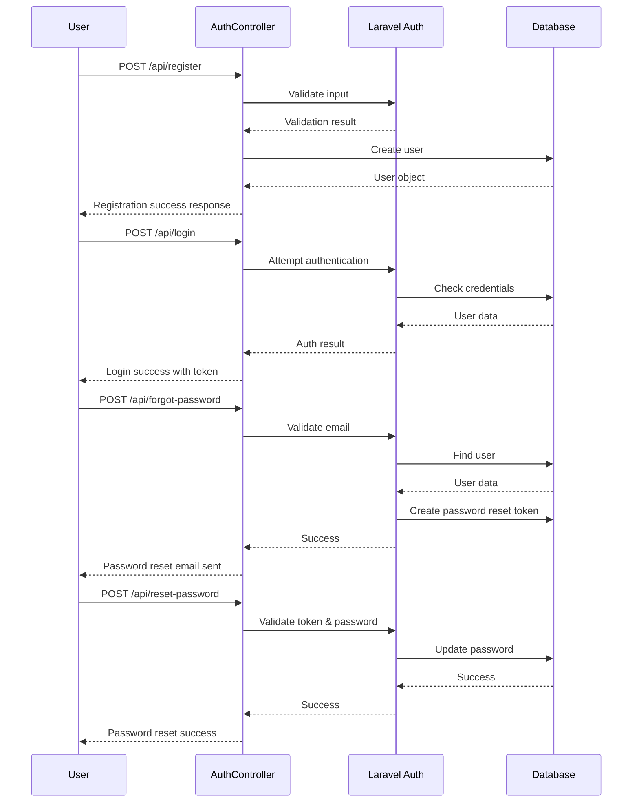

# Authentication System Design

## 1. Overview

This document outlines the design for implementing a complete authentication system for the SmartLink server application. The system will include user registration, login, and password recovery functionality using Laravel's built-in authentication features.

The current implementation already has a basic registration system, but lacks login and password recovery capabilities. This design will extend the existing system to provide a complete authentication solution.

The implementation will use Laravel Sanctum for API token authentication and Laravel's built-in password reset functionality.

## 2. Technology Stack & Dependencies

- **Framework**: Laravel 12 with PHP 8.4
- **Authentication**: Laravel Sanctum (API token authentication)
- **Database**: PostgreSQL 16
- **Password Reset**: Laravel's built-in password reset functionality
- **Validation**: Laravel Form Request Validation

## 3. System Architecture

### 3.1 Authentication Flow



### 3.2 Component Structure

```
app/
├── Http/
│   ├── Controllers/
│   │   └── Api/
│   │       └── AuthController.php
│   └── Requests/
│       └── Auth/
│           ├── LoginRequest.php
│           ├── RegisterRequest.php
│           ├── ForgotPasswordRequest.php
│           └── ResetPasswordRequest.php
├── Models/
│   └── User.php
└── Notifications/
    └── ResetPasswordNotification.php
```

### 3.3 Validation Requests

Form Request validation will be used to handle validation logic for authentication endpoints:

1. **LoginRequest** - Validates email and password for login
2. **ForgotPasswordRequest** - Validates email for password reset request
3. **ResetPasswordRequest** - Validates token, email, and password for password reset

Example implementation of LoginRequest:

```php
<?php

namespace App\Http\Requests\Auth;

use Illuminate\Foundation\Http\FormRequest;

class LoginRequest extends FormRequest
{
    public function authorize()
    {
        return true;
    }

    public function rules()
    {
        return [
            'email' => ['required', 'string', 'email'],
            'password' => ['required', 'string'],
            'device_name' => ['nullable', 'string'],
        ];
    }
}
```

## 4. API Endpoints Reference

### 4.1 Authentication Endpoints

| Endpoint | Method | Description | Authentication |
|----------|--------|-------------|----------------|
| `/api/register` | POST | Register a new user | None |
| `/api/login` | POST | Authenticate user credentials | None |
| `/api/logout` | POST | Logout current user | Required |
| `/api/forgot-password` | POST | Request password reset | None |
| `/api/reset-password` | POST | Reset user password | None |
| `/api/user` | GET | Get authenticated user data | Required |

### 4.2 Request/Response Schema

#### Register
**Request:**
```json
{
  "name": "string",
  "email": "string",
  "password": "string",
  "password_confirmation": "string",
  "referral_code": "string (optional)"
}
```

**Response:**
```json
{
  "message": "User registered successfully",
  "user": {
    "id": "integer",
    "name": "string",
    "email": "string",
    "referral_code": "string",
    "created_at": "datetime",
    "updated_at": "datetime"
  }
}
```

#### Login
**Request:**
```json
{
  "email": "string",
  "password": "string",
  "device_name": "string (optional)"
}
```

**Response:**
```json
{
  "user": {
    "id": "integer",
    "name": "string",
    "email": "string"
  },
  "token": "string"
}
```

#### Logout
**Response:**
```json
{
  "message": "Successfully logged out"
}
```

#### Forgot Password
**Request:**
```json
{
  "email": "string"
}
```

**Response:**
```json
{
  "message": "Password reset link sent to your email"
}
```

#### Reset Password
**Request:**
```json
{
  "token": "string",
  "email": "string",
  "password": "string",
  "password_confirmation": "string"
}
```

**Response:**
```json
{
  "message": "Password reset successfully"
}
```

### 4.3 Authentication Requirements

All endpoints except `/api/register`, `/api/login`, `/api/forgot-password`, and `/api/reset-password` require authentication via Laravel Sanctum.

The following routes will be added to `routes/api.php`:

```php
// Authentication routes
Route::post('/register', [App\Http\Controllers\Api\AuthController::class, 'register']);
Route::post('/login', [App\Http\Controllers\Api\AuthController::class, 'login']);
Route::post('/forgot-password', [App\Http\Controllers\Api\AuthController::class, 'forgotPassword']);
Route::post('/reset-password', [App\Http\Controllers\Api\AuthController::class, 'resetPassword']);

Route::middleware('auth:sanctum')->group(function () {
    Route::post('/logout', [App\Http\Controllers\Api\AuthController::class, 'logout']);
    Route::get('/user', function (Request $request) {
        return $request->user();
    });
    // ... other authenticated routes
});
```

Authentication is achieved by including the `Authorization: Bearer <token>` header in requests.

## 5. Data Models & ORM Mapping

### 5.1 User Model Extensions

The existing User model will be extended with Sanctum capabilities:

```php
<?php

namespace App\Models;

use Laravel\Sanctum\HasApiTokens; // Add this trait
use App\Notifications\ResetPasswordNotification;

class User extends Authenticatable
{
    use HasApiTokens, HasFactory, Notifiable;
    
    // ... existing code
    
    /**
     * Send the password reset notification.
     *
     * @param  string  $token
     * @return void
     */
    public function sendPasswordResetNotification($token)
    {
        $this->notify(new ResetPasswordNotification($token));
    }
}
```

### 5.2 Password Reset Tokens

Laravel's built-in password reset functionality uses the `password_reset_tokens` table which is already defined in the migrations.

### 5.3 Password Reset Notification

Laravel will use the built-in `ResetPasswordNotification` to send password reset emails. The notification can be customized by creating a custom notification class:

```php
<?php

namespace App\Notifications;

use Illuminate\Bus\Queueable;
use Illuminate\Notifications\Notification;
use Illuminate\Contracts\Queue\ShouldQueue;
use Illuminate\Notifications\Messages\MailMessage;
use Illuminate\Support\Facades\Lang;

class ResetPasswordNotification extends Notification
{
    use Queueable;

    public $token;

    public function __construct($token)
    {
        $this->token = $token;
    }

    public function via($notifiable)
    {
        return ['mail'];
    }

    public function toMail($notifiable)
    {
        $resetUrl = url(config('app.url').route('password.reset', ['token' => $this->token, 'email' => $notifiable->getEmailForPasswordReset()], false));

        return (new MailMessage)
            ->subject(Lang::get('Reset Password Notification'))
            ->line(Lang::get('You are receiving this email because we received a password reset request for your account.'))
            ->action(Lang::get('Reset Password'), $resetUrl)
            ->line(Lang::get('This password reset link will expire in :count minutes.', ['count' => config('auth.passwords.'.config('auth.defaults.passwords').'.expire')]))
            ->line(Lang::get('If you did not request a password reset, no further action is required.'));
    }

    public function toArray($notifiable)
    {
        return [
            //
        ];
    }
}
```

## 6. Business Logic Layer

### 6.1 AuthController Methods

The AuthController will be extended with the following methods:

1. **login()** - Authenticate user credentials and generate API token
2. **logout()** - Revoke current token
3. **forgotPassword()** - Send password reset email
4. **resetPassword()** - Reset user password

The implementation will replace the direct validation in the controller methods with Form Request validation:

```php
<?php

namespace App\Http\Controllers\Api;

use App\Http\Controllers\Controller;
use App\Models\User;
use App\Services\ReferralService;
use Illuminate\Http\Request;
use Illuminate\Support\Facades\Hash;
use Illuminate\Support\Facades\Auth;
use Illuminate\Support\Facades\Password;
use Illuminate\Support\Facades\Validator;
use Illuminate\Validation\Rules\Password as PasswordRule;
use Illuminate\Http\JsonResponse;

class AuthController extends Controller
{
    // ... existing methods ...
    
    /**
     * Login user and generate API token
     *
     * @param Request $request
     * @return JsonResponse
     */
    public function login(Request $request)
    {
        $validator = Validator::make($request->all(), [
            'email' => ['required', 'string', 'email'],
            'password' => ['required', 'string'],
            'device_name' => ['nullable', 'string'],
        ]);

        if ($validator->fails()) {
            return response()->json(['errors' => $validator->errors()], 422);
        }

        if (!Auth::attempt($request->only('email', 'password'))) {
            return response()->json([
                'message' => 'Invalid credentials'
            ], 401);
        }

        $user = Auth::user();
        $token = $user->createToken($request->device_name ?: 'api-token')->plainTextToken;

        return response()->json([
            'user' => $user,
            'token' => $token
        ]);
    }

    /**
     * Logout user and revoke token
     *
     * @param Request $request
     * @return JsonResponse
     */
    public function logout(Request $request)
    {
        $request->user()->currentAccessToken()->delete();

        return response()->json([
            'message' => 'Successfully logged out'
        ]);
    }

    /**
     * Send password reset link
     *
     * @param Request $request
     * @return JsonResponse
     */
    public function forgotPassword(Request $request)
    {
        $validator = Validator::make($request->all(), [
            'email' => ['required', 'string', 'email'],
        ]);

        if ($validator->fails()) {
            return response()->json(['errors' => $validator->errors()], 422);
        }

        $status = Password::sendResetLink(
            $request->only('email')
        );

        if ($status === Password::RESET_LINK_SENT) {
            return response()->json(['message' => __($status)]);
        }

        return response()->json(['message' => __($status)], 400);
    }

    /**
     * Reset user password
     *
     * @param Request $request
     * @return JsonResponse
     */
    public function resetPassword(Request $request)
    {
        $validator = Validator::make($request->all(), [
            'token' => ['required'],
            'email' => ['required', 'string', 'email'],
            'password' => ['required', 'confirmed', PasswordRule::defaults()],
        ]);

        if ($validator->fails()) {
            return response()->json(['errors' => $validator->errors()], 422);
        }

        $status = Password::reset(
            $request->only('email', 'password', 'password_confirmation', 'token'),
            function ($user, $password) {
                $user->forceFill([
                    'password' => Hash::make($password)
                ])->save();

                // Revoke all tokens for security
                $user->tokens()->delete();
            }
        );

        if ($status === Password::PASSWORD_RESET) {
            return response()->json(['message' => __($status)]);
        }

        return response()->json(['message' => __($status)], 400);
    }
}
```

### 6.2 Authentication Flow Logic

#### Login Process
1. Validate user credentials
2. Attempt authentication using Laravel's auth system
3. If successful, create a new Sanctum token
4. Return user data and token

#### Logout Process
1. Revoke the current token
2. Return success message

#### Password Reset Request Process
1. Validate email address
2. Generate password reset token
3. Send reset email notification

#### Password Reset Process
1. Validate reset token
2. Validate new password
3. Update user password
4. Revoke all tokens for security
5. Send confirmation notification

## 7. Middleware & Interceptors

### 7.1 Sanctum Middleware

Laravel Sanctum's `auth:sanctum` middleware will be used to protect authenticated routes.

### 7.2 Custom Middleware

No additional middleware is required for basic authentication functionality.

## 8. Security Considerations

1. **Password Hashing**: All passwords will be hashed using Laravel's bcrypt implementation
2. **Token Management**: API tokens will be securely generated and stored
3. **Rate Limiting**: Password reset requests will be rate-limited to prevent abuse
4. **Token Revocation**: Tokens will be properly revoked on logout and password reset
5. **Email Validation**: Password reset emails will only be sent to valid registered users

## 9. Implementation Plan

### 9.1 Phase 1: Environment Setup
- Install Laravel Sanctum package with `composer require laravel/sanctum`
- Publish and run Sanctum migrations with `php artisan vendor:publish --provider="Laravel\Sanctum\SanctumServiceProvider"` and `php artisan migrate`
- Configure Sanctum in `config/sanctum.php` (set stateful domains and token prefixes)
- Update User model to use `HasApiTokens` trait
- Update API routes to use Sanctum middleware

### 9.2 Phase 2: Login Functionality
- Create LoginRequest for validation
- Add login method to AuthController using LoginRequest
- Implement token generation with `$user->createToken()`
- Return user data and token in JSON response

### 9.3 Phase 3: Logout Functionality
- Add logout method to AuthController
- Implement token revocation with `$request->user()->currentAccessToken()->delete()`
- Return success message

### 9.4 Phase 4: Password Recovery
- Create ForgotPasswordRequest and ResetPasswordRequest
- Create ResetPasswordNotification class
- Update User model with `sendPasswordResetNotification()` method
- Implement forgotPassword method to send reset link
- Implement resetPassword method to update password
- Update routes in `routes/api.php`

### 9.5 Phase 5: Testing
- Create unit tests for AuthController methods
- Create feature tests for authentication flows
- Test authentication middleware
- Verify security measures (token revocation, rate limiting)
- Test password reset email functionality

## 10. Testing Strategy

### 10.1 Unit Tests
- AuthController method tests
- Request validation tests
- Password hashing verification

### 10.2 Feature Tests
- Complete registration flow
- Login and logout flows
- Password reset request and reset flows
- Authentication middleware tests

### 10.3 Security Tests
- Invalid credential handling
- Token expiration
- Password reset token validation
- Rate limiting verification