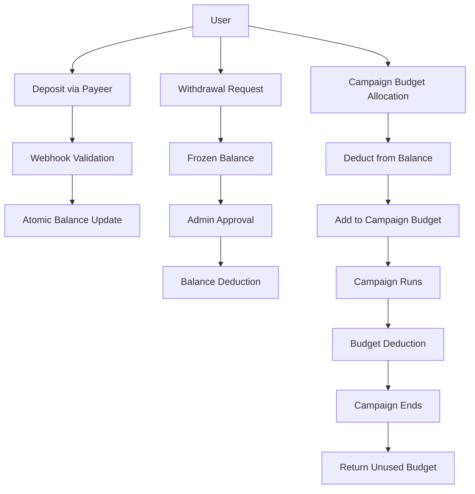
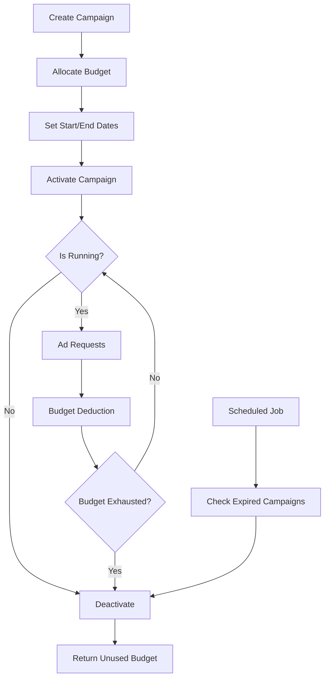
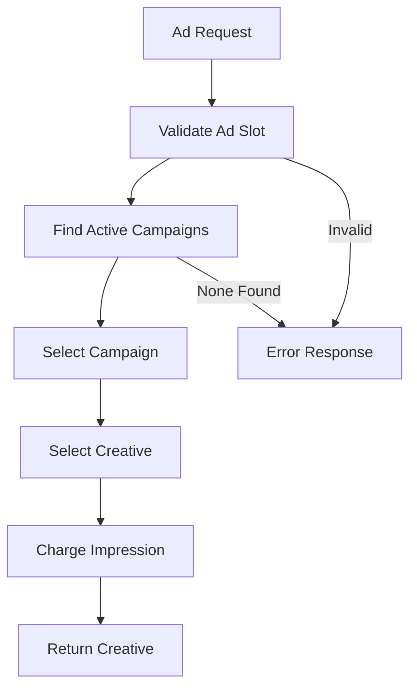

# SmartLink Business Logic Implementation Design

## 1. Overview

This document details the implementation of core business logic for the SmartLink advertising platform. The implementation focuses on four key areas:

1. Financial Core System (Deposits, Withdrawals, Budget Management)
2. Security Testing for Ownership Middleware
3. Campaign Lifecycle Management
4. Ad Slot Service Logic Implementation

The implementation follows a "Swiss Watch" precision approach, ensuring all components work together seamlessly with robust error handling and security measures.

Based on the existing codebase analysis, we'll be extending the current Laravel 12 application with PHP 8.4, PostgreSQL database, and Redis for caching/queues. The system already has a solid foundation with User, Site, AdSlot, Campaign, and Creative models, along with appropriate middleware for ownership validation.

## 2. Financial Core System

### 2.1 Deposit System with Payeer Integration

#### Requirements
- Integration with Payeer API for USDT deposits
- Webhook for atomic balance crediting
- Secure transaction processing

#### Implementation Plan
1. Create PayeerService for API communication
2. Implement webhook endpoint in FinancialController
3. Add transaction logging and verification
4. Implement atomic balance updates with database transactions

#### Technical Details
- Create `app/Services/PayeerService.php` to handle Payeer API interactions
- Add webhook endpoint `POST /api/deposit/payeer-webhook` in FinancialController
- Implement signature verification for webhook security
- Use database transactions to ensure atomicity of balance updates
- Add `transaction_id` field to User model for duplicate transaction prevention

### 2.2 Withdrawal System

#### Requirements
- Create withdrawal requests
- Freeze amounts on user balance
- Track withdrawal statuses

#### Implementation Plan
1. Add Withdrawal model with status tracking
2. Modify User model to handle frozen balances
3. Implement withdrawal request creation in FinancialController
4. Add withdrawal approval/rejection logic

#### Technical Details
- Create `app/Models/Withdrawal.php` with fields: id, user_id, amount, status, processed_at
- Add `frozen_balance` field to users table via migration
- Add methods to User model: freezeBalance(), unfreezeBalance()
- Create withdrawal statuses: pending, approved, rejected, processed
- Implement validation to prevent withdrawals exceeding available balance

### 2.3 Campaign Budget Management

#### Requirements
- Budget allocation from user balance to campaign
- Budget deduction during campaign runtime
- Budget return on campaign completion

#### Implementation Plan
1. Enhance CampaignService with real-time budget tracking
2. Implement scheduled budget checks
3. Add budget exhaustion handling

#### Technical Details
- Enhance existing `app/Services/CampaignService.php`
- Add methods: checkBudget(), deactivateExpired()
- Implement real-time budget deduction in AdSlotService when ads are served
- Create scheduled job to check for expired campaigns daily
- Ensure atomic operations for budget allocation and return using database transactions

## 3. Security Testing Implementation

### 3.1 Ownership Middleware Testing

#### Requirements
- Unit tests for all OwnershipMiddleware classes
- Test successful access (200 OK) for owners
- Test blocked access (403 Forbidden) for non-owners

#### Implementation Plan
1. Create test cases for SiteOwnershipMiddleware
2. Create test cases for CampaignOwnershipMiddleware
3. Create test cases for AdSlotOwnershipMiddleware
4. Create test cases for CreativeOwnershipMiddleware

#### Technical Details
- Create test files in `tests/Unit/Middleware/` directory
- Use PHPUnit to create test cases
- Test both positive (owner access) and negative (non-owner access) scenarios
- Mock User and Entity models for testing
- Ensure 100% coverage of ownership validation logic

## 4. Campaign Lifecycle Management

### 4.1 Scheduled Campaign Deactivation

#### Requirements
- Daily job to deactivate campaigns with exhausted budgets
- Daily job to deactivate campaigns past their end date
- Automatic budget return to user balance

#### Implementation Plan
1. Create CampaignDeactivationJob
2. Schedule job to run daily via Laravel scheduler
3. Implement campaign status checking logic
4. Add budget return functionality

#### Technical Details
- Create `app/Jobs/CampaignDeactivationJob.php`
- Use Laravel's task scheduling in `app/Console/Kernel.php`
- Query campaigns that are either past end date or have exhausted budget
- Use CampaignService::releaseBudget() to return unused funds
- Log all deactivation activities for audit purposes

### 4.2 Ad Slot Service Logic

#### Requirements
- Request processing for ad displays
- Active campaign lookup for ad slots
- Creative selection logic
- Micro-payment deduction per impression

#### Implementation Plan
1. Enhance AdSlotService with request processing
2. Implement campaign selection algorithm
3. Add creative selection logic
4. Integrate micro-payment system

#### Technical Details
- Enhance existing `app/Services/AdSlotService.php`
- Add method: processAdRequest(AdSlot $adSlot)
- Implement campaign selection based on budget and activity status
- Select random creative from active campaigns
- Deduct micro-payment from campaign budget using atomic operations
- Return creative data for ad display
- Log all ad requests for analytics

## 5. API Documentation ("Tablets of API")

### 5.1 Financial Endpoints

#### Deposit Endpoint
- Method: POST
- URL: `/api/deposit`
- Headers: Authorization: Bearer <token>
- Request Body: amount (numeric)
- Responses: 200, 400, 401, 422

**Response Examples:**
- 200: `{"message": "Deposit successful", "balance": 150.00}`
- 400: `{"error": "Invalid amount"}`
- 401: `{"message": "Unauthenticated."}`
- 422: `{"errors": {"amount": ["The amount field is required."]}}`

#### Withdrawal Endpoint
- Method: POST
- URL: `/api/withdraw`
- Headers: Authorization: Bearer <token>
- Request Body: amount (numeric)
- Responses: 200, 400, 401, 422

**Response Examples:**
- 200: `{"message": "Withdrawal successful", "balance": 50.00}`
- 400: `{"error": "Insufficient funds"}`
- 401: `{"message": "Unauthenticated."}`
- 422: `{"errors": {"amount": ["The amount must be at least 1."]}}`

#### Payeer Webhook Endpoint
- Method: POST
- URL: `/api/deposit/payeer-webhook`
- Headers: None (validated via signature)
- Request Body: Payeer transaction data
- Responses: 200, 400, 401, 422

**Response Examples:**
- 200: `{"status": "success"}`
- 400: `{"status": "error", "message": "Invalid signature"}`

### 5.2 Campaign Endpoints

#### Campaign Budget Allocation
- Method: POST
- URL: `/api/campaigns/{campaign}/allocate-budget`
- Headers: Authorization: Bearer <token>
- Request Body: amount (numeric)
- Responses: 200, 400, 401, 403, 422

**Response Examples:**
- 200: `{"message": "Budget allocated successfully", "campaign": {"id": 1, "budget": 100.00, ...}}`
- 400: `{"error": "Insufficient funds"}`
- 401: `{"message": "Unauthenticated."}`
- 403: `{"error": "Unauthorized access to resource"}`
- 422: `{"errors": {"amount": ["The amount field is required."]}}`

#### Campaign Activation
- Method: POST
- URL: `/api/campaigns/{campaign}/activate`
- Headers: Authorization: Bearer <token>
- Request Body: none
- Responses: 200, 400, 401, 403

**Response Examples:**
- 200: `{"message": "Campaign activated successfully", "campaign": {"id": 1, "is_active": true, ...}}`
- 400: `{"error": "Cannot activate campaign. Check budget and dates."}`
- 401: `{"message": "Unauthenticated."}`
- 403: `{"error": "Unauthorized access to resource"}`

#### Campaign Deactivation
- Method: POST
- URL: `/api/campaigns/{campaign}/deactivate`
- Headers: Authorization: Bearer <token>
- Request Body: none
- Responses: 200, 400, 401, 403

**Response Examples:**
- 200: `{"message": "Campaign deactivated successfully", "campaign": {"id": 1, "is_active": false, ...}}`
- 400: `{"error": "Cannot deactivate campaign."}`
- 401: `{"message": "Unauthenticated."}`
- 403: `{"error": "Unauthorized access to resource"}`

### 5.3 Ad Slot Endpoints

#### Ad Request Processing
- Method: GET
- URL: `/api/ad-slots/{adSlot}/request`
- Headers: none (public endpoint)
- Parameters: none
- Responses: 200, 404, 410

**Response Examples:**
- 200: `{"creative": {"id": 1, "type": "image", "data": "image_url"}, "campaign_id": 1}`
- 404: `{"error": "Ad slot not found"}`
- 410: `{"error": "Ad slot is not active"}`

#### Campaign Association
- Method: POST
- URL: `/api/ad-slots/{adSlot}/campaigns`
- Headers: Authorization: Bearer <token>
- Request Body: campaign_id
- Responses: 200, 400, 401, 403, 422

**Response Examples:**
- 200: `{"message": "Campaign associated successfully"}`
- 400: `{"error": "Campaign already associated"}`
- 401: `{"message": "Unauthenticated."}`
- 403: `{"error": "Unauthorized access to resource"}`
- 422: `{"errors": {"campaign_id": ["The campaign id field is required."]}}`

## 6. Data Models

### 6.1 Enhanced User Model
- Fields: id, name, email, password, balance, frozen_balance
- Relationships: sites, campaigns, creatives
- Methods: deductBalance, addBalance, hasBalance, freezeBalance, unfreezeBalance

#### Migration Changes
- Add `frozen_balance` decimal field to users table
- Add `transaction_id` field for duplicate prevention
- Ensure proper indexing for performance

### 6.2 Enhanced Campaign Model
- Fields: id, user_id, name, description, budget, spent, start_date, end_date, is_active
- Relationships: user, creatives, adSlots
- Methods: hasBudget, deductBudget, isRunning, canActivate
- Scopes: active, running

#### Additional Methods
- checkIfExpired(): bool - Check if campaign has passed end date
- returnUnusedBudget(): bool - Return unused budget to user
- getRemainingBudget(): float - Calculate remaining budget

### 6.3 Withdrawal Model
- Fields: id, user_id, amount, status, processed_at
- Relationships: user
- Statuses: pending, approved, rejected, processed

#### Additional Fields
- transaction_id: Unique identifier for tracking
- created_at, updated_at: Timestamps
- notes: Admin notes for approval/rejection

### 6.4 Transaction Log Model
- Fields: id, user_id, amount, type, reference, status, description
- Relationships: user
- Types: deposit, withdrawal, budget_allocation, budget_return, impression_charge

#### Additional Fields
- created_at: Timestamp of transaction
- ip_address: IP address of requester (for security)
- user_agent: Browser information (for security)

## 7. Services

### 7.1 PayeerService
- Methods: initiateDeposit, verifyWebhook, processDeposit
- Error Handling: Invalid signatures, duplicate transactions, amount mismatches

### 7.2 Enhanced CampaignService
- Methods: allocateBudget, releaseBudget, canActivate, checkBudget, deactivateExpired
- Additional: checkCampaignStatus, calculateDailySpend

### 7.3 Enhanced AdSlotService
- Methods: getActiveCreatives, canDisplayAds, associateCampaign, dissociateCampaign, processAdRequest
- Additional: selectCampaign, selectCreative, chargeImpression

### 7.4 FinancialService
- Methods: createWithdrawal, approveWithdrawal, rejectWithdrawal, processWithdrawal
- Validation: Balance checks, amount limits, duplicate prevention

## 8. Jobs & Scheduling

### 8.1 CampaignDeactivationJob
- Purpose: Deactivate expired or budget-exhausted campaigns
- Frequency: Daily
- Actions: Check campaign status, deactivate if needed, return unused budget
- Error Handling: Log failures, retry mechanism, admin notifications

### 8.2 BudgetMonitoringJob
- Purpose: Monitor campaign budgets in real-time
- Frequency: Every 15 minutes
- Actions: Check budget status, deactivate campaigns with exhausted budgets
- Performance: Batch processing, efficient querying, minimal resource usage

## 9. Middleware Testing

### 9.1 SiteOwnershipMiddleware Tests
- Test owner access (200 OK)
- Test non-owner access (403 Forbidden)
- Test invalid entity ID (404 Not Found)
- Test deleted entity (404 Not Found)

### 9.2 CampaignOwnershipMiddleware Tests
- Test owner access (200 OK)
- Test non-owner access (403 Forbidden)
- Test invalid entity ID (404 Not Found)
- Test deleted entity (404 Not Found)

### 9.3 AdSlotOwnershipMiddleware Tests
- Test owner access (200 OK)
- Test non-owner access (403 Forbidden)
- Test invalid entity ID (404 Not Found)
- Test deleted entity (404 Not Found)

### 9.4 CreativeOwnershipMiddleware Tests
- Test owner access (200 OK)
- Test non-owner access (403 Forbidden)
- Test invalid entity ID (404 Not Found)
- Test deleted entity (404 Not Found)

## 10. Error Handling & Validation

## 11. Monitoring & Logging

### 11.1 Financial Transactions
- Log all deposit/withdrawal activities
- Track budget allocations and deductions
- Monitor for suspicious activities
- Generate financial reports

### 11.2 Campaign Activities
- Log campaign activation/deactivation events
- Track budget spending in real-time
- Monitor campaign performance
- Alert on budget exhaustion

### 11.3 Ad Serving
- Log all ad requests and responses
- Track impression counts per campaign
- Monitor creative performance
- Detect and prevent fraud

### 11.4 System Health
- Monitor job execution status
- Track API response times
- Log middleware access patterns
- Alert on system errors

### 10.1 Financial Operations
- Insufficient funds handling
- Invalid amount validation
- Duplicate transaction prevention
- Transaction rollback on errors

### 10.2 Campaign Operations
- Budget allocation validation
- Campaign activation requirements
- Date range validation
- Concurrent access handling

### 10.3 Security
- Ownership validation for all operations
- Authentication requirement for protected endpoints
- Rate limiting for financial operations
- Input sanitization and validation
- SQL injection prevention through Eloquent ORM

## 12. Implementation Sequence

1. Enhance data models with new fields and relationships
2. Implement PayeerService and webhook integration
3. Develop FinancialService for withdrawal processing
4. Enhance CampaignService with improved budget management
5. Implement scheduled jobs for campaign lifecycle management
6. Enhance AdSlotService with ad request processing logic
7. Create comprehensive unit tests for middleware
8. Document all API endpoints with detailed specifications
9. Perform integration testing of all components
10. Final validation and documentation review

### 12.1 Implementation Priorities
- **Phase 1**: Data model enhancements and core service updates
- **Phase 2**: Financial system integration (Payeer, withdrawals)
- **Phase 3**: Campaign lifecycle automation
- **Phase 4**: Ad serving logic and micro-payments
- **Phase 5**: Testing, documentation, and validation