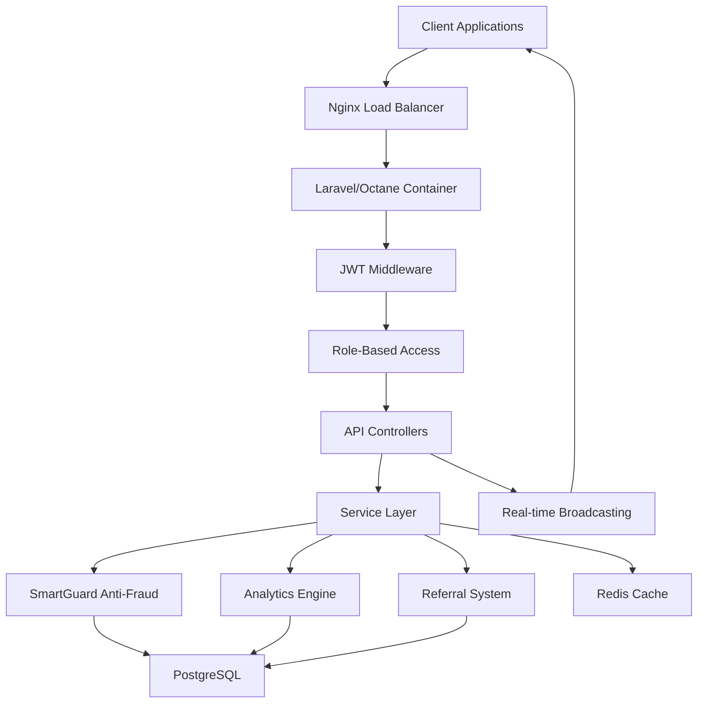
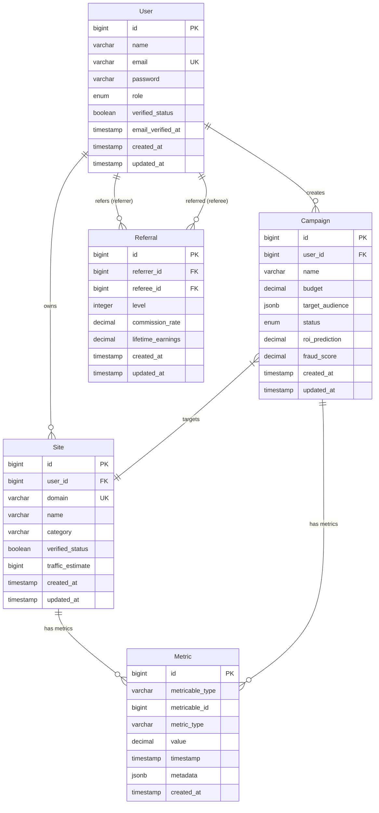
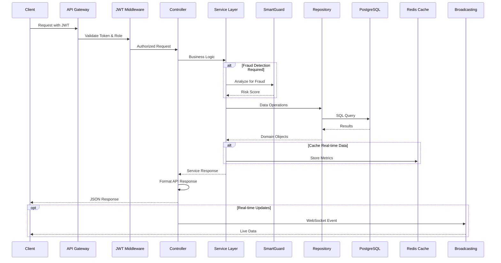

# SmartLink - Intelligent Advertising Ecosystem API

## Overview

SmartLink is an intelligent advertising ecosystem featuring Symbiotic AI (SmartGuard for anti-fraud), Zero Friction (instant actions, low thresholds), GlassBox Metrics (full transparency), and Kinetic UI (real-time data). The platform serves webmasters for site monetization with verified status, brands with Performance Engine and ROI predictions, and partners through The Synapse Network (lifetime percentages, 2 levels, quality bonuses).

### Project Goals
- Create enterprise-grade Dockerized backend with Laravel/Octane for reactor speed
- Implement JWT authentication with refresh tokens and role-based access (webmaster/brand/partner)
- Build real-time processing capabilities for advertising metrics and fraud detection
- Provide comprehensive API with OpenAPI documentation
- Ensure security-by-default with extensive validation and testing
- Deploy production-ready MVP within 48 hours

### Technology Stack
- **Framework**: Laravel 12.x with Octane (for reactor speed and real-time processing)
- **PHP Version**: 8.2+
- **Database**: PostgreSQL (with real-time extensions for metrics and referrals)
- **Authentication**: JWT with refresh tokens
- **Caching**: Redis
- **Containerization**: Docker & Docker Compose
- **API Documentation**: OpenAPI/Swagger
- **Testing**: PHPUnit (unit & integration)
- **Code Quality**: PHP CS Fixer, PHPStan

## Architecture

### Docker Container Architecture
```
smartlink-ecosystem/
├── docker/
│   ├── php/
│   │   ├── Dockerfile
│   │   └── octane.conf
│   ├── postgres/
│   │   └── init.sql
│   └── nginx/
│       └── default.conf
├── docker-compose.yml
├── app/
│   ├── Http/
│   │   ├── Controllers/
│   │   │   └── Api/
│   │   │       ├── Auth/
│   │   │       ├── Campaigns/
│   │   │       ├── Sites/
│   │   │       └── Analytics/
│   │   ├── Middleware/
│   │   ├── Requests/
│   │   └── Resources/
│   ├── Models/
│   │   ├── User.php
│   │   ├── Site.php
│   │   ├── Campaign.php
│   │   ├── Referral.php
│   │   └── Metric.php
│   ├── Services/
│   │   ├── SmartGuardService.php
│   │   ├── AnalyticsService.php
│   │   └── ReferralService.php
│   └── Repositories/
├── database/
│   ├── migrations/
│   ├── seeders/
│   └── factories/
├── tests/
│   ├── Feature/
│   └── Unit/
└── storage/
```

### Docker Services
- **smartlink-app**: Laravel/Octane application container
- **smartlink-db**: PostgreSQL database with real-time extensions
- **smartlink-redis**: Redis for caching and sessions
- **smartlink-nginx**: Nginx reverse proxy

### Architectural Patterns
- **Repository Pattern**: Data access abstraction for campaigns, sites, referrals
- **Service Layer**: Business logic for fraud detection, analytics, referral processing
- **Resource Transformation**: API response formatting with real-time metrics
- **JWT Authentication**: Stateless authentication with role-based access control
- **Event-Driven**: Real-time updates using Laravel broadcasting



## API Endpoints Reference

### Authentication Endpoints
| Method | Endpoint | Description | Roles |
|--------|----------|-------------|-------|
| POST | `/api/auth/register` | User registration with role selection | Public |
| POST | `/api/auth/login` | JWT login with refresh token | Public |
| POST | `/api/auth/refresh` | Refresh JWT token | Authenticated |
| POST | `/api/auth/logout` | Logout and invalidate tokens | Authenticated |
| GET | `/api/auth/me` | Get authenticated user profile | Authenticated |

### Webmaster Endpoints
| Method | Endpoint | Description | Roles |
|--------|----------|-------------|-------|
| GET | `/api/sites` | List webmaster sites | Webmaster |
| POST | `/api/sites` | Add new site for monetization | Webmaster |
| GET | `/api/sites/{id}/metrics` | Real-time site metrics | Webmaster |
| POST | `/api/sites/{id}/verify` | Request site verification | Webmaster |

### Brand Endpoints
| Method | Endpoint | Description | Roles |
|--------|----------|-------------|-------|
| GET | `/api/campaigns` | List brand campaigns | Brand |
| POST | `/api/campaigns` | Create new campaign | Brand |
| POST | `/api/campaigns/simulate` | ROI prediction simulation | Brand |
| GET | `/api/campaigns/{id}/performance` | Performance Engine metrics | Brand |

### Partner Endpoints (The Synapse Network)
| Method | Endpoint | Description | Roles |
|--------|----------|-------------|-------|
| GET | `/api/referrals` | Partner referral tree | Partner |
| GET | `/api/referrals/commissions` | Lifetime commission tracking | Partner |
| POST | `/api/referrals/invite` | Generate referral link | Partner |

### SmartGuard Anti-Fraud
| Method | Endpoint | Description | Roles |
|--------|----------|-------------|-------|
| POST | `/api/smartguard/analyze` | Fraud analysis request | System |
| GET | `/api/smartguard/reports` | Fraud detection reports | Admin |

### Real-time Analytics
| Method | Endpoint | Description | Roles |
|--------|----------|-------------|-------|
| GET | `/api/analytics/dashboard` | GlassBox Metrics dashboard | All |
| GET | `/api/analytics/stream` | WebSocket endpoint for live data | All |

### Request/Response Schema

#### JWT Authentication Request
```json
{
  "email": "webmaster@example.com",
  "password": "secure_password",
  "role": "webmaster"
}
```

#### JWT Authentication Response
```json
{
  "data": {
    "user": {
      "id": 1,
      "name": "John Webmaster",
      "email": "webmaster@example.com",
      "role": "webmaster",
      "verified_status": true,
      "created_at": "2024-01-01T00:00:00Z"
    },
    "tokens": {
      "access_token": "jwt_access_token_here",
      "refresh_token": "jwt_refresh_token_here",
      "expires_in": 3600
    }
  },
  "message": "Authentication successful"
}
```

#### Campaign Simulation Request
```json
{
  "budget": 10000,
  "target_audience": {
    "geo": ["US", "UK"],
    "demographics": {
      "age_range": [25, 45],
      "interests": ["technology", "finance"]
    }
  },
  "duration_days": 30
}
```

#### Campaign Simulation Response
```json
{
  "data": {
    "predicted_roi": 2.4,
    "estimated_impressions": 500000,
    "estimated_clicks": 12500,
    "estimated_conversions": 875,
    "fraud_risk_score": 0.12,
    "recommended_adjustments": [
      "Increase mobile targeting",
      "Exclude high-risk geos"
    ]
  }
}
```

### Authentication Requirements
- **JWT Tokens**: Access (1 hour) and Refresh (30 days) tokens
- **Role-based Access**: webmaster/brand/partner/admin roles
- **Rate Limiting**: 100 requests per minute for authenticated users
- **CORS**: Configured for frontend applications
- **Security Headers**: HSTS, CSP, X-Frame-Options

## Data Models & ORM Mapping

### Core Models Structure

#### User Model (Multi-role Authentication)
```php
class User extends Authenticatable implements JWTSubject
{
    protected $fillable = [
        'name', 'email', 'password', 'role', 'verified_status'
    ];
    
    protected $hidden = ['password', 'remember_token'];
    
    protected $casts = [
        'email_verified_at' => 'datetime',
        'verified_status' => 'boolean'
    ];
    
    // Role enum: webmaster, brand, partner, admin
    public function isWebmaster(): bool;
    public function isBrand(): bool;
    public function isPartner(): bool;
}
```

#### Site Model (Webmaster Monetization)
```php
class Site extends Model
{
    protected $fillable = [
        'user_id', 'domain', 'name', 'category', 
        'verified_status', 'traffic_estimate'
    ];
    
    public function user(): BelongsTo;
    public function metrics(): HasMany;
    public function campaigns(): BelongsToMany;
}
```

#### Campaign Model (Brand Performance)
```php
class Campaign extends Model
{
    protected $fillable = [
        'user_id', 'name', 'budget', 'target_audience',
        'status', 'roi_prediction', 'fraud_score'
    ];
    
    protected $casts = [
        'target_audience' => 'json',
        'roi_prediction' => 'decimal:2',
        'fraud_score' => 'decimal:3'
    ];
    
    public function user(): BelongsTo;
    public function sites(): BelongsToMany;
    public function metrics(): HasMany;
}
```

#### Referral Model (The Synapse Network)
```php
class Referral extends Model
{
    protected $fillable = [
        'referrer_id', 'referee_id', 'level', 
        'commission_rate', 'lifetime_earnings'
    ];
    
    protected $casts = [
        'commission_rate' => 'decimal:3',
        'lifetime_earnings' => 'decimal:2'
    ];
    
    public function referrer(): BelongsTo;
    public function referee(): BelongsTo;
}
```

#### Metric Model (GlassBox Analytics)
```php
class Metric extends Model
{
    protected $fillable = [
        'metricable_type', 'metricable_id', 'metric_type',
        'value', 'timestamp', 'metadata'
    ];
    
    protected $casts = [
        'value' => 'decimal:2',
        'timestamp' => 'datetime',
        'metadata' => 'json'
    ];
    
    public function metricable(): MorphTo;
}
```

### Database Schema

#### Users Table
| Column | Type | Constraints |
|--------|------|-------------|
| id | bigint | PRIMARY KEY, AUTO_INCREMENT |
| name | varchar(255) | NOT NULL |
| email | varchar(255) | UNIQUE, NOT NULL |
| password | varchar(255) | NOT NULL |
| role | enum | NOT NULL (webmaster,brand,partner,admin) |
| verified_status | boolean | DEFAULT FALSE |
| email_verified_at | timestamp | NULLABLE |
| created_at | timestamp | DEFAULT CURRENT_TIMESTAMP |
| updated_at | timestamp | DEFAULT CURRENT_TIMESTAMP |

#### Sites Table
| Column | Type | Constraints |
|--------|------|-------------|
| id | bigint | PRIMARY KEY, AUTO_INCREMENT |
| user_id | bigint | FOREIGN KEY (users.id) |
| domain | varchar(255) | UNIQUE, NOT NULL |
| name | varchar(255) | NOT NULL |
| category | varchar(100) | NOT NULL |
| verified_status | boolean | DEFAULT FALSE |
| traffic_estimate | bigint | DEFAULT 0 |
| created_at | timestamp | DEFAULT CURRENT_TIMESTAMP |
| updated_at | timestamp | DEFAULT CURRENT_TIMESTAMP |

#### Campaigns Table
| Column | Type | Constraints |
|--------|------|-------------|
| id | bigint | PRIMARY KEY, AUTO_INCREMENT |
| user_id | bigint | FOREIGN KEY (users.id) |
| name | varchar(255) | NOT NULL |
| budget | decimal(15,2) | NOT NULL |
| target_audience | jsonb | NOT NULL |
| status | enum | NOT NULL (draft,active,paused,completed) |
| roi_prediction | decimal(5,2) | NULLABLE |
| fraud_score | decimal(4,3) | DEFAULT 0.000 |
| created_at | timestamp | DEFAULT CURRENT_TIMESTAMP |
| updated_at | timestamp | DEFAULT CURRENT_TIMESTAMP |

#### Referrals Table
| Column | Type | Constraints |
|--------|------|-------------|
| id | bigint | PRIMARY KEY, AUTO_INCREMENT |
| referrer_id | bigint | FOREIGN KEY (users.id) |
| referee_id | bigint | FOREIGN KEY (users.id) |
| level | integer | NOT NULL (1 or 2) |
| commission_rate | decimal(5,3) | NOT NULL |
| lifetime_earnings | decimal(15,2) | DEFAULT 0.00 |
| created_at | timestamp | DEFAULT CURRENT_TIMESTAMP |
| updated_at | timestamp | DEFAULT CURRENT_TIMESTAMP |

#### Metrics Table
| Column | Type | Constraints |
|--------|------|-------------|
| id | bigint | PRIMARY KEY, AUTO_INCREMENT |
| metricable_type | varchar(255) | NOT NULL |
| metricable_id | bigint | NOT NULL |
| metric_type | varchar(100) | NOT NULL |
| value | decimal(15,2) | NOT NULL |
| timestamp | timestamp | NOT NULL |
| metadata | jsonb | NULLABLE |
| created_at | timestamp | DEFAULT CURRENT_TIMESTAMP |



## Business Logic Layer

### Service Classes Architecture

#### AuthService (JWT with Role-based Access)
```php
class AuthService
{
    public function register(array $data): array
    public function login(array $credentials): array
    public function logout(User $user): bool
    public function refreshToken(string $refreshToken): array
    public function validateRole(User $user, string $requiredRole): bool
}
```

#### SmartGuardService (Anti-Fraud AI)
```php
class SmartGuardService
{
    public function analyzeCampaign(Campaign $campaign): float
    public function detectFraudulentActivity(array $metrics): array
    public function updateRiskScore(int $campaignId, float $score): bool
    public function generateFraudReport(int $campaignId): array
    
    // Stub API integration
    private function callSmartGuardAPI(array $data): array
}
```

#### AnalyticsService (GlassBox Metrics)
```php
class AnalyticsService
{
    public function getDashboardMetrics(User $user): array
    public function getRealtimeData(int $entityId, string $type): array
    public function trackMetric(string $type, int $entityId, float $value): void
    public function generatePerformanceReport(int $campaignId): array
    public function predictROI(array $campaignData): float
}
```

#### ReferralService (The Synapse Network)
```php
class ReferralService
{
    public function createReferralLink(User $referrer): string
    public function processReferral(User $referee, string $referralCode): Referral
    public function calculateCommission(Referral $referral, float $amount): float
    public function getLifetimeEarnings(User $user): float
    public function getReferralTree(User $user, int $levels = 2): array
}
```

#### CampaignService (Performance Engine)
```php
class CampaignService
{
    public function createCampaign(User $brand, array $data): Campaign
    public function simulateROI(array $campaignData): array
    public function optimizeCampaign(Campaign $campaign): array
    public function getPerformanceMetrics(Campaign $campaign): array
    public function pauseCampaign(Campaign $campaign): bool
}
```

#### SiteService (Webmaster Management)
```php
class SiteService
{
    public function addSite(User $webmaster, array $data): Site
    public function verifySite(Site $site): bool
    public function getSiteMetrics(Site $site): array
    public function estimateTraffic(Site $site): int
    public function getMonetizationOpportunities(Site $site): array
}
```

### Repository Layer
```php
interface UserRepositoryInterface
{
    public function findByEmail(string $email): ?User;
    public function findByRole(string $role): Collection;
    public function updateVerificationStatus(int $id, bool $status): bool;
}

interface CampaignRepositoryInterface
{
    public function findByUser(int $userId): Collection;
    public function findActiveByBudget(float $minBudget): Collection;
    public function updateFraudScore(int $id, float $score): bool;
}

interface ReferralRepositoryInterface
{
    public function findByReferrer(int $referrerId): Collection;
    public function findReferralTree(int $userId, int $levels): Collection;
    public function updateLifetimeEarnings(int $id, float $amount): bool;
}
```

### Feature Implementation Flow


### Zero Friction Implementation
- **Instant Actions**: Sub-200ms response times via Octane
- **Low Thresholds**: Minimal requirements for platform entry
- **Auto-verification**: Automated site and user verification flows
- **One-click Setup**: Streamlined onboarding for all user types

## Middleware & Interceptors

### JWT Authentication Middleware
```php
class JWTAuthMiddleware
{
    public function handle(Request $request, Closure $next, string $role = null)
    {
        $token = $this->extractToken($request);
        $user = $this->validateJWT($token);
        
        if ($role && !$user->hasRole($role)) {
            throw new UnauthorizedException();
        }
        
        $request->setUserResolver(fn() => $user);
        return $next($request);
    }
}
```

### Role-based Access Control
```php
class RoleMiddleware
{
    protected array $roleHierarchy = [
        'admin' => ['webmaster', 'brand', 'partner'],
        'brand' => [],
        'webmaster' => [],
        'partner' => []
    ];
    
    public function handle(Request $request, Closure $next, string ...$roles)
    {
        $user = $request->user();
        
        if (!$this->hasRequiredRole($user, $roles)) {
            return response()->json(['error' => 'Insufficient permissions'], 403);
        }
        
        return $next($request);
    }
}
```

### SmartGuard Fraud Detection Middleware
```php
class SmartGuardMiddleware
{
    public function handle(Request $request, Closure $next)
    {
        if ($this->requiresFraudCheck($request)) {
            $riskScore = app(SmartGuardService::class)
                ->analyzeRequest($request->all());
                
            if ($riskScore > config('smartguard.risk_threshold')) {
                return response()->json([
                    'error' => 'Request blocked by fraud detection',
                    'risk_score' => $riskScore
                ], 429);
            }
            
            $request->merge(['fraud_score' => $riskScore]);
        }
        
        return $next($request);
    }
}
```

### API Rate Limiting
```php
// config/rate-limiting.php
'api' => [
    'webmaster' => '100:1',    // 100 requests per minute
    'brand' => '200:1',        // 200 requests per minute
    'partner' => '150:1',      // 150 requests per minute
    'admin' => '500:1'         // 500 requests per minute
],
'smartguard' => '10:1',        // SmartGuard API calls
'public' => '30:1'             // Public endpoints
```

### CORS Configuration for Kinetic UI
```php
// config/cors.php
'paths' => ['api/*', 'broadcasting/*'],
'allowed_methods' => ['*'],
'allowed_origins' => [
    'https://smartlink.app',
    'https://dashboard.smartlink.app',
    'https://analytics.smartlink.app'
],
'allowed_headers' => [
    'Authorization',
    'Content-Type',
    'X-Requested-With',
    'X-Real-Time-Channel'
],
'exposed_headers' => ['X-Rate-Limit-Remaining'],
'max_age' => 86400,
'supports_credentials' => true
```

### Security Headers Middleware
```php
class SecurityHeadersMiddleware
{
    public function handle(Request $request, Closure $next)
    {
        $response = $next($request);
        
        return $response->withHeaders([
            'X-Content-Type-Options' => 'nosniff',
            'X-Frame-Options' => 'DENY',
            'X-XSS-Protection' => '1; mode=block',
            'Strict-Transport-Security' => 'max-age=31536000; includeSubDomains',
            'Content-Security-Policy' => "default-src 'self'; script-src 'self' 'unsafe-inline'",
            'Referrer-Policy' => 'strict-origin-when-cross-origin'
        ]);
    }
}
```

### Request/Response Pipeline

```mermaid
graph LR
    A[Request] --> B[CORS]
    B --> C[Security Headers]
    C --> D[Rate Limiting]
    D --> E[JWT Authentication]
    E --> F[Role Authorization]
    F --> G[SmartGuard Fraud Check]
    G --> H[Input Validation]
    H --> I[Controller]
    I --> J[Response Formatting]
    J --> K[Cache Headers]
    K --> L[Response]
```


### Real-time Broadcasting Configuration
```php
// config/broadcasting.php
'default' => 'redis',
'connections' => [
    'redis' => [
        'driver' => 'redis',
        'connection' => 'default',
        'options' => [
            'cluster' => false,
            'prefix' => 'smartlink_'
        ]
    ]
],

// Real-time channels for Kinetic UI
'channels' => [
    'metrics.{userId}',
    'campaigns.{campaignId}',
    'fraud-alerts.{userId}',
    'referral-updates.{userId}'
]
```

## Testing

### Enterprise-Grade Testing Strategy

#### Unit Testing Coverage
- **Models**: 100% coverage for business logic, relationships, and validation
- **Services**: 95% coverage for all business operations
- **Repositories**: 90% coverage for data access patterns
- **Middleware**: 100% coverage for security and authentication logic
- **Overall Target**: Minimum 90% code coverage

#### Model Tests
```php
class UserTest extends TestCase
{
    use RefreshDatabase;
    
    public function test_user_creation_with_role()
    {
        $user = User::factory()->webmaster()->create();
        
        $this->assertTrue($user->isWebmaster());
        $this->assertFalse($user->isBrand());
        $this->assertDatabaseHas('users', [
            'email' => $user->email,
            'role' => 'webmaster'
        ]);
    }
    
    public function test_user_role_validation()
    {
        $this->expectException(ValidationException::class);
        
        User::factory()->create(['role' => 'invalid_role']);
    }
    
    public function test_user_relationships()
    {
        $webmaster = User::factory()->webmaster()->create();
        $site = Site::factory()->create(['user_id' => $webmaster->id]);
        
        $this->assertTrue($webmaster->sites->contains($site));
    }
}
```

#### Service Tests (Business Logic)
```php
class SmartGuardServiceTest extends TestCase
{
    use RefreshDatabase;
    
    public function test_fraud_detection_analysis()
    {
        $campaign = Campaign::factory()->create([
            'budget' => 10000,
            'target_audience' => ['geo' => ['US'], 'age' => [25, 45]]
        ]);
        
        $service = app(SmartGuardService::class);
        $riskScore = $service->analyzeCampaign($campaign);
        
        $this->assertIsFloat($riskScore);
        $this->assertGreaterThanOrEqual(0, $riskScore);
        $this->assertLessThanOrEqual(1, $riskScore);
    }
    
    public function test_fraud_alert_generation()
    {
        $metrics = [
            'unusual_traffic_spike' => true,
            'suspicious_click_patterns' => true,
            'geo_anomalies' => false
        ];
        
        $service = app(SmartGuardService::class);
        $alerts = $service->detectFraudulentActivity($metrics);
        
        $this->assertIsArray($alerts);
        $this->assertGreaterThan(0, count($alerts));
    }
}
```

#### API Integration Tests
```php
class AuthenticationApiTest extends TestCase
{
    use RefreshDatabase;
    
    public function test_user_registration_with_role()
    {
        $userData = [
            'name' => 'Test Webmaster',
            'email' => 'webmaster@test.com',
            'password' => 'SecurePass123!',
            'password_confirmation' => 'SecurePass123!',
            'role' => 'webmaster'
        ];
        
        $response = $this->postJson('/api/auth/register', $userData);
        
        $response->assertStatus(201)
            ->assertJsonStructure([
                'data' => [
                    'user' => ['id', 'name', 'email', 'role'],
                    'tokens' => ['access_token', 'refresh_token']
                ]
            ]);
    }
    
    public function test_jwt_authentication_flow()
    {
        $user = User::factory()->brand()->create();
        
        // Login
        $loginResponse = $this->postJson('/api/auth/login', [
            'email' => $user->email,
            'password' => 'password'
        ]);
        
        $loginResponse->assertStatus(200);
        $token = $loginResponse->json('data.tokens.access_token');
        
        // Access protected route
        $protectedResponse = $this->withHeaders([
            'Authorization' => 'Bearer ' . $token
        ])->getJson('/api/auth/me');
        
        $protectedResponse->assertStatus(200)
            ->assertJson([
                'data' => [
                    'id' => $user->id,
                    'role' => 'brand'
                ]
            ]);
    }
}
```

#### Campaign Performance Tests
```php
class CampaignSimulationTest extends TestCase
{
    use RefreshDatabase;
    
    public function test_roi_prediction_simulation()
    {
        $brand = User::factory()->brand()->create();
        
        $campaignData = [
            'budget' => 50000,
            'target_audience' => [
                'geo' => ['US', 'UK', 'CA'],
                'demographics' => [
                    'age_range' => [25, 45],
                    'interests' => ['technology', 'finance']
                ]
            ],
            'duration_days' => 30
        ];
        
        $response = $this->actingAs($brand)
            ->postJson('/api/campaigns/simulate', $campaignData);
        
        $response->assertStatus(200)
            ->assertJsonStructure([
                'data' => [
                    'predicted_roi',
                    'estimated_impressions',
                    'estimated_clicks',
                    'estimated_conversions',
                    'fraud_risk_score',
                    'recommended_adjustments'
                ]
            ]);
    }
}
```

#### Referral System Tests
```php
class ReferralSystemTest extends TestCase
{
    use RefreshDatabase;
    
    public function test_two_level_referral_commission()
    {
        $partner = User::factory()->partner()->create();
        $level1Referee = User::factory()->webmaster()->create();
        $level2Referee = User::factory()->brand()->create();
        
        // Level 1 referral
        $referralService = app(ReferralService::class);
        $level1Referral = $referralService->processReferral(
            $level1Referee, 
            $partner->referral_code
        );
        
        // Level 2 referral (referee of level 1 becomes referrer)
        $level2Referral = $referralService->processReferral(
            $level2Referee,
            $level1Referee->referral_code
        );
        
        $this->assertEquals(1, $level1Referral->level);
        $this->assertEquals(2, $level2Referral->level);
        $this->assertEquals($partner->id, $level2Referral->getRootReferrer()->id);
    }
}
```

### Docker Test Environment
```dockerfile
# docker/test/Dockerfile
FROM smartlink-app:latest

# Install test dependencies
RUN composer install --dev --no-scripts --no-autoloader
RUN composer dump-autoload

# Test database configuration
ENV DB_CONNECTION=pgsql_testing
ENV DB_HOST=smartlink-test-db
ENV DB_DATABASE=smartlink_test

# PHPUnit configuration
COPY phpunit.xml /var/www/html/
COPY tests/ /var/www/html/tests/

CMD ["vendor/bin/phpunit", "--coverage-html", "storage/coverage"]
```

### Test Database Strategy
- **PostgreSQL Test Instance**: Isolated test database container
- **Database Transactions**: Each test wrapped in transaction for isolation
- **Factory Patterns**: Comprehensive model factories for test data
- **Seeder Classes**: Consistent test scenarios and edge cases

### Performance Testing
```php
class PerformanceTest extends TestCase
{
    public function test_api_response_time_under_200ms()
    {
        $user = User::factory()->webmaster()->create();
        
        $startTime = microtime(true);
        
        $response = $this->actingAs($user)
            ->getJson('/api/analytics/dashboard');
        
        $endTime = microtime(true);
        $responseTime = ($endTime - $startTime) * 1000; // Convert to milliseconds
        
        $response->assertStatus(200);
        $this->assertLessThan(200, $responseTime, 'API response time exceeds 200ms');
    }
    
    public function test_smartguard_fraud_detection_performance()
    {
        $campaign = Campaign::factory()->create();
        
        $startTime = microtime(true);
        
        app(SmartGuardService::class)->analyzeCampaign($campaign);
        
        $endTime = microtime(true);
        $analysisTime = ($endTime - $startTime) * 1000;
        
        $this->assertLessThan(500, $analysisTime, 'Fraud analysis exceeds 500ms');
    }
}
```

### Continuous Integration Testing
```yaml
# .github/workflows/test.yml
name: SmartLink Test Suite
on: [push, pull_request]

jobs:
  test:
    runs-on: ubuntu-latest
    services:
      postgres:
        image: postgres:15
        env:
          POSTGRES_PASSWORD: secret
          POSTGRES_DB: smartlink_test
        options: >-
          --health-cmd pg_isready
          --health-interval 10s
          --health-timeout 5s
          --health-retries 5
      redis:
        image: redis:7
        options: >-
          --health-cmd "redis-cli ping"
          --health-interval 10s
          --health-timeout 5s
          --health-retries 5
    
    steps:
      - uses: actions/checkout@v3
      - name: Setup PHP
        uses: shivammathur/setup-php@v2
        with:
          php-version: 8.2
          extensions: pdo, pgsql, redis
      
      - name: Install dependencies
        run: composer install --prefer-dist --no-progress
      
      - name: Run tests
        run: |
          php artisan config:clear
          php artisan migrate:fresh
          vendor/bin/phpunit --coverage-clover coverage.xml
      
      - name: Upload coverage
        uses: codecov/codecov-action@v3
        with:
          file: ./coverage.xml
```

## Frontend Integration Documentation

### API Client Configuration

#### Base API Client Setup
```javascript
// src/services/api.js
import axios from 'axios';
import { getToken, refreshToken, logout } from './auth';

const API_BASE_URL = process.env.REACT_APP_API_URL || 'https://api.smartlink.app';

const apiClient = axios.create({
  baseURL: API_BASE_URL,
  timeout: 10000,
  headers: {
    'Content-Type': 'application/json',
    'Accept': 'application/json'
  }
});

// JWT Token Interceptor
apiClient.interceptors.request.use((config) => {
  const token = getToken();
  if (token) {
    config.headers.Authorization = `Bearer ${token}`;
  }
  return config;
});

// Auto-refresh token on 401
apiClient.interceptors.response.use(
  (response) => response,
  async (error) => {
    if (error.response?.status === 401) {
      try {
        await refreshToken();
        // Retry original request
        return apiClient.request(error.config);
      } catch (refreshError) {
        logout();
        window.location.href = '/login';
      }
    }
    return Promise.reject(error);
  }
);

export default apiClient;
```

#### Authentication Service
```javascript
// src/services/auth.js
import apiClient from './api';
import { jwtDecode } from 'jwt-decode';

class AuthService {
  constructor() {
    this.tokenKey = 'smartlink_access_token';
    this.refreshTokenKey = 'smartlink_refresh_token';
  }

  async login(credentials) {
    const response = await apiClient.post('/auth/login', credentials);
    const { access_token, refresh_token } = response.data.data.tokens;
    
    localStorage.setItem(this.tokenKey, access_token);
    localStorage.setItem(this.refreshTokenKey, refresh_token);
    
    return response.data.data.user;
  }

  async register(userData) {
    const response = await apiClient.post('/auth/register', userData);
    const { access_token, refresh_token } = response.data.data.tokens;
    
    localStorage.setItem(this.tokenKey, access_token);
    localStorage.setItem(this.refreshTokenKey, refresh_token);
    
    return response.data.data.user;
  }

  async refreshToken() {
    const refreshToken = localStorage.getItem(this.refreshTokenKey);
    const response = await apiClient.post('/auth/refresh', { refresh_token: refreshToken });
    const { access_token } = response.data.data.tokens;
    
    localStorage.setItem(this.tokenKey, access_token);
    return access_token;
  }

  getToken() {
    return localStorage.getItem(this.tokenKey);
  }

  getCurrentUser() {
    const token = this.getToken();
    if (!token) return null;
    
    try {
      const decoded = jwtDecode(token);
      return decoded;
    } catch (error) {
      this.logout();
      return null;
    }
  }

  getUserRole() {
    const user = this.getCurrentUser();
    return user?.role || null;
  }

  logout() {
    localStorage.removeItem(this.tokenKey);
    localStorage.removeItem(this.refreshTokenKey);
  }

  isAuthenticated() {
    const token = this.getToken();
    if (!token) return false;
    
    try {
      const decoded = jwtDecode(token);
      return decoded.exp * 1000 > Date.now();
    } catch (error) {
      return false;
    }
  }
}

export default new AuthService();
```

### Role-based Route Protection
```javascript
// src/components/ProtectedRoute.jsx
import React from 'react';
import { Navigate } from 'react-router-dom';
import authService from '../services/auth';

const ProtectedRoute = ({ children, allowedRoles = [] }) => {
  const isAuthenticated = authService.isAuthenticated();
  const userRole = authService.getUserRole();

  if (!isAuthenticated) {
    return <Navigate to="/login" replace />;
  }

  if (allowedRoles.length > 0 && !allowedRoles.includes(userRole)) {
    return <Navigate to="/unauthorized" replace />;
  }

  return children;
};

// Usage in Router
<Routes>
  <Route path="/login" element={<LoginPage />} />
  <Route path="/register" element={<RegisterPage />} />
  
  {/* Webmaster Routes */}
  <Route path="/webmaster/*" element={
    <ProtectedRoute allowedRoles={['webmaster']}>
      <WebmasterDashboard />
    </ProtectedRoute>
  } />
  
  {/* Brand Routes */}
  <Route path="/brand/*" element={
    <ProtectedRoute allowedRoles={['brand']}>
      <BrandDashboard />
    </ProtectedRoute>
  } />
  
  {/* Partner Routes */}
  <Route path="/partner/*" element={
    <ProtectedRoute allowedRoles={['partner']}>
      <PartnerDashboard />
    </ProtectedRoute>
  } />
</Routes>

export default ProtectedRoute;
```

### Real-time Data Integration (Kinetic UI)

#### WebSocket Service for Live Metrics
```javascript
// src/services/websocket.js
import { io } from 'socket.io-client';
import authService from './auth';

class WebSocketService {
  constructor() {
    this.socket = null;
    this.eventListeners = new Map();
  }

  connect() {
    const token = authService.getToken();
    const user = authService.getCurrentUser();
    
    this.socket = io(process.env.REACT_APP_WS_URL, {
      auth: {
        token: token
      },
      transports: ['websocket']
    });

    this.socket.on('connect', () => {
      console.log('Connected to SmartLink real-time service');
      
      // Join user-specific channels
      this.socket.emit('join-channel', `metrics.${user.id}`);
      this.socket.emit('join-channel', `fraud-alerts.${user.id}`);
      
      if (user.role === 'partner') {
        this.socket.emit('join-channel', `referral-updates.${user.id}`);
      }
    });

    this.socket.on('disconnect', () => {
      console.log('Disconnected from real-time service');
    });

    // Handle real-time events
    this.socket.on('metric-update', (data) => {
      this.emit('metric-update', data);
    });

    this.socket.on('fraud-alert', (data) => {
      this.emit('fraud-alert', data);
    });

    this.socket.on('campaign-performance', (data) => {
      this.emit('campaign-performance', data);
    });

    this.socket.on('referral-commission', (data) => {
      this.emit('referral-commission', data);
    });
  }

  disconnect() {
    if (this.socket) {
      this.socket.disconnect();
      this.socket = null;
    }
  }

  // Event subscription system
  on(event, callback) {
    if (!this.eventListeners.has(event)) {
      this.eventListeners.set(event, []);
    }
    this.eventListeners.get(event).push(callback);
  }

  off(event, callback) {
    if (this.eventListeners.has(event)) {
      const listeners = this.eventListeners.get(event);
      const index = listeners.indexOf(callback);
      if (index > -1) {
        listeners.splice(index, 1);
      }
    }
  }

  emit(event, data) {
    if (this.eventListeners.has(event)) {
      this.eventListeners.get(event).forEach(callback => {
        callback(data);
      });
    }
  }

  // Join specific campaign channel
  joinCampaignChannel(campaignId) {
    if (this.socket) {
      this.socket.emit('join-channel', `campaigns.${campaignId}`);
    }
  }

  // Leave campaign channel
  leaveCampaignChannel(campaignId) {
    if (this.socket) {
      this.socket.emit('leave-channel', `campaigns.${campaignId}`);
    }
  }
}

export default new WebSocketService();
```

#### Real-time Metrics Hook
```javascript
// src/hooks/useRealTimeMetrics.js
import { useState, useEffect } from 'react';
import websocketService from '../services/websocket';

export const useRealTimeMetrics = (entityType, entityId) => {
  const [metrics, setMetrics] = useState({});
  const [isConnected, setIsConnected] = useState(false);

  useEffect(() => {
    // Connect to WebSocket
    websocketService.connect();
    setIsConnected(true);

    // Subscribe to metric updates
    const handleMetricUpdate = (data) => {
      if (data.entity_type === entityType && data.entity_id === entityId) {
        setMetrics(prevMetrics => ({
          ...prevMetrics,
          [data.metric_type]: {
            value: data.value,
            timestamp: data.timestamp,
            change: data.change || 0
          }
        }));
      }
    };

    websocketService.on('metric-update', handleMetricUpdate);

    // Cleanup
    return () => {
      websocketService.off('metric-update', handleMetricUpdate);
      websocketService.disconnect();
      setIsConnected(false);
    };
  }, [entityType, entityId]);

  return { metrics, isConnected };
};
```

### API Service Modules

#### Campaign Service
```javascript
// src/services/campaigns.js
import apiClient from './api';

class CampaignService {
  async getCampaigns(filters = {}) {
    const response = await apiClient.get('/campaigns', { params: filters });
    return response.data.data;
  }

  async createCampaign(campaignData) {
    const response = await apiClient.post('/campaigns', campaignData);
    return response.data.data;
  }

  async simulateROI(simulationData) {
    const response = await apiClient.post('/campaigns/simulate', simulationData);
    return response.data.data;
  }

  async getCampaignPerformance(campaignId) {
    const response = await apiClient.get(`/campaigns/${campaignId}/performance`);
    return response.data.data;
  }

  async pauseCampaign(campaignId) {
    const response = await apiClient.patch(`/campaigns/${campaignId}/pause`);
    return response.data;
  }

  async resumeCampaign(campaignId) {
    const response = await apiClient.patch(`/campaigns/${campaignId}/resume`);
    return response.data;
  }
}

export default new CampaignService();
```

#### Analytics Service
```javascript
// src/services/analytics.js
import apiClient from './api';

class AnalyticsService {
  async getDashboardMetrics() {
    const response = await apiClient.get('/analytics/dashboard');
    return response.data.data;
  }

  async getRealtimeStream(entityType, entityId) {
    const response = await apiClient.get('/analytics/stream', {
      params: { entity_type: entityType, entity_id: entityId }
    });
    return response.data.data;
  }

  async getPerformanceReport(params) {
    const response = await apiClient.get('/analytics/performance', { params });
    return response.data.data;
  }

  async exportData(format, filters) {
    const response = await apiClient.get('/analytics/export', {
      params: { format, ...filters },
      responseType: 'blob'
    });
    return response.data;
  }
}

export default new AnalyticsService();
```

#### Referral Service
```javascript
// src/services/referrals.js
import apiClient from './api';

class ReferralService {
  async getReferralTree() {
    const response = await apiClient.get('/referrals');
    return response.data.data;
  }

  async getCommissions() {
    const response = await apiClient.get('/referrals/commissions');
    return response.data.data;
  }

  async generateInviteLink() {
    const response = await apiClient.post('/referrals/invite');
    return response.data.data;
  }

  async getLifetimeEarnings() {
    const response = await apiClient.get('/referrals/lifetime-earnings');
    return response.data.data;
  }

  async getReferralStats() {
    const response = await apiClient.get('/referrals/stats');
    return response.data.data;
  }
}

export default new ReferralService();
```

### Error Handling and Notifications

#### Error Handler
```javascript
// src/utils/errorHandler.js
import { toast } from 'react-toastify';

export const handleApiError = (error) => {
  if (error.response) {
    const { status, data } = error.response;
    
    switch (status) {
      case 400:
        toast.error(data.message || 'Invalid request');
        break;
      case 401:
        toast.error('Authentication required');
        break;
      case 403:
        toast.error('Insufficient permissions');
        break;
      case 404:
        toast.error('Resource not found');
        break;
      case 422:
        // Validation errors
        if (data.errors) {
          Object.values(data.errors).flat().forEach(msg => {
            toast.error(msg);
          });
        }
        break;
      case 429:
        toast.warning('Rate limit exceeded. Please try again later.');
        break;
      case 500:
        toast.error('Server error. Please try again.');
        break;
      default:
        toast.error('An unexpected error occurred');
    }
  } else if (error.request) {
    toast.error('Network error. Check your connection.');
  } else {
    toast.error('An unexpected error occurred');
  }
};
```

#### SmartGuard Integration
```javascript
// src/services/smartguard.js
import apiClient from './api';

class SmartGuardService {
  async getFraudReports() {
    const response = await apiClient.get('/smartguard/reports');
    return response.data.data;
  }

  async analyzeActivity(activityData) {
    const response = await apiClient.post('/smartguard/analyze', activityData);
    return response.data.data;
  }

  // Real-time fraud alert handler
  setupFraudAlerts() {
    websocketService.on('fraud-alert', (alert) => {
      // Show immediate notification
      toast.warning(`Fraud Alert: ${alert.message}`, {
        position: 'top-right',
        autoClose: false,
        closeOnClick: true
      });
      
      // Store alert for dashboard
      this.storeFraudAlert(alert);
    });
  }

  storeFraudAlert(alert) {
    const alerts = JSON.parse(localStorage.getItem('fraud_alerts') || '[]');
    alerts.unshift(alert);
    
    // Keep only last 50 alerts
    const recentAlerts = alerts.slice(0, 50);
    localStorage.setItem('fraud_alerts', JSON.stringify(recentAlerts));
  }
}

export default new SmartGuardService();
```

### TypeScript Type Definitions

```typescript
// src/types/api.ts
export interface User {
  id: number;
  name: string;
  email: string;
  role: 'webmaster' | 'brand' | 'partner' | 'admin';
  verified_status: boolean;
  created_at: string;
  updated_at: string;
}

export interface Campaign {
  id: number;
  user_id: number;
  name: string;
  budget: number;
  target_audience: {
    geo: string[];
    demographics: {
      age_range: [number, number];
      interests: string[];
    };
  };
  status: 'draft' | 'active' | 'paused' | 'completed';
  roi_prediction?: number;
  fraud_score: number;
  created_at: string;
  updated_at: string;
}

export interface Site {
  id: number;
  user_id: number;
  domain: string;
  name: string;
  category: string;
  verified_status: boolean;
  traffic_estimate: number;
  created_at: string;
  updated_at: string;
}

export interface Referral {
  id: number;
  referrer_id: number;
  referee_id: number;
  level: 1 | 2;
  commission_rate: number;
  lifetime_earnings: number;
  created_at: string;
  updated_at: string;
}

export interface MetricData {
  metric_type: string;
  value: number;
  timestamp: string;
  change?: number;
  metadata?: Record<string, any>;
}

export interface ApiResponse<T> {
  data: T;
  message?: string;
  meta?: {
    pagination?: {
      current_page: number;
      per_page: number;
      total: number;
      last_page: number;
    };
  };
}

export interface AuthTokens {
  access_token: string;
  refresh_token: string;
  expires_in: number;
}
```

### Environment Configuration
```javascript
// .env.example
REACT_APP_API_URL=https://api.smartlink.app
REACT_APP_WS_URL=wss://ws.smartlink.app
REACT_APP_APP_NAME=SmartLink
REACT_APP_VERSION=1.0.0
REACT_APP_ENVIRONMENT=production

// Development
REACT_APP_API_URL=http://localhost:8000/api
REACT_APP_WS_URL=ws://localhost:6001
REACT_APP_ENVIRONMENT=development
```

### Frontend Testing Examples
```javascript
// src/services/__tests__/auth.test.js
import { render, screen, waitFor } from '@testing-library/react';
import userEvent from '@testing-library/user-event';
import AuthService from '../auth';
import apiClient from '../api';

jest.mock('../api');

describe('AuthService', () => {
  beforeEach(() => {
    localStorage.clear();
    jest.clearAllMocks();
  });

  test('should login user and store tokens', async () => {
    const mockResponse = {
      data: {
        data: {
          user: { id: 1, email: 'test@example.com', role: 'webmaster' },
          tokens: {
            access_token: 'access_token_123',
            refresh_token: 'refresh_token_123'
          }
        }
      }
    };

    apiClient.post.mockResolvedValue(mockResponse);

    const user = await AuthService.login({
      email: 'test@example.com',
      password: 'password'
    });

    expect(user.email).toBe('test@example.com');
    expect(localStorage.getItem('smartlink_access_token')).toBe('access_token_123');
    expect(localStorage.getItem('smartlink_refresh_token')).toBe('refresh_token_123');
  });

  test('should handle authentication errors', async () => {
    apiClient.post.mockRejectedValue({
      response: {
        status: 401,
        data: { message: 'Invalid credentials' }
      }
    });

    await expect(AuthService.login({
      email: 'wrong@example.com',
      password: 'wrongpass'
    })).rejects.toThrow();
  });
});
```