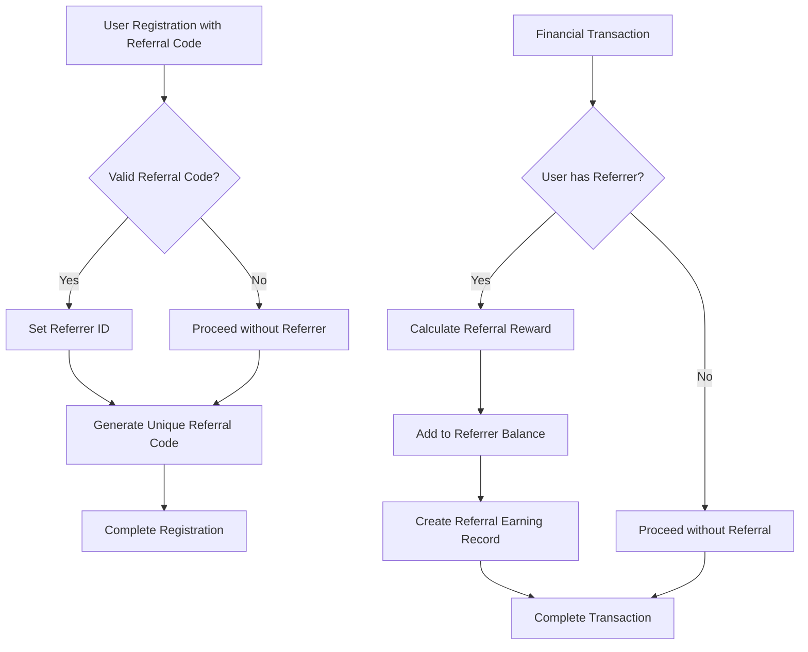
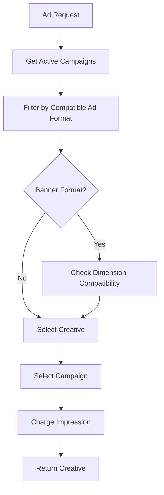

# Integration of The Synapse Network and Extended Ad Formats

## Overview

This document outlines the design for integrating two new systems into the SmartLink core:
1. The Synapse Network - A partner referral system
2. Extended Ad Formats - Support for new advertising formats

The integration will be deep, seamless, and organic, as if these systems were part of our world from the beginning.

## Architecture

### Repository Type
Backend Application (Laravel-based)

### Technology Stack
- PHP 8.4 with Laravel 12 framework
- PostgreSQL 16 database
- Redis 7 for caching and queues
- Docker for containerization

## Part 1: The Synapse Network (Partner System)

### Data Model Modifications

#### User Model Enhancement
Modify the User model to support referral relationships:
- Add `referrer_id` (nullable, foreign key -> users.id) to store the ID of the referring user
- Add `referral_code` (string, unique) as a unique referral code for each user

#### New ReferralEarning Model
Create a new model to track referral earnings:
- Fields:
  - `id` (primary key)
  - `user_id` (foreign key -> users.id) - the user who receives the income
  - `referred_user_id` (foreign key -> users.id) - the user from whom the income was earned
  - `amount` (decimal) - reward amount in USDT
  - `source_transaction_id` (foreign key -> transaction_logs.id) - ID of the source transaction
  - `type` (enum: deposit, ad_spend) - source of the referral income

### Database Schema Changes

#### Migration for User Model
Create a new migration to add referral fields to the users table:
```php
Schema::table('users', function (Blueprint $table) {
    $table->foreignId('referrer_id')->nullable()->constrained('users')->onDelete('set null');
    $table->string('referral_code')->unique()->nullable();
});
```

#### Migration for ReferralEarning Table
Create a new migration for the referral_earnings table:
```php
Schema::create('referral_earnings', function (Blueprint $table) {
    $table->id();
    $table->foreignId('user_id')->constrained()->onDelete('cascade');
    $table->foreignId('referred_user_id')->constrained('users')->onDelete('cascade');
    $table->decimal('amount', 15, 2);
    $table->foreignId('source_transaction_id')->constrained('transaction_logs')->onDelete('cascade');
    $table->enum('type', ['deposit', 'ad_spend']);
    $table->timestamps();
});
```

### Service Layer Implementation

#### ReferralService
Create a new service class to handle referral logic:
- Method `calculateAndDistributeEarnings(Transaction $transaction)`:
  - Check if the user who made the transaction has a referrer_id
  - Calculate the referral reward (e.g., 1% of the transaction amount)
  - Atomically add this amount to the referrer's balance
  - Create a record in the referral_earnings table

### API Endpoints

#### New Referral Endpoints
- `GET /api/profile/referral-stats`:
  - Returns referral statistics for the current user
  - Data includes: referral code, number of referred users, total earnings

### Registration Logic Enhancement

#### AuthController Modification
Update the registration process to handle referral codes:
- Check for referral_code in the registration request
- If valid, find the owner and set their ID as the referrer_id of the new user
- Generate a unique referral_code for the new user

## Part 2: Extended Ad Formats

### Data Model Modifications

#### Creative Model Enhancement
Modify the Creative model to support new ad formats:
- Update `type` enum to include: banner, link, context, creative_image_text
- Modify `content` field to be JSONB and have different structures based on type:
  - banner: `{ "image_url": "...", "target_url": "..." }`
  - link: `{ "text": "...", "target_url": "..." }`
  - context: `{ "title": "...", "description": "...", "target_url": "..." }`
  - creative_image_text: `{ "image_url": "...", "title": "...", "description": "...", "target_url": "..." }`

#### AdSlot Model Enhancement
Modify the AdSlot model to align with new ad formats:
- Rename `format` field to `type` to match creative types
- Add `dimensions` (JSONB, nullable) field for banner dimensions: `{ "width": 468, "height": 60 }`

### Database Schema Changes

#### Migration for Creative Model
Update the creatives table migration:
```php
Schema::table('creatives', function (Blueprint $table) {
    $table->string('type')->change(); // Update enum values
    $table->jsonb('content')->change(); // Change to JSONB
});
```

#### Migration for AdSlot Model
Update the ad_slots table migration:
```php
Schema::table('ad_slots', function (Blueprint $table) {
    $table->renameColumn('format', 'type');
    $table->jsonb('dimensions')->nullable();
});
```

### Service Layer Implementation

#### AdSlotService Enhancement
Update the AdSlotService to handle new ad formats:
- Modify `processAdRequest` method to:
  - Ensure the creative type in a campaign matches the ad slot type
  - For banners, verify that creative dimensions match ad slot dimensions
- Update campaign selection logic to consider format compatibility

### Validation Enhancement

#### ValidationService Update
Update validation rules in the ValidationService:
- Modify creative validation to require different fields in content based on selected type
- Add validation for ad slot dimensions when type is banner

### API Controller Updates

#### CreativeController Enhancement
Update the CreativeController to handle new ad formats:
- Update validation logic for different creative types
- Ensure proper handling of JSON content based on type

## Business Logic Layer

### Referral System Workflow



### Ad Format Matching Workflow



## API Endpoints Reference

### Referral System Endpoints
| Method | Endpoint | Description | Authentication |
|--------|----------|-------------|----------------|
| GET | `/api/profile/referral-stats` | Get referral statistics for current user | Required |

### Creative Management Endpoints
Existing endpoints in `CreativeController` will be updated to support new ad formats:
- `GET /api/campaigns/{campaign}/creatives` - List creatives
- `POST /api/campaigns/{campaign}/creatives` - Create creative
- `GET /api/creatives/{creative}` - Get creative details
- `PUT /api/creatives/{creative}` - Update creative
- `DELETE /api/creatives/{creative}` - Delete creative

## Data Models & ORM Mapping

### Updated User Model
```php
class User extends Authenticatable
{
    // Existing fields...
    
    // New referral fields
    protected $fillable = [
        // ... existing fields
        'referrer_id',
        'referral_code',
    ];
    
    protected $casts = [
        // ... existing casts
        'balance' => 'decimal:2',
        'frozen_balance' => 'decimal:2',
    ];
    
    // Relationships
    public function referrer()
    {
        return $this->belongsTo(User::class, 'referrer_id');
    }
    
    public function referrals()
    {
        return $this->hasMany(User::class, 'referrer_id');
    }
    
    public function referralEarnings()
    {
        return $this->hasMany(ReferralEarning::class);
    }
}
```

### New ReferralEarning Model
```php
class ReferralEarning extends Model
{
    protected $fillable = [
        'user_id',
        'referred_user_id',
        'amount',
        'source_transaction_id',
        'type',
    ];
    
    protected $casts = [
        'amount' => 'decimal:2',
    ];
    
    // Relationships
    public function user()
    {
        return $this->belongsTo(User::class);
    }
    
    public function referredUser()
    {
        return $this->belongsTo(User::class, 'referred_user_id');
    }
    
    public function sourceTransaction()
    {
        return $this->belongsTo(TransactionLog::class, 'source_transaction_id');
    }
}
```

### Updated Creative Model
```php
class Creative extends Model
{
    protected $fillable = [
        'campaign_id',
        'name',
        'type',
        'content',
        'url',
        'is_active',
    ];
    
    protected $casts = [
        'is_active' => 'boolean',
        'content' => 'array', // Changed to array for JSON handling
    ];
    
    // Updated type constants
    const TYPE_BANNER = 'banner';
    const TYPE_LINK = 'link';
    const TYPE_CONTEXT = 'context';
    const TYPE_CREATIVE_IMAGE_TEXT = 'creative_image_text';
    
    public static function getAvailableTypes()
    {
        return [
            self::TYPE_BANNER,
            self::TYPE_LINK,
            self::TYPE_CONTEXT,
            self::TYPE_CREATIVE_IMAGE_TEXT,
        ];
    }
}
```

### Updated AdSlot Model
```php
class AdSlot extends Model
{
    protected $fillable = [
        'site_id',
        'name',
        'type', // Renamed from format
        'dimensions',
        'price_per_click',
        'price_per_impression',
        'is_active',
    ];
    
    protected $casts = [
        'price_per_click' => 'decimal:4',
        'price_per_impression' => 'decimal:4',
        'is_active' => 'boolean',
        'dimensions' => 'array', // Added for JSON handling
    ];
}
```

## Middleware & Interceptors

### Referral Tracking Middleware
Create middleware to track referral codes in sessions:
- Store referral codes from URL parameters in user sessions
- Apply to marketing landing pages

## Testing Strategy

### Unit Tests
1. ReferralService unit tests:
   - Test referral reward calculation
   - Test balance updates
   - Test referral earning record creation

2. ValidationService unit tests:
   - Test new creative validation rules
   - Test ad slot dimension validation

### Feature Tests
1. Referral system feature tests:
   - Test registration with referral code
   - Test referral reward distribution
   - Test referral statistics endpoint

2. Ad format feature tests:
   - Test creation of different creative types
   - Test ad slot matching logic
   - Test dimension validation for banners

### Integration Tests
1. End-to-end referral workflow:
   - User registration with referral
   - Financial transaction
   - Referral reward distribution

2. Ad serving integration:
   - Ad request with format matching
   - Dimension validation
   - Creative delivery

## Success Criteria

1. Users registering with a referral code are properly linked to their referrer
2. When a referred user makes a purchase, the referrer automatically receives a percentage to their balance
3. Users can create 4 different ad types through the API, with proper validation and storage
4. The ad engine correctly matches and serves ads based on type and dimensions