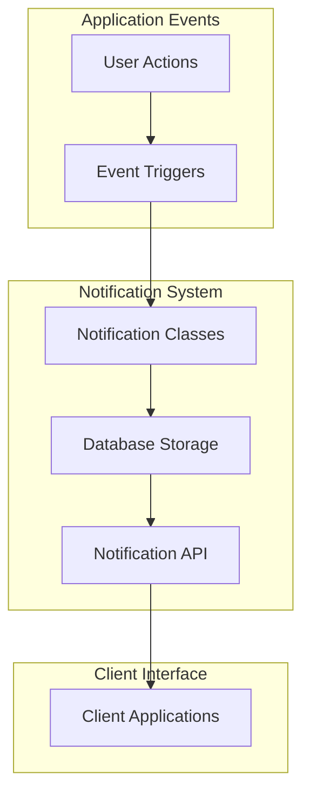

# Notification System Implementation

## Overview

This document outlines the implementation of a Notification System for the SmartLink server application. The system will provide notifications for key events such as campaign budget warnings, balance top-ups, and withdrawal approvals. The implementation will leverage Laravel's built-in notification system with database storage and API endpoints for retrieving and marking notifications as read.

## Architecture

The notification system will follow Laravel's standard notification architecture with the following components:

1. **Notification Classes** - Custom notification classes for each event type
2. **Database Storage** - Using Laravel's built-in notifications table
3. **API Endpoints** - RESTful endpoints for retrieving and managing notifications
4. **Notification Controller** - Handles API requests for notifications
5. **Database Migration** - Creates the notifications table

### System Components



## Notification Types

### 1. CampaignBudgetWarning
Triggered when a campaign's budget is running low (e.g., 80% spent)

### 2. BalanceTopUpSuccess
Triggered when a user successfully tops up their account balance

### 3. WithdrawalApproved
Triggered when a user's withdrawal request is approved

## Database Schema

### Notifications Table
The notifications table will use Laravel's standard schema:

| Column | Type | Description |
|--------|------|-------------|
| id | UUID | Primary key |
| type | String | Notification class type |
| notifiable_type | String | Notifiable entity type |
| notifiable_id | Big Integer | Notifiable entity ID |
| data | Text (JSON) | Notification data |
| read_at | Timestamp | When notification was read |
| created_at | Timestamp | Creation timestamp |
| updated_at | Timestamp | Last update timestamp |

## API Endpoints

### GET /api/notifications
Retrieve all notifications for the authenticated user

**Response:**
```json
{
  "data": [
    {
      "id": "910a77b0-4f9d-4d7b-9f0a-1b1c7d8e9f0a",
      "type": "App\\Notifications\\CampaignBudgetWarning",
      "data": {
        "campaign_id": 1,
        "campaign_name": "Summer Sale",
        "remaining_budget": 200.00,
        "spent_percentage": 80
      },
      "read_at": null,
      "created_at": "2025-09-01T12:00:00.000000Z"
    }
  ]
}
```

### POST /api/notifications/{id}/read
Mark a notification as read

**Response:**
```json
{
  "message": "Notification marked as read"
}
```

## Implementation Plan

Before implementing the notification system, we need to ensure the notifications table exists in the database. Since we verified that the migration already exists, we just need to run it:

### Step 1: Run Database Migration
Run the existing notifications table migration using Docker:

```bash
docker-compose exec smartlink-app php artisan migrate
```

This will create the `notifications` table in the database with the following schema:

| Column | Type | Description |
|--------|------|-------------|
| id | UUID | Primary key |
| type | String | Notification class type |
| notifiable_type | String | Notifiable entity type |
| notifiable_id | Big Integer | Notifiable entity ID |
| data | Text (JSON) | Notification data |
| read_at | Timestamp | When notification was read |
| created_at | Timestamp | Creation timestamp |
| updated_at | Timestamp | Last update timestamp |

### Step 2: Create Notification Classes
Create three new notification classes in the `app/Notifications` directory:

**File: app/Notifications/CampaignBudgetWarning.php**
```php
<?php

namespace App\Notifications;

use Illuminate\Bus\Queueable;
use Illuminate\Notifications\Notification;
use App\Models\Campaign;

class CampaignBudgetWarning extends Notification
{
    use Queueable;

    protected $campaign;
    protected $remainingBudget;
    protected $spentPercentage;

    /**
     * Create a new notification instance.
     */
    public function __construct(Campaign $campaign, $remainingBudget, $spentPercentage)
    {
        $this->campaign = $campaign;
        $this->remainingBudget = $remainingBudget;
        $this->spentPercentage = $spentPercentage;
    }

    /**
     * Get the notification's delivery channels.
     */
    public function via($notifiable): array
    {
        return ['database'];
    }

    /**
     * Get the array representation of the notification.
     */
    public function toArray($notifiable): array
    {
        return [
            'campaign_id' => $this->campaign->id,
            'campaign_name' => $this->campaign->name,
            'remaining_budget' => $this->remainingBudget,
            'spent_percentage' => $this->spentPercentage,
        ];
    }
}
```

**File: app/Notifications/BalanceTopUpSuccess.php**
```php
<?php

namespace App\Notifications;

use Illuminate\Bus\Queueable;
use Illuminate\Notifications\Notification;

class BalanceTopUpSuccess extends Notification
{
    use Queueable;

    protected $amount;
    protected $newBalance;

    /**
     * Create a new notification instance.
     */
    public function __construct($amount, $newBalance)
    {
        $this->amount = $amount;
        $this->newBalance = $newBalance;
    }

    /**
     * Get the notification's delivery channels.
     */
    public function via($notifiable): array
    {
        return ['database'];
    }

    /**
     * Get the array representation of the notification.
     */
    public function toArray($notifiable): array
    {
        return [
            'amount' => $this->amount,
            'new_balance' => $this->newBalance,
        ];
    }
}
```

**File: app/Notifications/WithdrawalApproved.php**
```php
<?php

namespace App\Notifications;

use Illuminate\Bus\Queueable;
use Illuminate\Notifications\Notification;
use App\Models\Withdrawal;

class WithdrawalApproved extends Notification
{
    use Queueable;

    protected $withdrawal;

    /**
     * Create a new notification instance.
     */
    public function __construct(Withdrawal $withdrawal)
    {
        $this->withdrawal = $withdrawal;
    }

    /**
     * Get the notification's delivery channels.
     */
    public function via($notifiable): array
    {
        return ['database'];
    }

    /**
     * Get the array representation of the notification.
     */
    public function toArray($notifiable): array
    {
        return [
            'withdrawal_id' => $this->withdrawal->id,
            'amount' => $this->withdrawal->amount,
            'processed_at' => $this->withdrawal->processed_at,
        ];
    }
}
```

### Step 3: Create Notification Controller
Create `NotificationController` with methods for retrieving and managing notifications. This will be a new controller in the `app/Http/Controllers/Api` directory:

**File: app/Http/Controllers/Api/NotificationController.php**
```php
<?php

namespace App\Http\Controllers\Api;

use App\Http\Controllers\Controller;
use Illuminate\Http\Request;
use Illuminate\Support\Facades\Auth;
use Illuminate\Support\Facades\Validator;

class NotificationController extends Controller
{
    /**
     * Display a listing of the resource.
     */
    public function index(Request $request)
    {
        $validator = Validator::make($request->all(), [
            'per_page' => 'integer|min:1|max:100',
        ]);

        if ($validator->fails()) {
            return response()->json(['errors' => $validator->errors()], 422);
        }

        $perPage = $request->get('per_page', 20);
        $notifications = Auth::user()->notifications()->paginate($perPage);
        
        return response()->json($notifications);
    }

    /**
     * Mark a notification as read.
     */
    public function markAsRead($id)
    {
        $notification = Auth::user()->notifications()->find($id);
        
        if (!$notification) {
            return response()->json(['message' => 'Notification not found'], 404);
        }
        
        if ($notification->read_at === null) {
            $notification->markAsRead();
        }
        
        return response()->json([
            'message' => 'Notification marked as read'
        ]);
    }

    /**
     * Mark all notifications as read.
     */
    public function markAllAsRead()
    {
        Auth::user()->unreadNotifications()->update(['read_at' => now()]);
        
        return response()->json([
            'message' => 'All notifications marked as read'
        ]);
    }
}
```

### Step 4: Register API Routes
Add notification routes to `routes/api.php` within the authenticated middleware group. Add these routes to the existing authenticated routes section:

```php
// Notification routes
Route::get('/notifications', [App\Http\Controllers\Api\NotificationController::class, 'index']);
Route::post('/notifications/{id}/read', [App\Http\Controllers\Api\NotificationController::class, 'markAsRead']);
Route::post('/notifications/read-all', [App\Http\Controllers\Api\NotificationController::class, 'markAllAsRead']);
```

### Step 5: Add Notification Triggers
Integrate notification triggers in existing services. We need to add notification calls to the appropriate places in the existing codebase:

#### Campaign Budget Monitoring
In **app/Jobs/BudgetMonitoringJob.php**, add notification when campaign budget reaches threshold:

```php
// After checking if budget is low
if ($remainingBudget <= $campaign->budget * 0.2) { // 20% remaining
    $campaign->user->notify(new CampaignBudgetWarning(
        $campaign, 
        $remainingBudget, 
        $spentPercentage
    ));
}
```

#### Financial Transactions
In **app/Services/FinancialService.php**, add notification after successful deposit:

```php
// After successful deposit
$user->notify(new BalanceTopUpSuccess($amount, $user->balance));
```

#### Withdrawal Processing
In the withdrawal approval process (likely in **app/Services/FinancialService.php** or a dedicated withdrawal service), add notification when withdrawal is approved:

```php
// After withdrawal approval
$withdrawal->user->notify(new WithdrawalApproved($withdrawal));
```

## Integration Points

### Campaign Budget Monitoring
Integrate with `BudgetMonitoringJob` to check campaign budgets and send warnings when thresholds are reached.

### Financial Transactions
Integrate with `FinancialService` to send notifications after successful deposits.

### Withdrawal Processing
Integrate with withdrawal approval process to notify users when their withdrawals are approved.

## Testing Strategy

After implementing the notification system, we need to run tests to ensure everything works correctly. All tests should be run using Docker commands:

### Unit Tests
1. Test each notification class's `toArray()` method
2. Test notification controller methods
3. Test notification triggers in services

### Feature Tests
Create feature tests in the **tests/Feature** directory and run them using Docker:

```bash
docker-compose exec smartlink-app php artisan test --filter=NotificationTest
```

**File: tests/Feature/NotificationTest.php**
```php
<?php

namespace Tests\Feature;

use App\Models\User;
use App\Notifications\CampaignBudgetWarning;
use App\Notifications\BalanceTopUpSuccess;
use App\Notifications\WithdrawalApproved;
use Illuminate\Foundation\Testing\RefreshDatabase;
use Tests\TestCase;

class NotificationTest extends TestCase
{
    use RefreshDatabase;

    protected $user;

    protected function setUp(): void
    {
        parent::setUp();
        $this->user = User::factory()->create();
    }

    /** @test */
    public function user_can_retrieve_their_notifications()
    {
        // Create some notifications
        $this->user->notify(new BalanceTopUpSuccess(100.00, 500.00));
        $this->user->notify(new WithdrawalApproved(
            // Mock withdrawal object
        ));

        $response = $this->actingAs($this->user, 'sanctum')
                        ->get('/api/notifications');

        $response->assertStatus(200)
                 ->assertJsonStructure([
                     'data',
                     'links',
                     'meta'
                 ]);
    }

    /** @test */
    public function user_can_mark_notification_as_read()
    {
        // Create a notification
        $this->user->notify(new BalanceTopUpSuccess(100.00, 500.00));
        $notification = $this->user->notifications->first();

        $response = $this->actingAs($this->user, 'sanctum')
                        ->post("/api/notifications/{$notification->id}/read");

        $response->assertStatus(200)
                 ->assertJson([
                     'message' => 'Notification marked as read'
                 ]);

        $this->assertNotNull($notification->fresh()->read_at);
    }

    /** @test */
    public function user_cannot_access_other_users_notifications()
    {
        // Create another user with notification
        $otherUser = User::factory()->create();
        $otherUser->notify(new BalanceTopUpSuccess(100.00, 500.00));
        $notification = $otherUser->notifications->first();

        $response = $this->actingAs($this->user, 'sanctum')
                        ->post("/api/notifications/{$notification->id}/read");

        $response->assertStatus(404);
    }
}
```

### Unit Tests
Create unit tests in the **tests/Unit** directory and run them using Docker:

```bash
docker-compose exec smartlink-app php artisan test --filter=NotificationsTest
```

**File: tests/Unit/NotificationsTest.php**
```php
<?php

namespace Tests\Unit;

use App\Models\User;
use App\Models\Campaign;
use App\Models\Withdrawal;
use App\Notifications\CampaignBudgetWarning;
use App\Notifications\BalanceTopUpSuccess;
use App\Notifications\WithdrawalApproved;
use Illuminate\Foundation\Testing\RefreshDatabase;
use Tests\TestCase;

class NotificationsTest extends TestCase
{
    use RefreshDatabase;

    /** @test */
    public function campaign_budget_warning_notification_data_is_correct()
    {
        $user = User::factory()->create();
        $campaign = Campaign::factory()->create([
            'user_id' => $user->id,
            'name' => 'Test Campaign',
            'budget' => 1000.00,
        ]);

        $notification = new CampaignBudgetWarning($campaign, 200.00, 80);
        $data = $notification->toArray($user);

        $this->assertEquals([
            'campaign_id' => $campaign->id,
            'campaign_name' => 'Test Campaign',
            'remaining_budget' => 200.00,
            'spent_percentage' => 80,
        ], $data);
    }

    /** @test */
    public function balance_top_up_success_notification_data_is_correct()
    {
        $user = User::factory()->create();
        $notification = new BalanceTopUpSuccess(100.00, 500.00);
        $data = $notification->toArray($user);

        $this->assertEquals([
            'amount' => 100.00,
            'new_balance' => 500.00,
        ], $data);
    }

    /** @test */
    public function withdrawal_approved_notification_data_is_correct()
    {
        $user = User::factory()->create();
        $withdrawal = Withdrawal::factory()->create([
            'user_id' => $user->id,
            'amount' => 100.00,
        ]);

        $notification = new WithdrawalApproved($withdrawal);
        $data = $notification->toArray($user);

        $this->assertEquals([
            'withdrawal_id' => $withdrawal->id,
            'amount' => 100.00,
            'processed_at' => $withdrawal->processed_at,
        ], $data);
    }
}
```

## Security Considerations

1. All notification endpoints will be protected by authentication middleware
2. Users can only access their own notifications
3. Input validation will be implemented for all API endpoints
4. Rate limiting will be applied to notification endpoints

## Deployment

After implementing and testing the notification system, deploy the changes using Docker:

1. Rebuild the Docker containers if necessary:
   ```bash
   docker-compose build
   ```

2. Run the migration to create the notifications table:
   ```bash
   docker-compose exec smartlink-app php artisan migrate
   ```

3. Restart the containers:
   ```bash
   docker-compose down
   docker-compose up -d
   ```

## Performance Considerations

1. Database indexes on notifications table for efficient querying
2. Pagination for notification lists
3. Soft deletes for notifications (if needed)
4. Regular cleanup of old notifications (optional)