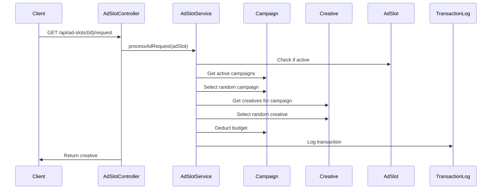
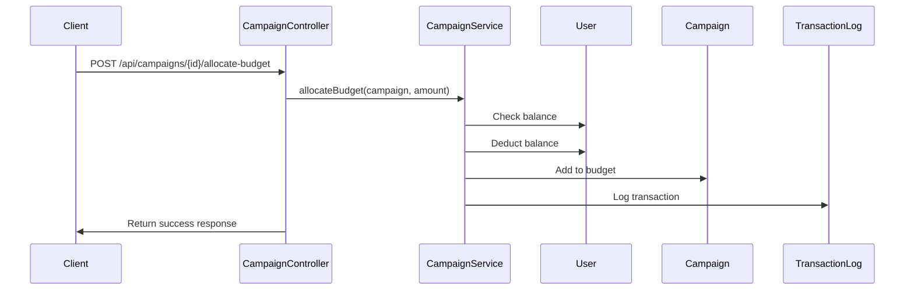

# SmartLink Server Project Analysis

## 1. Overview

The SmartLink Server is a Laravel-based backend application that implements an advertising platform with financial management capabilities. The system allows users to create advertising campaigns, associate them with ad slots on their websites, and manage their advertising budgets. The platform also includes financial features such as deposits, withdrawals, and transaction tracking.

## 2. Architecture

The system follows a traditional MVC architecture with additional service and job layers:

```
┌─────────────────┐    ┌──────────────────┐    ┌──────────────────┐
│   Controllers   │────│    Services      │────│      Models      │
│ (API Handling)  │    │ (Business Logic) │    │ (Data Structure) │
└─────────────────┘    └──────────────────┘    └──────────────────┘
         │                       │                       │
         ▼                       ▼                       ▼
┌─────────────────┐    ┌──────────────────┐    ┌──────────────────┐
│   Middleware    │    │      Jobs        │    │   Database       │
│ (Authorization) │    │ (Background      │    │ (PostgreSQL)     │
│                 │    │  Processing)     │    │                  │
└─────────────────┘    └──────────────────┘    └──────────────────┘
```

### Key Components:

1. **Models**: Represent the data entities and their relationships
2. **Controllers**: Handle API requests and responses
3. **Services**: Implement business logic
4. **Middleware**: Handle authentication and authorization
5. **Jobs**: Perform background tasks
6. **Database**: PostgreSQL with migrations for schema management

## 3. Data Models & ORM Mapping

### 3.1 User Model
Represents platform users with financial capabilities:
- Attributes: id, name, email, password, balance, frozen_balance
- Relationships: 
  - hasMany Sites
  - hasMany Campaigns
  - hasMany Creatives

### 3.2 Site Model
Represents websites owned by users:
- Attributes: id, user_id, url, name, is_active
- Relationships:
  - belongsTo User
  - hasMany AdSlots

### 3.3 AdSlot Model
Represents advertising spaces on websites:
- Attributes: id, site_id, name, size, price_per_click, price_per_impression, is_active
- Relationships:
  - belongsTo Site
  - belongsToMany Campaigns

### 3.4 Campaign Model
Represents advertising campaigns:
- Attributes: id, user_id, name, description, budget, spent, start_date, end_date, is_active
- Relationships:
  - belongsTo User
  - hasMany Creatives
  - belongsToMany AdSlots

### 3.5 Creative Model
Represents advertising content:
- Attributes: id, campaign_id, name, type, content, is_active
- Relationships:
  - belongsTo Campaign

### 3.6 Financial Models
- **Withdrawal**: Tracks withdrawal requests with status (pending, approved, rejected, processed)
- **TransactionLog**: Records all financial transactions for auditing

## 4. Business Logic Layer

### 4.1 Campaign Management
Campaigns represent advertising campaigns that users create to promote their content:

1. **Creation**: Users create campaigns with a name, description, budget, start date, and optional end date
2. **Budget Allocation**: Users can allocate funds from their balance to campaigns
3. **Activation**: Campaigns can be activated if they have sufficient budget and are within their date range
4. **Deactivation**: Campaigns can be manually deactivated or automatically deactivated when:
   - Budget is exhausted
   - End date has passed
5. **Budget Management**: 
   - Budget is deducted as ads are served
   - Unused budget is returned to user balance when campaign ends

### 4.2 Ad Serving Logic
The system serves ads through the following process:

1. **Ad Request**: A request comes to an ad slot endpoint
2. **Validation**: System checks if ad slot and site are active
3. **Campaign Selection**: System selects from active campaigns associated with the ad slot that have budget
4. **Creative Selection**: System randomly selects an active creative from the selected campaign
5. **Charging**: System deducts the impression cost from the campaign budget
6. **Response**: System returns the creative to be displayed

### 4.3 Financial Management
Users can manage their funds through deposits and withdrawals:

1. **Deposits**: 
   - Processed through Payeer payment gateway
   - Webhook endpoint updates user balance
2. **Withdrawals**:
   - Users request withdrawals which freeze the amount
   - Admins can approve/reject withdrawals
   - Approved withdrawals are processed and funds deducted
   - Rejected withdrawals unfreeze the amount

### 4.4 Background Jobs
The system uses background jobs for maintenance tasks:

1. **Budget Monitoring**: Checks campaigns with low budget and deactivates those with exhausted budgets
2. **Campaign Deactivation**: Automatically deactivates expired campaigns and returns unused budget

## 5. API Endpoints Reference

### 5.1 Site Management
```
GET    /api/sites                  # List user's sites
POST   /api/sites                  # Create a new site
GET    /api/sites/{site}           # Get a specific site
PUT    /api/sites/{site}           # Update a site
DELETE /api/sites/{site}           # Delete a site
```

### 5.2 Ad Slot Management
```
GET    /api/sites/{site}/ad-slots              # List ad slots for a site
POST   /api/sites/{site}/ad-slots              # Create an ad slot
GET    /api/sites/{site}/ad-slots/{adSlot}     # Get an ad slot
PUT    /api/sites/{site}/ad-slots/{adSlot}     # Update an ad slot
DELETE /api/sites/{site}/ad-slots/{adSlot}     # Delete an ad slot
POST   /api/ad-slots/{adSlot}/request          # Request an ad (public)
```

### 5.3 Campaign Management
```
GET    /api/campaigns                          # List user's campaigns
POST   /api/campaigns                          # Create a new campaign
GET    /api/campaigns/{campaign}               # Get a campaign
PUT    /api/campaigns/{campaign}               # Update a campaign
DELETE /api/campaigns/{campaign}               # Delete a campaign
POST   /api/campaigns/{campaign}/allocate-budget # Allocate budget
POST   /api/campaigns/{campaign}/activate      # Activate campaign
POST   /api/campaigns/{campaign}/deactivate    # Deactivate campaign
```

### 5.4 Creative Management
```
GET    /api/campaigns/{campaign}/creatives     # List creatives for a campaign
POST   /api/campaigns/{campaign}/creatives     # Create a creative
GET    /api/campaigns/{campaign}/creatives/{creative} # Get a creative
PUT    /api/campaigns/{campaign}/creatives/{creative} # Update a creative
DELETE /api/campaigns/{campaign}/creatives/{creative} # Delete a creative
```

### 5.5 Financial Operations
```
POST   /api/deposit                    # Deposit funds
POST   /api/withdraw                   # Request withdrawal
POST   /api/deposit/payeer-webhook     # Payeer payment notification (public)
```

## 6. Middleware & Interceptors

The system uses middleware for authentication and ownership validation:

1. **Authentication**: `auth:sanctum` middleware ensures only authenticated users can access protected endpoints
2. **Ownership Validation**:
   - `site.owner`: Validates that the user owns the site they're trying to access
   - `campaign.owner`: Validates that the user owns the campaign they're trying to access
   - Custom middleware for ad slots and creatives that validate ownership through their parent entities

## 7. Data Flow Between Components

### 7.1 Ad Serving Flow


### 7.2 Campaign Budget Allocation Flow


## 8. Testing

The system includes both unit and feature tests:

### 8.1 Unit Tests
- Middleware tests for ownership validation
- Model method tests for business logic

### 8.2 Feature Tests
- Ad slot operations
- Campaign operations
- Financial operations

Tests ensure that:
1. Business rules are properly enforced
2. Authorization is correctly implemented
3. Financial operations are atomic and consistent
4. Error conditions are properly handled