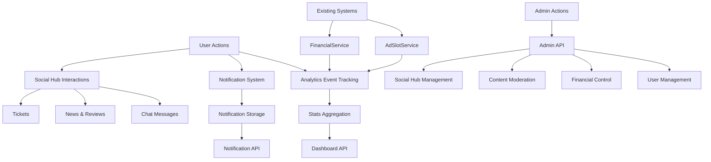

# SmartLink Core Modernization Design Document

## 1. Overview

This document outlines the design for the SmartLink Core Modernization project, which aims to transform the existing platform into a fully managed Pro-ecosystem by integrating social, analytical, and administrative modules. The modernization follows the "Citadel Construction and Communication Establishment" concept, building a secure fortress for administrators while creating vibrant spaces for users.

### Objectives
- Implement comprehensive analytics tracking and dashboard capabilities
- Establish real-time communication systems including chat and notifications
- Create social hubs with news, reviews, and ticketing systems
- Develop a robust administrative interface with full control capabilities
- Ensure all components are seamlessly integrated into the existing Laravel architecture

## 2. Technology Stack & Dependencies

- **Backend Framework**: Laravel 11 (PHP 8.4)
- **Database**: PostgreSQL (via Docker)
- **Real-time Communication**: Laravel Echo with Soketi/Redis
- **Containerization**: Docker
- **Frontend Asset Compilation**: Vite with TailwindCSS
- **Testing**: PHPUnit for feature and unit tests

## 3. Architecture Overview

The modernization follows the existing Laravel MVC architecture with additional layers for real-time communication and analytics. The system is organized into three main modules:

1. **Analytics Module**: Tracks user interactions, campaign performance, and financial transactions
2. **Social Hub Module**: Facilitates user interaction through chat, news, reviews, and support tickets
3. **Admin Module**: Provides comprehensive administrative controls with role-based access

All modules integrate with the existing user, campaign, and financial systems while maintaining data consistency and security.

## 4. Analytics Module

### 4.1 AnalyticsEvent Model

The AnalyticsEvent model will track all significant user interactions and system events.

#### Database Migration
```php
Schema::create('analytics_events', function (Blueprint $table) {
    $table->id();
    $table->foreignId('user_id')->constrained()->onDelete('cascade');
    $table->enum('type', ['impression', 'click', 'spend', 'earning']);
    $table->unsignedBigInteger('related_id');
    $table->string('related_type'); // 'campaign', 'site', etc.
    $table->decimal('cost', 15, 4)->nullable();
    $table->timestamps();
    
    // Indexes for performance
    $table->index(['user_id', 'type']);
    $table->index(['related_id', 'related_type']);
    $table->index('created_at');
});
```

#### Model Implementation
```php
namespace App\Models;

use Illuminate\Database\Eloquent\Model;

class AnalyticsEvent extends Model
{
    protected $fillable = [
        'user_id',
        'type',
        'related_id',
        'related_type',
        'cost',
    ];
    
    protected $casts = [
        'cost' => 'decimal:4',
    ];
    
    public function user()
    {
        return $this->belongsTo(User::class);
    }
    
    public function related()
    {
        return $this->morphTo();
    }
    
    // Scope methods for filtering
    public function scopeForUser($query, $userId)
    {
        return $query->where('user_id', $userId);
    }
    
    public function scopeOfType($query, $type)
    {
        return $query->where('type', $type);
    }
    
    public function scopeForPeriod($query, $startDate, $endDate)
    {
        return $query->whereBetween('created_at', [$startDate, $endDate]);
    }
}
```

### 4.2 Integration Points

#### AdSlotService Integration
- Track impressions when ads are displayed
- Track clicks when users interact with ads

In `AdSlotService.php`, add methods to create analytics events:
```php
public function trackImpression($userId, $campaignId, $cost)
{
    AnalyticsEvent::create([
        'user_id' => $userId,
        'type' => 'impression',
        'related_id' => $campaignId,
        'related_type' => 'campaign',
        'cost' => $cost,
    ]);
}

public function trackClick($userId, $campaignId, $cost)
{
    AnalyticsEvent::create([
        'user_id' => $userId,
        'type' => 'click',
        'related_id' => $campaignId,
        'related_type' => 'campaign',
        'cost' => $cost,
    ]);
}
```

#### Financial Services Integration
- Track spending when campaign budgets are deducted
- Track earnings when users receive payments

In `FinancialService.php`, add methods to create analytics events:
```php
public function trackSpending($userId, $campaignId, $amount)
{
    AnalyticsEvent::create([
        'user_id' => $userId,
        'type' => 'spend',
        'related_id' => $campaignId,
        'related_type' => 'campaign',
        'cost' => $amount,
    ]);
}

public function trackEarning($userId, $siteId, $amount)
{
    AnalyticsEvent::create([
        'user_id' => $userId,
        'type' => 'earning',
        'related_id' => $siteId,
        'related_type' => 'site',
        'cost' => $amount,
    ]);
}
```

### 4.3 StatsController API

#### Controller Implementation
```php
namespace App\Http\Controllers\Api;

use App\Models\AnalyticsEvent;
use Illuminate\Http\Request;
use Illuminate\Support\Facades\DB;

class StatsController extends Controller
{
    public function dashboard(Request $request)
    {
        $period = $request->input('period', 'month');
        $userId = auth()->id();
        
        // Determine date range based on period
        $startDate = $this->getStartDateForPeriod($period);
        
        // Get aggregated statistics
        $stats = AnalyticsEvent::forUser($userId)
            ->forPeriod($startDate, now())
            ->select('type', DB::raw('COUNT(*) as count'), DB::raw('SUM(cost) as total'))
            ->groupBy('type')
            ->get()
            ->keyBy('type');
        
        // Calculate specific metrics
        $impressions = $stats->get('impression', (object)['count' => 0, 'total' => 0]);
        $clicks = $stats->get('click', (object)['count' => 0, 'total' => 0]);
        $spend = $stats->get('spend', (object)['count' => 0, 'total' => 0]);
        $earnings = $stats->get('earning', (object)['count' => 0, 'total' => 0]);
        
        // Calculate CTR
        $ctr = $impressions->count > 0 ? ($clicks->count / $impressions->count) * 100 : 0;
        
        return response()->json([
            'revenue' => $earnings->total,
            'spend' => $spend->total,
            'impressions' => $impressions->count,
            'clicks' => $clicks->count,
            'ctr' => round($ctr, 2),
        ]);
    }
    
    private function getStartDateForPeriod($period)
    {
        switch ($period) {
            case 'today':
                return now()->startOfDay();
            case 'week':
                return now()->startOfWeek();
            case 'year':
                return now()->startOfYear();
            case 'month':
            default:
                return now()->startOfMonth();
        }
    }
}
```

#### Endpoint: GET /api/stats/dashboard
- **Parameters**: `period` (today, week, month, year)
- **Response**: Aggregated statistics for the authenticated user
  - Revenue (total earnings)
  - Spend (total campaign costs)
  - Impressions (total ad displays)
  - Clicks (total ad interactions)
  - CTR (Click-Through Rate)
  
#### Route Definition
```php
Route::middleware('auth:sanctum')->group(function () {
    Route::get('/stats/dashboard', [StatsController::class, 'dashboard']);
});
```

## 5. Notification System

### 5.1 Notification Types

#### CampaignBudgetWarning
Triggered when a campaign's budget is running low (80% consumed).

```php
namespace App\Notifications;

use Illuminate\Bus\Queueable;
use Illuminate\Notifications\Notification;
use App\Models\Campaign;

class CampaignBudgetWarning extends Notification
{
    use Queueable;
    
    protected $campaign;
    
    public function __construct(Campaign $campaign)
    {
        $this->campaign = $campaign;
    }
    
    public function via($notifiable): array
    {
        return ['database'];
    }
    
    public function toArray($notifiable): array
    {
        return [
            'campaign_id' => $this->campaign->id,
            'campaign_name' => $this->campaign->name,
            'budget_used' => $this->campaign->spent,
            'budget_total' => $this->campaign->budget,
            'percentage_used' => $this->campaign->getSpentPercentage(),
        ];
    }
}
```

#### BalanceTopUpSuccess
Triggered when a user successfully deposits funds.

```php
namespace App\Notifications;

use Illuminate\Bus\Queueable;
use Illuminate\Notifications\Notification;

class BalanceTopUpSuccess extends Notification
{
    use Queueable;
    
    protected $amount;
    protected $transactionId;
    
    public function __construct($amount, $transactionId)
    {
        $this->amount = $amount;
        $this->transactionId = $transactionId;
    }
    
    public function via($notifiable): array
    {
        return ['database'];
    }
    
    public function toArray($notifiable): array
    {
        return [
            'amount' => $this->amount,
            'transaction_id' => $this->transactionId,
            'balance_after' => $notifiable->balance,
        ];
    }
}
```

#### WithdrawalApproved
Triggered when a withdrawal request is approved by an administrator.

```php
namespace App\Notifications;

use Illuminate\Bus\Queueable;
use Illuminate\Notifications\Notification;
use App\Models\Withdrawal;

class WithdrawalApproved extends Notification
{
    use Queueable;
    
    protected $withdrawal;
    
    public function __construct(Withdrawal $withdrawal)
    {
        $this->withdrawal = $withdrawal;
    }
    
    public function via($notifiable): array
    {
        return ['database'];
    }
    
    public function toArray($notifiable): array
    {
        return [
            'withdrawal_id' => $this->withdrawal->id,
            'amount' => $this->withdrawal->amount,
            'processed_at' => $this->withdrawal->processed_at,
        ];
    }
}
```

### 5.2 Notification API Endpoints

#### GET /api/notifications
Retrieve all notifications for the authenticated user.

```php
namespace App\Http\Controllers\Api;

use Illuminate\Http\Request;

class NotificationController extends Controller
{
    public function index(Request $request)
    {
        $notifications = $request->user()
            ->notifications()
            ->paginate(20);
            
        return response()->json($notifications);
    }
}
```

#### POST /api/notifications/{id}/read
Mark a specific notification as read.

```php
public function markAsRead($id)
{
    $notification = auth()->user()
        ->notifications()
        ->where('id', $id)
        ->first();
        
    if ($notification) {
        $notification->markAsRead();
        return response()->json(['message' => 'Notification marked as read']);
    }
    
    return response()->json(['error' => 'Notification not found'], 404);
}
```

#### Route Definitions
```php
Route::middleware('auth:sanctum')->group(function () {
    Route::get('/notifications', [NotificationController::class, 'index']);
    Route::post('/notifications/{id}/read', [NotificationController::class, 'markAsRead']);
});
```

## 6. Social Hub Module

### 6.1 Real-time Chat System

#### ChatMessage Model
```php
Schema::create('chat_messages', function (Blueprint $table) {
    $table->id();
    $table->foreignId('user_id')->constrained()->onDelete('cascade');
    $table->text('message');
    $table->timestamps();
    
    // Indexes for performance
    $table->index('user_id');
    $table->index('created_at');
});
```

#### ChatMessage Model Implementation
```php
namespace App\Models;

use Illuminate\Database\Eloquent\Model;

class ChatMessage extends Model
{
    protected $fillable = [
        'user_id',
        'message',
    ];
    
    public function user()
    {
        return $this->belongsTo(User::class);
    }
    
    // Scope for getting recent messages
    public function scopeRecent($query, $limit = 50)
    {
        return $query->latest()->limit($limit);
    }
}
```

#### Chat API Implementation
```php
namespace App\Http\Controllers\Api;

use App\Models\ChatMessage;
use Illuminate\Http\Request;
use Illuminate\Support\Facades\Broadcast;

class ChatController extends Controller
{
    public function index(Request $request)
    {
        $messages = ChatMessage::with('user')
            ->recent()
            ->get()
            ->sortBy('created_at');
            
        return response()->json($messages);
    }
    
    public function store(Request $request)
    {
        $validated = $request->validate([
            'message' => 'required|string|max:1000',
        ]);
        
        $message = ChatMessage::create([
            'user_id' => auth()->id(),
            'message' => $validated['message'],
        ]);
        
        // Load the user relationship
        $message->load('user');
        
        // Broadcast the message
        broadcast(new \App\Events\MessageSent($message))->toOthers();
        
        return response()->json($message, 201);
    }
}
```

#### Event for Broadcasting
```php
namespace App\Events;

use App\Models\ChatMessage;
use Illuminate\Broadcasting\Channel;
use Illuminate\Broadcasting\InteractsWithSockets;
use Illuminate\Broadcasting\PresenceChannel;
use Illuminate\Contracts\Broadcasting\ShouldBroadcast;

class MessageSent implements ShouldBroadcast
{
    use InteractsWithSockets;
    
    public $message;
    
    public function __construct(ChatMessage $message)
    {
        $this->message = $message;
    }
    
    public function broadcastOn()
    {
        return new Channel('chat');
    }
}
```

#### Chat API Endpoints
- **GET /api/chat/messages**: Retrieve chat message history
- **POST /api/chat/messages**: Send a new chat message
- **WebSocket Broadcasting**: Real-time message delivery via Laravel Echo

### 6.2 News Module

#### News Model
```php
Schema::create('news', function (Blueprint $table) {
    $table->id();
    $table->string('title');
    $table->text('content');
    $table->string('author')->nullable();
    $table->boolean('is_published')->default(false);
    $table->timestamp('published_at')->nullable();
    $table->timestamps();
});
```

#### News Model Implementation
```php
namespace App\Models;

use Illuminate\Database\Eloquent\Model;

class News extends Model
{
    protected $fillable = [
        'title',
        'content',
        'author',
        'is_published',
        'published_at',
    ];
    
    protected $casts = [
        'is_published' => 'boolean',
        'published_at' => 'datetime',
    ];
    
    // Scope for published news
    public function scopePublished($query)
    {
        return $query->where('is_published', true)
                    ->where('published_at', '<=', now());
    }
    
    // Automatically set published_at when publishing
    public function setPublishedAttribute($value)
    {
        $this->attributes['is_published'] = $value;
        if ($value && !$this->published_at) {
            $this->attributes['published_at'] = now();
        }
    }
}
```

#### News API Implementation
```php
namespace App\Http\Controllers\Api;

use App\Models\News;

class NewsController extends Controller
{
    public function index()
    {
        $news = News::published()
            ->latest('published_at')
            ->paginate(10);
            
        return response()->json($news);
    }
}
```

#### News API Endpoint
- **GET /api/news**: Retrieve all published news items

#### Admin News API Implementation
```php
namespace App\Http\Controllers\Api\Admin;

use App\Models\News;
use Illuminate\Http\Request;

class NewsController extends Controller
{
    public function index()
    {
        $news = News::latest()->paginate(20);
        return response()->json($news);
    }
    
    public function store(Request $request)
    {
        $validated = $request->validate([
            'title' => 'required|string|max:255',
            'content' => 'required|string',
            'author' => 'nullable|string|max:255',
            'is_published' => 'boolean',
        ]);
        
        $news = News::create($validated);
        return response()->json($news, 201);
    }
    
    public function update(Request $request, News $news)
    {
        $validated = $request->validate([
            'title' => 'sometimes|required|string|max:255',
            'content' => 'sometimes|required|string',
            'author' => 'nullable|string|max:255',
            'is_published' => 'boolean',
        ]);
        
        $news->update($validated);
        return response()->json($news);
    }
    
    public function destroy(News $news)
    {
        $news->delete();
        return response()->json(['message' => 'News deleted successfully']);
    }
}
```

#### Route Definitions
```php
// Public routes
Route::get('/news', [NewsController::class, 'index']);

// Admin routes
Route::middleware(['auth:sanctum', 'admin'])->group(function () {
    Route::apiResource('admin.news', Admin\NewsController::class);
});
```

### 6.3 Review Module

#### Review Model
```php
Schema::create('reviews', function (Blueprint $table) {
    $table->id();
    $table->foreignId('user_id')->constrained()->onDelete('cascade');
    $table->unsignedBigInteger('related_id'); // ID of the entity being reviewed
    $table->string('related_type'); // Type of entity (campaign, site, etc.)
    $table->tinyInteger('rating')->unsigned(); // 1-5 rating
    $table->text('comment')->nullable();
    $table->boolean('is_approved')->default(false);
    $table->timestamps();
    
    // Indexes for performance
    $table->index(['related_id', 'related_type']);
    $table->index('user_id');
});
```

#### Review Model Implementation
```php
namespace App\Models;

use Illuminate\Database\Eloquent\Model;

class Review extends Model
{
    protected $fillable = [
        'user_id',
        'related_id',
        'related_type',
        'rating',
        'comment',
        'is_approved',
    ];
    
    protected $casts = [
        'is_approved' => 'boolean',
        'rating' => 'integer',
    ];
    
    public function user()
    {
        return $this->belongsTo(User::class);
    }
    
    public function related()
    {
        return $this->morphTo();
    }
    
    // Scope for approved reviews
    public function scopeApproved($query)
    {
        return $query->where('is_approved', true);
    }
    
    // Scope for reviews of specific entity
    public function scopeForEntity($query, $type, $id)
    {
        return $query->where('related_type', $type)
                    ->where('related_id', $id);
    }
}
```

#### Review API Implementation
```php
namespace App\Http\Controllers\Api;

use App\Models\Review;
use Illuminate\Http\Request;

class ReviewController extends Controller
{
    public function index()
    {
        $reviews = Review::approved()
            ->with('user')
            ->latest()
            ->paginate(20);
            
        return response()->json($reviews);
    }
    
    public function store(Request $request)
    {
        $validated = $request->validate([
            'related_id' => 'required|integer',
            'related_type' => 'required|string|in:campaign,site',
            'rating' => 'required|integer|min:1|max:5',
            'comment' => 'nullable|string|max:1000',
        ]);
        
        $review = Review::create([
            'user_id' => auth()->id(),
            'related_id' => $validated['related_id'],
            'related_type' => $validated['related_type'],
            'rating' => $validated['rating'],
            'comment' => $validated['comment'],
            'is_approved' => false, // Reviews need admin approval
        ]);
        
        return response()->json($review, 201);
    }
}
```

#### Review API Endpoints
- **GET /api/reviews**: Retrieve all approved reviews
- **POST /api/reviews**: Create a new review (authenticated users only)

#### Route Definitions
```php
Route::middleware('auth:sanctum')->group(function () {
    Route::apiResource('reviews', ReviewController::class)->only(['index', 'store']);
});
```

### 6.4 Ticketing System

#### Ticket Model
```php
Schema::create('tickets', function (Blueprint $table) {
    $table->id();
    $table->foreignId('user_id')->constrained()->onDelete('cascade');
    $table->string('subject');
    $table->text('description');
    $table->enum('status', ['open', 'in_progress', 'resolved', 'closed'])->default('open');
    $table->enum('priority', ['low', 'medium', 'high'])->default('medium');
    $table->timestamps();
});
```

#### Ticket Model Implementation
```php
namespace App\Models;

use Illuminate\Database\Eloquent\Model;

class Ticket extends Model
{
    protected $fillable = [
        'user_id',
        'subject',
        'description',
        'status',
        'priority',
    ];
    
    protected $casts = [
        'status' => 'string',
        'priority' => 'string',
    ];
    
    public function user()
    {
        return $this->belongsTo(User::class);
    }
    
    public function messages()
    {
        return $this->hasMany(TicketMessage::class);
    }
    
    // Scope methods
    public function scopeForUser($query, $userId)
    {
        return $query->where('user_id', $userId);
    }
    
    public function scopeOpen($query)
    {
        return $query->where('status', 'open');
    }
}
```

#### TicketMessage Model
```php
Schema::create('ticket_messages', function (Blueprint $table) {
    $table->id();
    $table->foreignId('ticket_id')->constrained()->onDelete('cascade');
    $table->foreignId('user_id')->constrained()->onDelete('cascade');
    $table->text('message');
    $table->boolean('is_admin')->default(false);
    $table->timestamps();
    
    // Indexes for performance
    $table->index('ticket_id');
    $table->index(['user_id', 'is_admin']);
});
```

#### TicketMessage Model Implementation
```php
namespace App\Models;

use Illuminate\Database\Eloquent\Model;

class TicketMessage extends Model
{
    protected $fillable = [
        'ticket_id',
        'user_id',
        'message',
        'is_admin',
    ];
    
    protected $casts = [
        'is_admin' => 'boolean',
    ];
    
    public function ticket()
    {
        return $this->belongsTo(Ticket::class);
    }
    
    public function user()
    {
        return $this->belongsTo(User::class);
    }
}
```

#### Ticket API Implementation
```php
namespace App\Http\Controllers\Api;

use App\Models\Ticket;
use App\Models\TicketMessage;
use Illuminate\Http\Request;

class TicketController extends Controller
{
    public function index(Request $request)
    {
        $tickets = Ticket::forUser(auth()->id())
            ->with('messages')
            ->latest()
            ->paginate(20);
            
        return response()->json($tickets);
    }
    
    public function store(Request $request)
    {
        $validated = $request->validate([
            'subject' => 'required|string|max:255',
            'description' => 'required|string',
            'priority' => 'sometimes|in:low,medium,high',
        ]);
        
        $ticket = Ticket::create([
            'user_id' => auth()->id(),
            'subject' => $validated['subject'],
            'description' => $validated['description'],
            'priority' => $validated['priority'] ?? 'medium',
        ]);
        
        return response()->json($ticket, 201);
    }
    
    public function reply(Request $request, Ticket $ticket)
    {
        // Verify ticket belongs to user
        if ($ticket->user_id !== auth()->id()) {
            return response()->json(['error' => 'Unauthorized'], 403);
        }
        
        $validated = $request->validate([
            'message' => 'required|string',
        ]);
        
        $message = TicketMessage::create([
            'ticket_id' => $ticket->id,
            'user_id' => auth()->id(),
            'message' => $validated['message'],
            'is_admin' => false,
        ]);
        
        return response()->json($message, 201);
    }
}
```

#### Admin Ticket API Implementation
```php
namespace App\Http\Controllers\Api\Admin;

use App\Models\Ticket;
use App\Models\TicketMessage;
use Illuminate\Http\Request;

class TicketController extends Controller
{
    public function index()
    {
        $tickets = Ticket::with('user', 'messages')
            ->latest()
            ->paginate(20);
            
        return response()->json($tickets);
    }
    
    public function reply(Request $request, Ticket $ticket)
    {
        $validated = $request->validate([
            'message' => 'required|string',
        ]);
        
        $message = TicketMessage::create([
            'ticket_id' => $ticket->id,
            'user_id' => auth()->id(),
            'message' => $validated['message'],
            'is_admin' => true,
        ]);
        
        // Update ticket status if needed
        if ($ticket->status === 'open') {
            $ticket->update(['status' => 'in_progress']);
        }
        
        return response()->json($message, 201);
    }
}
```

#### Ticket API Endpoints
- **GET /api/tickets**: Retrieve all tickets for the authenticated user
- **POST /api/tickets**: Create a new support ticket
- **POST /api/tickets/{id}/reply**: Add a reply to a ticket

#### Route Definitions
```php
// User routes
Route::middleware('auth:sanctum')->group(function () {
    Route::apiResource('tickets', TicketController::class)->only(['index', 'store']);
    Route::post('/tickets/{ticket}/reply', [TicketController::class, 'reply']);
});

// Admin routes
Route::middleware(['auth:sanctum', 'admin'])->group(function () {
    Route::apiResource('admin.tickets', Admin\TicketController::class)->only(['index']);
    Route::post('/admin/tickets/{ticket}/reply', [Admin\TicketController::class, 'reply']);
});
```

## 7. Admin Module

### 7.1 Admin Infrastructure

All admin endpoints will be grouped under `/api/admin` with middleware protection that verifies:
```php
auth()->user()->role === 'admin'
```

#### Admin Middleware Implementation
```php
namespace App\Http\Middleware;

use Closure;
use Illuminate\Http\Request;

class AdminMiddleware
{
    public function handle(Request $request, Closure $next)
    {
        if (!auth()->check() || auth()->user()->role !== 'admin') {
            return response()->json(['error' => 'Unauthorized'], 403);
        }
        
        return $next($request);
    }
}
```

Register the middleware in `app/Http/Kernel.php`:
```php
protected $routeMiddleware = [
    // ... existing middleware
    'admin' => \App\Http\Middleware\AdminMiddleware::class,
];
```

### 7.2 User Management Tools

#### Controller Implementation
```php
namespace App\Http\Controllers\Api\Admin;

use App\Models\User;
use Illuminate\Http\Request;

class UserController extends Controller
{
    public function index(Request $request)
    {
        $query = User::query();
        
        // Search functionality
        if ($search = $request->input('search')) {
            $query->where(function ($q) use ($search) {
                $q->where('name', 'like', "%{$search}%")
                  ->orWhere('email', 'like', "%{$search}%");
            });
        }
        
        $users = $query->paginate(20);
        return response()->json($users);
    }
    
    public function ban(User $user)
    {
        $user->update(['is_banned' => true]);
        return response()->json(['message' => 'User banned successfully']);
    }
    
    public function unban(User $user)
    {
        $user->update(['is_banned' => false]);
        return response()->json(['message' => 'User unbanned successfully']);
    }
}
```

#### Endpoints
- **GET /api/admin/users**: Retrieve paginated list of all users with search capability
- **POST /api/admin/users/{user}/ban**: Ban a user
- **POST /api/admin/users/{user}/unban**: Unban a user

### 7.3 Financial Control Tools

#### Controller Implementation
```php
namespace App\Http\Controllers\Api\Admin;

use App\Models\Withdrawal;
use App\Services\FinancialService;
use Illuminate\Http\Request;

class FinancialController extends Controller
{
    protected $financialService;
    
    public function __construct(FinancialService $financialService)
    {
        $this->financialService = $financialService;
    }
    
    public function withdrawals(Request $request)
    {
        $withdrawals = Withdrawal::with('user')
            ->latest()
            ->paginate(20);
            
        return response()->json($withdrawals);
    }
    
    public function approve(Withdrawal $withdrawal)
    {
        $result = $this->financialService->approveWithdrawal($withdrawal);
        
        if ($result['success']) {
            return response()->json(['message' => 'Withdrawal approved successfully']);
        }
        
        return response()->json(['error' => $result['error']], 400);
    }
    
    public function reject(Withdrawal $withdrawal)
    {
        $result = $this->financialService->rejectWithdrawal($withdrawal);
        
        if ($result['success']) {
            return response()->json(['message' => 'Withdrawal rejected successfully']);
        }
        
        return response()->json(['error' => $result['error']], 400);
    }
}
```

#### Endpoints
- **GET /api/admin/withdrawals**: Retrieve all withdrawal requests
- **POST /api/admin/withdrawals/{withdrawal}/approve**: Approve a withdrawal request
- **POST /api/admin/withdrawals/{withdrawal}/reject**: Reject a withdrawal request

### 7.4 Content Moderation Tools

#### Controller Implementation
```php
namespace App\Http\Controllers\Api\Admin;

use App\Models\Site;
use App\Models\Campaign;
use Illuminate\Http\Request;

class ContentModerationController extends Controller
{
    public function sites(Request $request)
    {
        $sites = Site::with('user')
            ->latest()
            ->paginate(20);
            
        return response()->json($sites);
    }
    
    public function campaigns(Request $request)
    {
        $campaigns = Campaign::with('user')
            ->latest()
            ->paginate(20);
            
        return response()->json($campaigns);
    }
    
    public function approveSite(Site $site)
    {
        $site->update(['is_active' => true]);
        return response()->json(['message' => 'Site approved successfully']);
    }
    
    public function rejectSite(Site $site)
    {
        $site->update(['is_active' => false]);
        return response()->json(['message' => 'Site rejected successfully']);
    }
}
```

#### Endpoints
- **GET /api/admin/sites**: Retrieve all sites for moderation
- **GET /api/admin/campaigns**: Retrieve all campaigns for moderation
- **POST /api/admin/sites/{site}/approve**: Approve a site
- **POST /api/admin/sites/{site}/reject**: Reject a site

### 7.5 Social Hub Management

#### News Management
- **GET /api/admin/news**: Retrieve all news items
- **POST /api/admin/news**: Create a new news item
- **PUT /api/admin/news/{news}**: Update a news item
- **DELETE /api/admin/news/{news}**: Delete a news item

#### Ticket Management
- **GET /api/admin/tickets**: Retrieve all support tickets
- **POST /api/admin/tickets/{id}/reply**: Add an administrative reply to a ticket

#### Route Definitions
```php
Route::middleware(['auth:sanctum', 'admin'])->prefix('admin')->group(function () {
    Route::apiResource('users', Admin\UserController::class);
    Route::post('/users/{user}/ban', [Admin\UserController::class, 'ban']);
    Route::post('/users/{user}/unban', [Admin\UserController::class, 'unban']);
    
    Route::get('/withdrawals', [Admin\FinancialController::class, 'withdrawals']);
    Route::post('/withdrawals/{withdrawal}/approve', [Admin\FinancialController::class, 'approve']);
    Route::post('/withdrawals/{withdrawal}/reject', [Admin\FinancialController::class, 'reject']);
    
    Route::get('/sites', [Admin\ContentModerationController::class, 'sites']);
    Route::get('/campaigns', [Admin\ContentModerationController::class, 'campaigns']);
    Route::post('/sites/{site}/approve', [Admin\ContentModerationController::class, 'approveSite']);
    Route::post('/sites/{site}/reject', [Admin\ContentModerationController::class, 'rejectSite']);
    
    Route::apiResource('news', Admin\NewsController::class);
    Route::apiResource('tickets', Admin\TicketController::class)->only(['index']);
    Route::post('/tickets/{ticket}/reply', [Admin\TicketController::class, 'reply']);
});
```

## 8. Data Flow Architecture



## 9. Security Considerations

1. **Role-Based Access Control**: Admin endpoints are protected with role verification
2. **Data Validation**: All API inputs are validated before processing
3. **Rate Limiting**: API endpoints implement rate limiting to prevent abuse
4. **Authentication**: All protected endpoints require Sanctum authentication
5. **Authorization**: Ownership middleware ensures users can only access their own data

## 10. Testing Strategy

### 10.1 Unit Tests
- AnalyticsEvent model functionality
- Notification delivery mechanisms
- Chat message broadcasting
- Review and ticket validation

### 10.2 Feature Tests
- Stats dashboard API endpoints
- Notification API endpoints
- Chat system functionality
- News, review, and ticket API endpoints
- Admin API endpoints with role verification

### 10.3 Integration Tests
- Analytics integration with AdSlotService
- Notification triggers from financial events
- Real-time chat message broadcasting
- Admin user management workflows

### 10.4 Test Implementation Examples

#### Analytics Module Tests
```php
namespace Tests\Feature;

class AnalyticsTest extends TestCase
{
    public function test_analytics_event_creation()
    {
        $user = User::factory()->create();
        
        $event = AnalyticsEvent::create([
            'user_id' => $user->id,
            'type' => 'impression',
            'related_id' => 1,
            'related_type' => 'campaign',
            'cost' => 0.01,
        ]);
        
        $this->assertDatabaseHas('analytics_events', [
            'user_id' => $user->id,
            'type' => 'impression',
            'cost' => 0.01,
        ]);
    }
    
    public function test_stats_dashboard_endpoint()
    {
        $user = User::factory()->create();
        
        AnalyticsEvent::factory()->count(5)->create([
            'user_id' => $user->id,
            'type' => 'impression',
            'cost' => 0.01,
        ]);
        
        $response = $this->actingAs($user, 'sanctum')
                        ->get('/api/stats/dashboard');
        
        $response->assertStatus(200)
                ->assertJsonStructure([
                    'revenue',
                    'spend',
                    'impressions',
                    'clicks',
                    'ctr',
                ]);
    }
}
```

#### Notification Tests
```php
namespace Tests\Feature;

class NotificationTest extends TestCase
{
    public function test_campaign_budget_warning_notification()
    {
        $user = User::factory()->create();
        $campaign = Campaign::factory()->create([
            'user_id' => $user->id,
            'budget' => 100,
            'spent' => 85, // 85% of budget
        ]);
        
        // Trigger notification
        if ($campaign->getSpentPercentage() > 80) {
            $user->notify(new CampaignBudgetWarning($campaign));
        }
        
        $this->assertCount(1, $user->notifications);
        $this->assertEquals(
            'Campaign budget warning', 
            $user->notifications->first()->type
        );
    }
}
```

#### Chat System Tests
```php
namespace Tests\Feature;

class ChatTest extends TestCase
{
    public function test_chat_message_creation()
    {
        $user = User::factory()->create();
        
        $response = $this->actingAs($user, 'sanctum')
                        ->post('/api/chat/messages', [
                            'message' => 'Hello, world!',
                        ]);
        
        $response->assertStatus(201);
        $this->assertDatabaseHas('chat_messages', [
            'user_id' => $user->id,
            'message' => 'Hello, world!',
        ]);
    }
    
    public function test_chat_message_retrieval()
    {
        $user = User::factory()->create();
        ChatMessage::factory()->count(3)->create();
        
        $response = $this->actingAs($user, 'sanctum')
                        ->get('/api/chat/messages');
        
        $response->assertStatus(200)
                ->assertJsonCount(3);
    }
}
```

#### Admin Module Tests
```php
namespace Tests\Feature;

class AdminTest extends TestCase
{
    public function test_admin_middleware_blocks_non_admins()
    {
        $user = User::factory()->create(['role' => 'user']);
        
        $response = $this->actingAs($user, 'sanctum')
                        ->get('/api/admin/users');
        
        $response->assertStatus(403);
    }
    
    public function test_admin_can_ban_user()
    {
        $admin = User::factory()->create(['role' => 'admin']);
        $user = User::factory()->create(['is_banned' => false]);
        
        $response = $this->actingAs($admin, 'sanctum')
                        ->post("/api/admin/users/{$user->id}/ban");
        
        $response->assertStatus(200);
        $this->assertTrue($user->refresh()->is_banned);
    }
}
```

## 11. Database Migrations

The following database migrations need to be created for the new functionality:

1. **Analytics Events Table**
```bash
php artisan make:migration create_analytics_events_table
```

Migration content:
```php
Schema::create('analytics_events', function (Blueprint $table) {
    $table->id();
    $table->foreignId('user_id')->constrained()->onDelete('cascade');
    $table->enum('type', ['impression', 'click', 'spend', 'earning']);
    $table->unsignedBigInteger('related_id');
    $table->string('related_type');
    $table->decimal('cost', 15, 4)->nullable();
    $table->timestamps();
    
    $table->index(['user_id', 'type']);
    $table->index(['related_id', 'related_type']);
    $table->index('created_at');
});
```

2. **Chat Messages Table**
```bash
php artisan make:migration create_chat_messages_table
```

Migration content:
```php
Schema::create('chat_messages', function (Blueprint $table) {
    $table->id();
    $table->foreignId('user_id')->constrained()->onDelete('cascade');
    $table->text('message');
    $table->timestamps();
    
    $table->index('user_id');
    $table->index('created_at');
});
```

3. **News Table**
```bash
php artisan make:migration create_news_table
```

Migration content:
```php
Schema::create('news', function (Blueprint $table) {
    $table->id();
    $table->string('title');
    $table->text('content');
    $table->string('author')->nullable();
    $table->boolean('is_published')->default(false);
    $table->timestamp('published_at')->nullable();
    $table->timestamps();
});
```

4. **Reviews Table**
```bash
php artisan make:migration create_reviews_table
```

Migration content:
```php
Schema::create('reviews', function (Blueprint $table) {
    $table->id();
    $table->foreignId('user_id')->constrained()->onDelete('cascade');
    $table->unsignedBigInteger('related_id');
    $table->string('related_type');
    $table->tinyInteger('rating')->unsigned();
    $table->text('comment')->nullable();
    $table->boolean('is_approved')->default(false);
    $table->timestamps();
    
    $table->index(['related_id', 'related_type']);
    $table->index('user_id');
});
```

5. **Tickets Table**
```bash
php artisan make:migration create_tickets_table
```

Migration content:
```php
Schema::create('tickets', function (Blueprint $table) {
    $table->id();
    $table->foreignId('user_id')->constrained()->onDelete('cascade');
    $table->string('subject');
    $table->text('description');
    $table->enum('status', ['open', 'in_progress', 'resolved', 'closed'])->default('open');
    $table->enum('priority', ['low', 'medium', 'high'])->default('medium');
    $table->timestamps();
});
```

6. **Ticket Messages Table**
```bash
php artisan make:migration create_ticket_messages_table
```

Migration content:
```php
Schema::create('ticket_messages', function (Blueprint $table) {
    $table->id();
    $table->foreignId('ticket_id')->constrained()->onDelete('cascade');
    $table->foreignId('user_id')->constrained()->onDelete('cascade');
    $table->text('message');
    $table->boolean('is_admin')->default(false);
    $table->timestamps();
    
    $table->index('ticket_id');
    $table->index(['user_id', 'is_admin']);
});
```

7. **Add Role and Ban Fields to Users Table**
```bash
php artisan make:migration add_role_and_ban_fields_to_users_table --table=users
```

Migration content:
```php
Schema::table('users', function (Blueprint $table) {
    $table->string('role')->default('user');
    $table->boolean('is_banned')->default(false);
});
```

## 12. Deployment Considerations

All commands should be executed within the Docker environment:
```bash
# Running tests
docker-compose exec smartlink-app php artisan test

# Database migrations
docker-compose exec smartlink-app php artisan migrate

# Seeding data
docker-compose exec smartlink-app php artisan db:seed
```

## 13. Future Implementation Roadmap

1. **Phase 1**: Analytics module implementation (Week 1-2)
   - Create AnalyticsEvent model and migration
   - Implement StatsController API endpoints
   - Integrate with AdSlotService for impression/click tracking
   - Integrate with FinancialService for spend/earning tracking

2. **Phase 2**: Notification system enhancement (Week 2-3)
   - Implement CampaignBudgetWarning notification
   - Implement BalanceTopUpSuccess notification
   - Implement WithdrawalApproved notification
   - Create Notification API endpoints
   - Add notification triggers to existing services

3. **Phase 3**: Social hub development (Week 3-5)
   - Implement ChatMessage model and real-time broadcasting
   - Create Chat API endpoints
   - Implement News model and API endpoints
   - Implement Review model and API endpoints
   - Create Ticket and TicketMessage models
   - Implement Ticket API endpoints

4. **Phase 4**: Admin module implementation (Week 5-6)
   - Create admin middleware
   - Implement User management API endpoints
   - Implement Financial control API endpoints
   - Create Content moderation API endpoints
   - Implement Social hub management API endpoints

5. **Phase 5**: Integration and testing (Week 6-7)
   - Cross-module integration testing
   - Performance optimization
   - Security auditing
   - Documentation finalization
   - Deployment preparation


