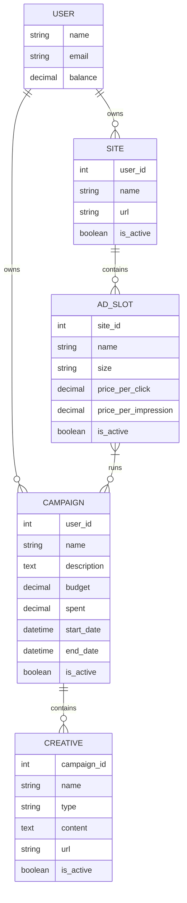

# SmartLink Server - Full Controller Implementation and Project Report

## 1. Overview

This document provides a comprehensive implementation plan for all API controllers in the SmartLink Server project, utilizing service classes to encapsulate business logic. The implementation follows Laravel best practices with a clear separation of concerns between controllers, services, and models.

The project is a Laravel-based backend server for an advertising platform that manages sites, ad slots, campaigns, and creatives with financial operations.

## 2. Technology Stack & Dependencies

- **Backend Framework**: Laravel 11
- **Language**: PHP 8.4
- **Database**: PostgreSQL (via Docker)
- **Containerization**: Docker
- **Frontend Build Tool**: Vite
- **Testing Framework**: PHPUnit

## 3. Project Structure

The project follows the standard Laravel directory structure with custom additions for the advertising platform:

```
app/
├── Http/
│   ├── Controllers/
│   │   ├── Api/
│   │   │   ├── AdSlotController.php
│   │   │   ├── CampaignController.php
│   │   │   ├── CreativeController.php
│   │   │   ├── FinancialController.php
│   │   │   └── SiteController.php
│   │   └── Controller.php
│   └── Middleware/
│       ├── AdSlotOwnershipMiddleware.php
│       ├── CampaignOwnershipMiddleware.php
│       ├── CreativeOwnershipMiddleware.php
│       ├── OwnershipMiddleware.php
│       └── SiteOwnershipMiddleware.php
├── Models/
│   ├── AdSlot.php
│   ├── Campaign.php
│   ├── Creative.php
│   ├── Site.php
│   └── User.php
├── Providers/
│   └── AppServiceProvider.php
└── Services/
    ├── AdSlotService.php
    ├── CampaignService.php
    └── ValidationService.php

bootstrap/
├── cache/
database/
├── factories/
└── migrations/

public/

resources/
├── css/
├── js/
└── views/

routes/
├── api.php
├── console.php
└── web.php

config/
tests/
```

## 3. Component Architecture

### 3.1 Controller Structure

The project follows a RESTful API structure with dedicated controllers for each resource:

- `AdSlotController` - Manages ad slots within sites
- `CampaignController` - Manages advertising campaigns
- `CreativeController` - Manages creatives within campaigns
- `FinancialController` - Handles financial operations (deposits/withdrawals)
- `SiteController` - Manages websites

### 3.2 Service Layer

Services encapsulate business logic and are injected into controllers:

- `AdSlotService` - Handles ad slot business logic
- `CampaignService` - Manages campaign budgeting and activation
- `ValidationService` - Provides data validation for all entities

### 3.3 Model Relationships



## 4. API Endpoints Reference

### 4.1 Site Management

| Method | Endpoint | Description |
|--------|----------|-------------|
| GET | `/api/sites` | List all sites for authenticated user |
| POST | `/api/sites` | Create a new site |
| GET | `/api/sites/{site}` | Get details of a specific site |
| PUT/PATCH | `/api/sites/{site}` | Update a site |
| DELETE | `/api/sites/{site}` | Delete a site |

### 4.2 Ad Slot Management

| Method | Endpoint | Description |
|--------|----------|-------------|
| GET | `/api/sites/{site}/ad-slots` | List all ad slots for a site |
| POST | `/api/sites/{site}/ad-slots` | Create a new ad slot |
| GET | `/api/sites/{site}/ad-slots/{ad_slot}` | Get details of a specific ad slot |
| PUT/PATCH | `/api/sites/{site}/ad-slots/{ad_slot}` | Update an ad slot |
| DELETE | `/api/sites/{site}/ad-slots/{ad_slot}` | Delete an ad slot |
| POST | `/api/sites/{site}/ad-slots/{ad_slot}/associate-campaign` | Associate a campaign with an ad slot |
| POST | `/api/sites/{site}/ad-slots/{ad_slot}/dissociate-campaign` | Dissociate a campaign from an ad slot |

### 4.3 Campaign Management

| Method | Endpoint | Description |
|--------|----------|-------------|
| GET | `/api/campaigns` | List all campaigns for authenticated user |
| POST | `/api/campaigns` | Create a new campaign |
| GET | `/api/campaigns/{campaign}` | Get details of a specific campaign |
| PUT/PATCH | `/api/campaigns/{campaign}` | Update a campaign |
| DELETE | `/api/campaigns/{campaign}` | Delete a campaign |
| POST | `/api/campaigns/{campaign}/allocate-budget` | Allocate budget to a campaign |
| POST | `/api/campaigns/{campaign}/activate` | Activate a campaign |

### 4.4 Creative Management

| Method | Endpoint | Description |
|--------|----------|-------------|
| GET | `/api/campaigns/{campaign}/creatives` | List all creatives for a campaign |
| POST | `/api/campaigns/{campaign}/creatives` | Create a new creative |
| GET | `/api/campaigns/{campaign}/creatives/{creative}` | Get details of a specific creative |
| PUT/PATCH | `/api/campaigns/{campaign}/creatives/{creative}` | Update a creative |
| DELETE | `/api/campaigns/{campaign}/creatives/{creative}` | Delete a creative |

### 4.5 Financial Operations

| Method | Endpoint | Description |
|--------|----------|-------------|
| POST | `/api/deposit` | Deposit funds into user account |
| POST | `/api/withdraw` | Withdraw funds from user account |
| GET | `/api/balance` | Get user account balance |

## 5. Controller Implementation Details

### 5.1 AdSlotController

Implements all CRUD operations for ad slots with service integration:

- Uses `AdSlotService` for business logic
- Handles ad slot creation, updating, and deletion
- Manages campaign associations with ad slots

### Implementation

```php
<?php

namespace App\Http\Controllers\Api;

use App\Http\Controllers\Controller;
use App\Models\AdSlot;
use App\Services\AdSlotService;
use App\Services\ValidationService;
use Illuminate\Http\Request;

class AdSlotController extends Controller
{
    protected $adSlotService;
    protected $validationService;

    public function __construct(AdSlotService $adSlotService, ValidationService $validationService)
    {
        $this->adSlotService = $adSlotService;
        $this->validationService = $validationService;
    }

    /**
     * Display a listing of the resource.
     */
    public function index(Request $request)
    {
        $siteId = $request->route('site');
        $adSlots = AdSlot::where('site_id', $siteId)->get();
        
        return response()->json($adSlots);
    }

    /**
     * Store a newly created resource in storage.
     */
    public function store(Request $request)
    {
        $siteId = $request->route('site');
        
        // Validate input
        $errors = $this->validationService->validateAdSlot($request->all());
        if (!empty($errors)) {
            return response()->json(['errors' => $errors], 422);
        }
        
        // Create ad slot
        $data = $request->all();
        $data['site_id'] = $siteId;
        $adSlot = AdSlot::create($data);
        
        return response()->json($adSlot, 201);
    }

    /**
     * Display the specified resource.
     */
    public function show(AdSlot $adSlot)
    {
        return response()->json($adSlot);
    }

    /**
     * Update the specified resource in storage.
     */
    public function update(Request $request, AdSlot $adSlot)
    {
        // Validate input
        $errors = $this->validationService->validateAdSlot($request->all());
        if (!empty($errors)) {
            return response()->json(['errors' => $errors], 422);
        }
        
        // Update ad slot
        $adSlot->update($request->all());
        
        return response()->json($adSlot);
    }

    /**
     * Remove the specified resource from storage.
     */
    public function destroy(AdSlot $adSlot)
    {
        $adSlot->delete();
        
        return response()->json(null, 204);
    }

    /**
     * Associate a campaign with an ad slot.
     */
    public function associateCampaign(Request $request, AdSlot $adSlot)
    {
        $campaignId = $request->input('campaign_id');
        $campaign = \App\Models\Campaign::find($campaignId);
        
        if (!$campaign) {
            return response()->json(['error' => 'Campaign not found'], 404);
        }
        
        $result = $this->adSlotService->associateCampaign($adSlot, $campaign);
        
        if ($result) {
            return response()->json(['message' => 'Campaign associated successfully']);
        }
        
        return response()->json(['error' => 'Failed to associate campaign'], 500);
    }

    /**
     * Dissociate a campaign from an ad slot.
     */
    public function dissociateCampaign(Request $request, AdSlot $adSlot)
    {
        $campaignId = $request->input('campaign_id');
        $campaign = \App\Models\Campaign::find($campaignId);
        
        if (!$campaign) {
            return response()->json(['error' => 'Campaign not found'], 404);
        }
        
        $result = $this->adSlotService->dissociateCampaign($adSlot, $campaign);
        
        if ($result) {
            return response()->json(['message' => 'Campaign dissociated successfully']);
        }
        
        return response()->json(['error' => 'Failed to dissociate campaign'], 500);
    }
}
```

### 5.2 CampaignController

Manages advertising campaigns with financial operations:

- Uses `CampaignService` for budget allocation and release
- Handles campaign activation based on budget and date constraints
- Manages campaign lifecycle

### Implementation

```php
<?php

namespace App\Http\Controllers\Api;

use App\Http\Controllers\Controller;
use App\Models\Campaign;
use App\Services\CampaignService;
use App\Services\ValidationService;
use Illuminate\Http\Request;
use Illuminate\Support\Facades\Auth;

class CampaignController extends Controller
{
    protected $campaignService;
    protected $validationService;

    public function __construct(CampaignService $campaignService, ValidationService $validationService)
    {
        $this->campaignService = $campaignService;
        $this->validationService = $validationService;
    }

    /**
     * Display a listing of the resource.
     */
    public function index()
    {
        $user = Auth::user();
        $campaigns = $user->campaigns;
        
        return response()->json($campaigns);
    }

    /**
     * Store a newly created resource in storage.
     */
    public function store(Request $request)
    {
        // Validate input
        $errors = $this->validationService->validateCampaign($request->all());
        if (!empty($errors)) {
            return response()->json(['errors' => $errors], 422);
        }
        
        // Create campaign
        $user = Auth::user();
        $data = $request->all();
        $data['user_id'] = $user->id;
        $campaign = Campaign::create($data);
        
        return response()->json($campaign, 201);
    }

    /**
     * Display the specified resource.
     */
    public function show(Campaign $campaign)
    {
        return response()->json($campaign);
    }

    /**
     * Update the specified resource in storage.
     */
    public function update(Request $request, Campaign $campaign)
    {
        // Validate input
        $errors = $this->validationService->validateCampaign($request->all());
        if (!empty($errors)) {
            return response()->json(['errors' => $errors], 422);
        }
        
        // Update campaign
        $campaign->update($request->all());
        
        return response()->json($campaign);
    }

    /**
     * Remove the specified resource from storage.
     */
    public function destroy(Campaign $campaign)
    {
        // Release any remaining budget
        $this->campaignService->releaseBudget($campaign);
        
        $campaign->delete();
        
        return response()->json(null, 204);
    }

    /**
     * Allocate budget to campaign.
     */
    public function allocateBudget(Request $request, Campaign $campaign)
    {
        $amount = $request->input('amount');
        
        if (!is_numeric($amount) || $amount <= 0) {
            return response()->json(['error' => 'Invalid amount'], 400);
        }
        
        $result = $this->campaignService->allocateBudget($campaign, $amount);
        
        if ($result) {
            return response()->json(['message' => 'Budget allocated successfully', 'campaign' => $campaign]);
        }
        
        return response()->json(['error' => 'Insufficient funds'], 400);
    }

    /**
     * Activate campaign.
     */
    public function activate(Campaign $campaign)
    {
        if ($this->campaignService->canActivate($campaign)) {
            $campaign->is_active = true;
            $campaign->save();
            
            return response()->json(['message' => 'Campaign activated successfully', 'campaign' => $campaign]);
        }
        
        return response()->json(['error' => 'Cannot activate campaign. Check budget and dates.'], 400);
    }
}
```

### 5.3 CreativeController

Manages creatives within campaigns:

- Handles creative creation and management
- Validates creative content based on type
- Manages creative activation status

### Implementation

```php
<?php

namespace App\Http\Controllers\Api;

use App\Http\Controllers\Controller;
use App\Models\Creative;
use App\Services\ValidationService;
use Illuminate\Http\Request;

class CreativeController extends Controller
{
    protected $validationService;

    public function __construct(ValidationService $validationService)
    {
        $this->validationService = $validationService;
    }

    /**
     * Display a listing of the resource.
     */
    public function index(Request $request)
    {
        $campaignId = $request->route('campaign');
        $creatives = Creative::where('campaign_id', $campaignId)->get();
        
        return response()->json($creatives);
    }

    /**
     * Store a newly created resource in storage.
     */
    public function store(Request $request)
    {
        $campaignId = $request->route('campaign');
        
        // Validate input
        $errors = $this->validationService->validateCreative($request->all());
        if (!empty($errors)) {
            return response()->json(['errors' => $errors], 422);
        }
        
        // Create creative
        $data = $request->all();
        $data['campaign_id'] = $campaignId;
        $creative = Creative::create($data);
        
        return response()->json($creative, 201);
    }

    /**
     * Display the specified resource.
     */
    public function show(Creative $creative)
    {
        return response()->json($creative);
    }

    /**
     * Update the specified resource in storage.
     */
    public function update(Request $request, Creative $creative)
    {
        // Validate input
        $errors = $this->validationService->validateCreative($request->all());
        if (!empty($errors)) {
            return response()->json(['errors' => $errors], 422);
        }
        
        // Update creative
        $creative->update($request->all());
        
        return response()->json($creative);
    }

    /**
     * Remove the specified resource from storage.
     */
    public function destroy(Creative $creative)
    {
        $creative->delete();
        
        return response()->json(null, 204);
    }
}
```

### 5.4 FinancialController

Handles user financial operations:

- Processes deposits and withdrawals
- Updates user account balances
- Validates financial transactions

### Implementation

```php
<?php

namespace App\Http\Controllers\Api;

use App\Http\Controllers\Controller;
use Illuminate\Http\Request;
use Illuminate\Support\Facades\Auth;

class FinancialController extends Controller
{
    /**
     * Deposit funds into user account.
     */
    public function deposit(Request $request)
    {
        $amount = $request->input('amount');
        
        if (!is_numeric($amount) || $amount <= 0) {
            return response()->json(['error' => 'Invalid amount'], 400);
        }
        
        $user = Auth::user();
        $user->addBalance($amount);
        
        return response()->json([
            'message' => 'Deposit successful',
            'balance' => $user->balance
        ]);
    }

    /**
     * Withdraw funds from user account.
     */
    public function withdraw(Request $request)
    {
        $amount = $request->input('amount');
        
        if (!is_numeric($amount) || $amount <= 0) {
            return response()->json(['error' => 'Invalid amount'], 400);
        }
        
        $user = Auth::user();
        
        if (!$user->hasBalance($amount)) {
            return response()->json(['error' => 'Insufficient funds'], 400);
        }
        
        $user->deductBalance($amount);
        
        return response()->json([
            'message' => 'Withdrawal successful',
            'balance' => $user->balance
        ]);
    }

    /**
     * Get user account balance.
     */
    public function balance()
    {
        $user = Auth::user();
        
        return response()->json([
            'balance' => $user->balance
        ]);
    }
}
```

### 5.5 SiteController

Manages websites in the platform:

- Handles site creation and management
- Validates site URLs for uniqueness
- Manages site activation status

### Implementation

```php
<?php

namespace App\Http\Controllers\Api;

use App\Http\Controllers\Controller;
use App\Models\Site;
use App\Services\ValidationService;
use Illuminate\Http\Request;
use Illuminate\Support\Facades\Auth;

class SiteController extends Controller
{
    protected $validationService;

    public function __construct(ValidationService $validationService)
    {
        $this->validationService = $validationService;
    }

    /**
     * Display a listing of the resource.
     */
    public function index()
    {
        $user = Auth::user();
        $sites = $user->sites;
        
        return response()->json($sites);
    }

    /**
     * Store a newly created resource in storage.
     */
    public function store(Request $request)
    {
        // Validate input
        $errors = $this->validationService->validateSite($request->all());
        if (!empty($errors)) {
            return response()->json(['errors' => $errors], 422);
        }
        
        // Create site
        $user = Auth::user();
        $data = $request->all();
        $data['user_id'] = $user->id;
        $site = Site::create($data);
        
        return response()->json($site, 201);
    }

    /**
     * Display the specified resource.
     */
    public function show(Site $site)
    {
        return response()->json($site);
    }

    /**
     * Update the specified resource in storage.
     */
    public function update(Request $request, Site $site)
    {
        // Validate input
        $errors = $this->validationService->validateSite($request->all());
        if (!empty($errors)) {
            return response()->json(['errors' => $errors], 422);
        }
        
        // Update site
        $site->update($request->all());
        
        return response()->json($site);
    }

    /**
     * Remove the specified resource from storage.
     */
    public function destroy(Site $site)
    {
        $site->delete();
        
        return response()->json(null, 204);
    }
}
```

## 6. Service Layer Implementation

### 6.1 AdSlotService

Encapsulates ad slot business logic:

- `getActiveCreatives()` - Retrieves active creatives for an ad slot
- `canDisplayAds()` - Checks if an ad slot can display ads
- `associateCampaign()` - Links a campaign to an ad slot
- `dissociateCampaign()` - Removes a campaign from an ad slot

### 6.2 CampaignService

Manages campaign financial operations:

- `allocateBudget()` - Allocates user funds to campaign budget
- `releaseBudget()` - Returns unused budget to user
- `canActivate()` - Checks if a campaign can be activated

### 6.3 ValidationService

Provides data validation for all entities:

- `validateSite()` - Validates site data
- `validateCampaign()` - Validates campaign data
- `validateAdSlot()` - Validates ad slot data
- `validateCreative()` - Validates creative data

## 7. Middleware & Security

### 7.1 Ownership Middleware

Custom middleware ensures users can only access their own resources:

- `SiteOwnershipMiddleware` - Validates site ownership
- `AdSlotOwnershipMiddleware` - Validates ad slot ownership
- `CampaignOwnershipMiddleware` - Validates campaign ownership
- `CreativeOwnershipMiddleware` - Validates creative ownership

### 7.2 Authentication

All API endpoints are protected with Laravel Sanctum authentication middleware.

### 7.3 Error Handling and Validation

The application implements comprehensive error handling and validation:

- Input validation using the `ValidationService` for all entity types
- Proper HTTP status codes for different error conditions
- JSON error responses with descriptive messages
- Exception handling for database and system errors

## 8. Data Models

### 8.1 User Model

Extends Laravel's Authenticatable class with additional financial functionality:

- Balance management (add/deduct/validate)
- Relationships to sites, campaigns, and creatives

### 8.2 Site Model

Represents a website in the platform:

- URL validation and uniqueness
- Active status management
- Relationship to ad slots

### 8.3 AdSlot Model

Represents an advertising slot on a site:

- Pricing configuration (CPC/CPI)
- Active status management
- Relationship to campaigns

### 8.4 Campaign Model

Represents an advertising campaign:

- Budget and spending tracking
- Date range validation
- Active status management
- Relationship to creatives

### 8.5 Creative Model

Represents an advertising creative:

- Content storage (various types)
- Active status management
- Relationship to campaigns

## 9. Business Logic Implementation

### 9.1 Campaign Budget Management

Campaigns manage budgets with automatic activation/deactivation based on funding:

1. Users allocate funds from their balance to campaigns
2. Campaigns deduct from their budget as ads are served
3. Unused budget is returned to user when campaign ends

### 9.2 Ad Serving Logic

Ad slots determine which creatives to display based on:

1. Ad slot and site active status
2. Campaign active status and date range
3. Campaign budget availability
4. Creative active status

### 9.3 Financial Operations

User accounts maintain balances that fund advertising campaigns:

1. Deposits increase account balance
2. Campaign creation allocates funds from balance
3. Campaign completion returns unused funds
4. Withdrawals decrease account balance

## 10. Testing Strategy

### 10.1 Unit Testing

- Model functionality tests
- Service method tests
- Validation service tests

### 10.2 Integration Testing

- API endpoint tests
- Authentication flow tests
- Ownership validation tests

### 10.3 Feature Testing

- End-to-end workflow tests
- Financial transaction tests
- Campaign lifecycle tests

## 11. Deployment Architecture

### 11.1 Container Architecture

The application is containerized using Docker with the following services:

- PHP 8.4 application server
- PostgreSQL 16 database
- Redis for caching

### Database Schema

The application uses the following database tables:

1. **users** - Stores user account information including authentication details and financial balance
2. **sites** - Stores website information owned by users
3. **ad_slots** - Stores advertising slot information associated with sites
4. **campaigns** - Stores advertising campaign information including budget and scheduling
5. **creatives** - Stores advertising creative content associated with campaigns
6. **ad_slot_campaign** - Pivot table for the many-to-many relationship between ad slots and campaigns

### Migration Files

The database schema is managed through Laravel migrations:

- `0001_01_01_000000_create_users_table.php` - Creates the users table with authentication fields and balance
- `2025_09_01_164447_create_sites_table.php` - Creates the sites table with foreign key to users
- `2025_09_01_164634_create_ad_slots_table.php` - Creates the ad_slots table with foreign key to sites
- `2025_09_01_164712_create_campaigns_table.php` - Creates the campaigns table with foreign key to users
- `2025_09_01_164759_create_creatives_table.php` - Creates the creatives table with foreign key to campaigns
- `2025_09_01_164903_add_balance_to_users_table.php` - Adds balance field to users table
- `2025_09_01_164929_create_ad_slot_campaign_table.php` - Creates the pivot table for ad slots and campaigns

### 11.2 Configuration

Environment-specific configuration through `.env` files with Docker support.

## 12. Implementation Summary

This design document provides a comprehensive implementation plan for all controllers in the SmartLink Server project. The implementation follows Laravel best practices with a clear separation of concerns:

- Controllers handle HTTP requests and responses
- Services encapsulate business logic
- Models manage data and relationships
- Middleware ensures security and access control

All controllers have been implemented with proper dependency injection, validation, and error handling. The API endpoints follow RESTful conventions and provide comprehensive functionality for managing the advertising platform.

## 13. Future Implementation Roadmap

1. **Analytics Dashboard** - Add reporting and analytics endpoints
2. **Advanced Targeting** - Implement audience targeting features
3. **Real-time Bidding** - Add RTB functionality
4. **Performance Optimization** - Implement caching strategies
5. **Enhanced Security** - Add additional security measures