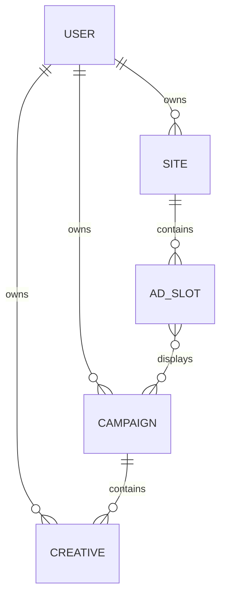

# Entity Logic Design for SmartLink Server

## 1. Overview

This document outlines the business logic for the core entities in the SmartLink server application. The system is designed as an advertising platform that allows users to manage websites, ad slots, advertising campaigns, and creatives. The entities are interconnected through ownership relationships and associations that enable the delivery of targeted advertisements.

## 2. Entity Relationships

## 3. Entity Logic

### 3.1 User Entity

The User is the central entity that owns all other entities in the system.

**Attributes:**
- id (primary key)
- name
- email
- password
- balance (decimal)
- timestamps (created_at, updated_at)

**Relationships:**
- Has many Sites
- Has many Campaigns
- Has many Creatives (through Campaigns)

**Business Logic:**
- Users can create and manage multiple sites
- Users can create and manage advertising campaigns
- Users have a balance that can be used for campaign budgets
- Authentication and authorization are handled through Laravel's built-in authentication system

### 3.2 Site Entity

A Site represents a website owned by a user where ad slots can be placed.

**Attributes:**
- id (primary key)
- user_id (foreign key to User)
- name
- url (unique)
- description
- is_active (boolean)
- timestamps (created_at, updated_at)

**Relationships:**
- Belongs to User
- Has many Ad Slots

**Business Logic:**
- Sites must have a unique URL
- Sites can be activated or deactivated
- All ad slots associated with a site are only displayed when the site is active
- Ownership validation ensures only the site owner can manage it

### 3.3 Ad Slot Entity

An Ad Slot represents a specific placement on a site where advertisements can be displayed.

**Attributes:**
- id (primary key)
- site_id (foreign key to Site)
- name
- size (e.g., '300x250', '728x90')
- price_per_click (decimal)
- price_per_impression (decimal)
- is_active (boolean)
- timestamps (created_at, updated_at)

**Relationships:**
- Belongs to Site
- Belongs to many Campaigns (many-to-many)

**Business Logic:**
- Ad slots are associated with specific sites
- Each ad slot has defined dimensions
- Pricing can be set for both clicks and impressions
- Ad slots can be activated or deactivated
- Ad slots can be associated with multiple campaigns

### 3.4 Campaign Entity

A Campaign represents an advertising campaign created by a user with a specific budget and time frame.

**Attributes:**
- id (primary key)
- user_id (foreign key to User)
- name
- description
- budget (decimal)
- spent (decimal)
- start_date (datetime)
- end_date (datetime, nullable)
- is_active (boolean)
- timestamps (created_at, updated_at)

**Relationships:**
- Belongs to User
- Has many Creatives
- Belongs to many Ad Slots (many-to-many)

**Business Logic:**
- Campaigns have a defined budget that gets deducted as the campaign runs
- Campaigns track how much has been spent
- Campaigns have a start and end date
- Campaigns can be activated or deactivated
- Campaigns can be associated with multiple ad slots
- Budget validation prevents overspending

### 3.5 Creative Entity

A Creative represents the actual advertisement content (banner or text) that is part of a campaign.

**Attributes:**
- id (primary key)
- campaign_id (foreign key to Campaign)
- name
- type ('banner' or 'text')
- content (HTML content for banner or text content for text links)
- url
- is_active (boolean)
- timestamps (created_at, updated_at)

**Relationships:**
- Belongs to Campaign

**Business Logic:**
- Creatives are associated with specific campaigns
- Creatives can be either banner or text type
- Each creative has a URL that users will be directed to when they click
- Creatives can be activated or deactivated
- Content validation ensures appropriate content for the creative type

## 4. Ownership and Access Control

### 4.1 Middleware Implementation

The system implements ownership-based access control using middleware:

1. **CampaignOwnershipMiddleware**: Ensures that users can only access campaigns they own
2. **SiteOwnershipMiddleware**: Ensures that users can only access sites they own

### 4.2 Access Control Logic

- Users can only view, edit, or delete entities they own
- Ownership is validated through foreign key relationships
- Unauthorized access attempts return a 403 Forbidden response

## 5. Data Flow and Business Rules

### 5.1 Campaign Budget Management

1. When a campaign is created, the budget is allocated from the user's balance
2. As the campaign runs and ads are clicked or viewed, the spent amount is incremented
3. When the spent amount reaches the budget, the campaign is automatically deactivated
4. Campaigns cannot exceed their budget

### 5.2 Ad Display Logic

1. Ad slots display creatives from associated campaigns
2. Only active campaigns and creatives are displayed
3. Only active ad slots display advertisements
4. Only active sites display ad slots

### 5.3 Entity Validation Rules

1. Sites must have unique URLs
2. Campaigns must have a start date before the end date
3. Campaign budgets must be positive values
4. Ad slot pricing must be non-negative
5. Creatives must have valid content based on their type

## 6. API Endpoints Structure

Each entity follows a consistent RESTful API pattern:
- `GET /api/{entity}` - List all entities (with ownership filtering)
- `POST /api/{entity}` - Create a new entity
- `GET /api/{entity}/{id}` - Retrieve a specific entity
- `PUT/PATCH /api/{entity}/{id}` - Update a specific entity
- `DELETE /api/{entity}/{id}` - Delete a specific entity

Middleware is applied to ensure ownership validation for each endpoint.
