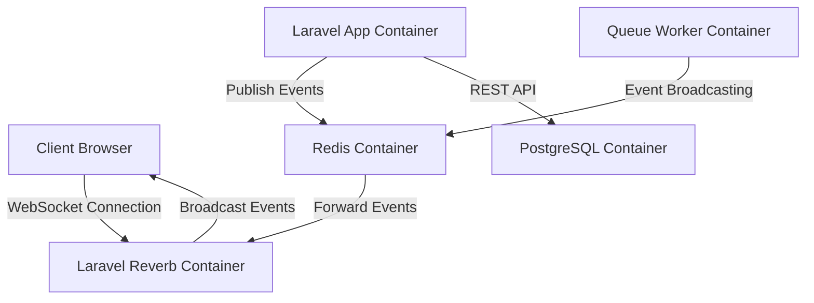

# WebSocket Integration Design Document

## 1. Overview

This document outlines the design for enhancing the existing chat functionality in the SmartLink platform by implementing a more robust WebSocket integration using Laravel 12 and Reverb. The current implementation uses Laravel Echo with Pusher/Soketi for basic real-time messaging.

The WebSocket integration will provide:
- Enhanced real-time chat capabilities with typing indicators and read receipts
- Real-time notifications for system events
- Live user presence tracking
- Real-time campaign status updates
- Real-time financial transaction notifications

## 2. Technology Stack & Dependencies

### Backend
- **Laravel 12** with Broadcasting component and Reverb
- **Redis** for message queue and broadcasting
- **Laravel Reverb** as WebSocket server
- **PHP 8.4** (Docker)

### Frontend
- **Laravel Echo** client library
- **Pusher JS** client
- **JavaScript** for client-side logic

### Infrastructure
- **Docker** for containerization
- **PostgreSQL** for data persistence
- **Redis** for caching and pub/sub

## 3. Architecture Overview



### Component Interaction Flow

1. Client establishes WebSocket connection with Laravel Reverb container
2. Laravel application container publishes events to Redis container
3. Redis container forwards events to Laravel Reverb container
4. Laravel Reverb container broadcasts events to connected clients
5. Clients receive real-time updates through WebSocket connection

### Docker Services
- `smartlink-app`: Main Laravel application
- `smartlink-reverb`: Laravel Reverb WebSocket server
- `smartlink-db`: PostgreSQL database
- `smartlink-redis`: Redis server for caching and pub/sub

## 4. WebSocket Channels Design

### Public Channels
- `chat`: General chat messages for all users (existing)

### Private Channels
- `private-user.{userId}`: User-specific notifications and updates
- `private-campaign.{campaignId}`: Campaign-specific updates
- `private-financial.{userId}`: Financial transaction notifications

### Presence Channels
- `presence-chat`: Track online users in chat
- `presence-campaign.{campaignId}`: Track users viewing specific campaign

## 5. Enhanced Chat Features

### Real-time Typing Indicators
- Users can see when others are typing in chat
- Implementation using temporary broadcast events

### Message Read Receipts
- Track when messages are read by recipients
- Update message status in real-time

### Online Presence
- Show which users are currently online
- Update user status in real-time

### Direct Messaging
- Private chat between specific users
- Separate channels for direct conversations
- Implementation using private channels: `private-chat.{userId1}.{userId2}`

## 6. Event Design

### Chat Events
| Event | Channel | Description |
|-------|---------|-------------|
| `MessageSent` | `chat` | New message posted to general chat (existing) |
| `UserTyping` | `chat` | User started typing in chat |
| `MessageRead` | `private-user.{userId}` | Message marked as read |
| `UserJoined` | `presence-chat` | User joined chat room |
| `UserLeft` | `presence-chat` | User left chat room |
| `PrivateMessageSent` | `private-chat.{userId1}.{userId2}` | Private message between users |

### Notification Events
| Event | Channel | Description |
|-------|---------|-------------|
| `NotificationCreated` | `private-user.{userId}` | New notification for user |
| `NotificationRead` | `private-user.{userId}` | Notification marked as read |

### Campaign Events
| Event | Channel | Description |
|-------|---------|-------------|
| `CampaignUpdated` | `private-campaign.{campaignId}` | Campaign status/properties updated |
| `BudgetChanged` | `private-campaign.{campaignId}` | Campaign budget updated |
| `CampaignActivated` | `private-campaign.{campaignId}` | Campaign activated |
| `CampaignDeactivated` | `private-campaign.{campaignId}` | Campaign deactivated |

### Financial Events
| Event | Channel | Description |
|-------|---------|-------------|
| `DepositCompleted` | `private-financial.{userId}` | User deposit completed |
| `WithdrawalProcessed` | `private-financial.{userId}` | User withdrawal processed |
| `BalanceUpdated` | `private-financial.{userId}` | User balance changed |

## 7. Implementation Plan

### Phase 4: Frontend Integration Implementation

Let's implement the frontend integration to handle the new events and features:

1. First, we need to update the Laravel Echo configuration to use Reverb instead of Pusher:
   ```javascript
   import Echo from 'laravel-echo';
   import Pusher from 'pusher-js';
   
   window.Pusher = Pusher;
   
   window.Echo = new Echo({
       broadcaster: 'reverb',
       key: process.env.MIX_REVERB_APP_KEY,
       wsHost: process.env.MIX_REVERB_HOST,
       wsPort: process.env.MIX_REVERB_PORT,
       wssPort: process.env.MIX_REVERB_PORT,
       forceTLS: false,
       encrypted: true,
       disableStats: true,
       enabledTransports: ['ws', 'wss'],
   });
   ```

2. We also need to update the `.env` file to include the Reverb variables:
   ```env
   MIX_REVERB_APP_KEY="${REVERB_APP_KEY}"
   MIX_REVERB_HOST="localhost"
   MIX_REVERB_PORT=8080
   ```

3. Now let's implement real-time UI updates for the enhanced chat features:
   ```javascript
   // Listen for typing indicators
   window.Echo.channel('chat')
       .listen('UserTyping', (e) => {
           // Update UI to show typing indicator
           console.log(`${e.user.name} is typing...`);
       });
   
   // Listen for message read events
   window.Echo.private(`user.${userId}`)
       .listen('MessageRead', (e) => {
           // Update message status to show as read
           console.log(`Message ${e.message.id} read by ${e.user.name}`);
       });
   
   // Listen for private messages
   // Generate consistent channel name (lower ID first)
   const channelId = userId1 < userId2 ? 
       `private-chat.${userId1}.${userId2}` : 
       `private-chat.${userId2}.${userId1}`;
   
   window.Echo.private(channelId)
       .listen('PrivateMessageSent', (e) => {
           // Display private message in UI
           console.log(`Private message from ${e.message.user.name}: ${e.message.message}`);
       });
   
   // Listen for user presence events
   window.Echo.join('chat')
       .here((users) => {
           // Show all online users
           console.log('Online users:', users);
       })
       .joining((user) => {
           // Show user joined
           console.log(`${user.name} joined`);
       })
       .leaving((user) => {
           // Show user left
           console.log(`${user.name} left`);
       });
   ```

4. Let's implement connection status indicators:
   ```javascript
   // Connection status
   window.Echo.connector.pusher.connection.bind('connected', () => {
       console.log('Connected to WebSocket');
       // Update UI to show connected status
   });
   
   window.Echo.connector.pusher.connection.bind('disconnected', () => {
       console.log('Disconnected from WebSocket');
       // Update UI to show disconnected status
   });
   
   window.Echo.connector.pusher.connection.bind('error', (error) => {
       console.log('WebSocket error:', error);
       // Update UI to show error status
   });
   ```

5. Let's implement reconnection logic:
   ```javascript
   let reconnectAttempts = 0;
   const maxReconnectAttempts = 5;
   
   window.Echo.connector.pusher.connection.bind('disconnected', () => {
       if (reconnectAttempts < maxReconnectAttempts) {
           reconnectAttempts++;
           console.log(`Reconnection attempt ${reconnectAttempts}`);
           
           // Try to reconnect after a delay
           setTimeout(() => {
               window.Echo.connector.pusher.connect();
           }, 1000 * reconnectAttempts); // Exponential backoff
       } else {
           console.log('Max reconnection attempts reached');
           // Show error to user
       }
   });
   
   window.Echo.connector.pusher.connection.bind('connected', () => {
       // Reset reconnect attempts on successful connection
       reconnectAttempts = 0;
   });
   ```

### Phase 3: Extended Real-time Features Implementation

Let's implement the extended real-time features by creating events for notifications, campaigns, and financial transactions:

1. First, let's create the `NotificationCreated` event:
   ```bash
   docker-compose exec smartlink-app php artisan make:event NotificationCreated
   ```

2. The `NotificationCreated` event class should look like this:
   ```php
   <?php
   
   namespace App\Events;
   
   use App\Models\User;
   use Illuminate\Broadcasting\Channel;
   use Illuminate\Broadcasting\InteractsWithSockets;
   use Illuminate\Contracts\Broadcasting\ShouldBroadcast;
   
   class NotificationCreated implements ShouldBroadcast
   {
       use InteractsWithSockets;
       
       public $notification;
       public $user;
       
       public function __construct($notification, User $user)
       {
           $this->notification = $notification;
           $this->user = $user;
       }
       
       public function broadcastOn()
       {
           return new Channel('private-user.' . $this->user->id);
       }
   }
   ```

3. Next, let's create the `NotificationRead` event:
   ```bash
   docker-compose exec smartlink-app php artisan make:event NotificationRead
   ```

4. The `NotificationRead` event class should look like this:
   ```php
   <?php
   
   namespace App\Events;
   
   use App\Models\User;
   use Illuminate\Broadcasting\Channel;
   use Illuminate\Broadcasting\InteractsWithSockets;
   use Illuminate\Contracts\Broadcasting\ShouldBroadcast;
   
   class NotificationRead implements ShouldBroadcast
   {
       use InteractsWithSockets;
       
       public $notificationId;
       public $user;
       
       public function __construct($notificationId, User $user)
       {
           $this->notificationId = $notificationId;
           $this->user = $user;
       }
       
       public function broadcastOn()
       {
           return new Channel('private-user.' . $this->user->id);
       }
   }
   ```

5. Let's create events for campaign updates. First, the `CampaignUpdated` event:
   ```bash
   docker-compose exec smartlink-app php artisan make:event CampaignUpdated
   ```

6. The `CampaignUpdated` event class should look like this:
   ```php
   <?php
   
   namespace App\Events;
   
   use App\Models\Campaign;
   use Illuminate\Broadcasting\Channel;
   use Illuminate\Broadcasting\InteractsWithSockets;
   use Illuminate\Contracts\Broadcasting\ShouldBroadcast;
   
   class CampaignUpdated implements ShouldBroadcast
   {
       use InteractsWithSockets;
       
       public $campaign;
       
       public function __construct(Campaign $campaign)
       {
           $this->campaign = $campaign;
       }
       
       public function broadcastOn()
       {
           return new Channel('private-campaign.' . $this->campaign->id);
       }
   }
   ```

7. Next, let's create the `BudgetChanged` event:
   ```bash
   docker-compose exec smartlink-app php artisan make:event BudgetChanged
   ```

8. The `BudgetChanged` event class should look like this:
   ```php
   <?php
   
   namespace App\Events;
   
   use App\Models\Campaign;
   use Illuminate\Broadcasting\Channel;
   use Illuminate\Broadcasting\InteractsWithSockets;
   use Illuminate\Contracts\Broadcasting\ShouldBroadcast;
   
   class BudgetChanged implements ShouldBroadcast
   {
       use InteractsWithSockets;
       
       public $campaign;
       public $oldBudget;
       public $newBudget;
       
       public function __construct(Campaign $campaign, $oldBudget, $newBudget)
       {
           $this->campaign = $campaign;
           $this->oldBudget = $oldBudget;
           $this->newBudget = $newBudget;
       }
       
       public function broadcastOn()
       {
           return new Channel('private-campaign.' . $this->campaign->id);
       }
   }
   ```

9. Let's create the `CampaignActivated` event:
   ```bash
   docker-compose exec smartlink-app php artisan make:event CampaignActivated
   ```

10. The `CampaignActivated` event class should look like this:
    ```php
    <?php
    
    namespace App\Events;
    
    use App\Models\Campaign;
    use Illuminate\Broadcasting\Channel;
    use Illuminate\Broadcasting\InteractsWithSockets;
    use Illuminate\Contracts\Broadcasting\ShouldBroadcast;
    
    class CampaignActivated implements ShouldBroadcast
    {
        use InteractsWithSockets;
        
        public $campaign;
        
        public function __construct(Campaign $campaign)
        {
            $this->campaign = $campaign;
        }
        
        public function broadcastOn()
        {
            return new Channel('private-campaign.' . $this->campaign->id);
        }
    }
    ```

11. Finally, let's create the `CampaignDeactivated` event:
    ```bash
    docker-compose exec smartlink-app php artisan make:event CampaignDeactivated
    ```

12. The `CampaignDeactivated` event class should look like this:
    ```php
    <?php
    
    namespace App\Events;
    
    use App\Models\Campaign;
    use Illuminate\Broadcasting\Channel;
    use Illuminate\Broadcasting\InteractsWithSockets;
    use Illuminate\Contracts\Broadcasting\ShouldBroadcast;
    
    class CampaignDeactivated implements ShouldBroadcast
    {
        use InteractsWithSockets;
        
        public $campaign;
        
        public function __construct(Campaign $campaign)
        {
            $this->campaign = $campaign;
        }
        
        public function broadcastOn()
        {
            return new Channel('private-campaign.' . $this->campaign->id);
        }
    }
    ```

13. Now let's create events for financial transactions. First, the `DepositCompleted` event:
    ```bash
    docker-compose exec smartlink-app php artisan make:event DepositCompleted
    ```

14. The `DepositCompleted` event class should look like this:
    ```php
    <?php
    
    namespace App\Events;
    
    use App\Models\User;
    use Illuminate\Broadcasting\Channel;
    use Illuminate\Broadcasting\InteractsWithSockets;
    use Illuminate\Contracts\Broadcasting\ShouldBroadcast;
    
    class DepositCompleted implements ShouldBroadcast
    {
        use InteractsWithSockets;
        
        public $user;
        public $amount;
        
        public function __construct(User $user, $amount)
        {
            $this->user = $user;
            $this->amount = $amount;
        }
        
        public function broadcastOn()
        {
            return new Channel('private-financial.' . $this->user->id);
        }
    }
    ```

15. Next, let's create the `WithdrawalProcessed` event:
    ```bash
    docker-compose exec smartlink-app php artisan make:event WithdrawalProcessed
    ```

16. The `WithdrawalProcessed` event class should look like this:
    ```php
    <?php
    
    namespace App\Events;
    
    use App\Models\User;
    use Illuminate\Broadcasting\Channel;
    use Illuminate\Broadcasting\InteractsWithSockets;
    use Illuminate\Contracts\Broadcasting\ShouldBroadcast;
    
    class WithdrawalProcessed implements ShouldBroadcast
    {
        use InteractsWithSockets;
        
        public $user;
        public $amount;
        
        public function __construct(User $user, $amount)
        {
            $this->user = $user;
            $this->amount = $amount;
        }
        
        public function broadcastOn()
        {
            return new Channel('private-financial.' . $this->user->id);
        }
    }
    ```

17. Finally, let's create the `BalanceUpdated` event:
    ```bash
    docker-compose exec smartlink-app php artisan make:event BalanceUpdated
    ```

18. The `BalanceUpdated` event class should look like this:
    ```php
    <?php
    
    namespace App\Events;
    
    use App\Models\User;
    use Illuminate\Broadcasting\Channel;
    use Illuminate\Broadcasting\InteractsWithSockets;
    use Illuminate\Contracts\Broadcasting\ShouldBroadcast;
    
    class BalanceUpdated implements ShouldBroadcast
    {
        use InteractsWithSockets;
        
        public $user;
        public $oldBalance;
        public $newBalance;
        
        public function __construct(User $user, $oldBalance, $newBalance)
        {
            $this->user = $user;
            $this->oldBalance = $oldBalance;
            $this->newBalance = $newBalance;
        }
        
        public function broadcastOn()
        {
            return new Channel('private-financial.' . $this->user->id);
        }
    }
    ```

### Phase 2: Enhanced Chat Features Implementation

Let's start implementing the enhanced chat features by creating the necessary events for typing indicators:

1. First, let's create the `UserTyping` event:
   ```bash
   docker-compose exec smartlink-app php artisan make:event UserTyping
   ```

2. The `UserTyping` event class should look like this:
   ```php
   <?php
   
   namespace App\Events;
   
   use App\Models\User;
   use Illuminate\Broadcasting\Channel;
   use Illuminate\Broadcasting\InteractsWithSockets;
   use Illuminate\Broadcasting\PresenceChannel;
   use Illuminate\Contracts\Broadcasting\ShouldBroadcast;
   
   class UserTyping implements ShouldBroadcast
   {
       use InteractsWithSockets;
       
       public $user;
       public $typing;
       
       public function __construct(User $user, bool $typing)
       {
           $this->user = $user;
           $this->typing = $typing;
       }
       
       public function broadcastOn()
       {
           return new Channel('chat');
       }
   }
   ```

3. Next, let's create the `MessageRead` event:
   ```bash
   docker-compose exec smartlink-app php artisan make:event MessageRead
   ```

4. The `MessageRead` event class should look like this:
   ```php
   <?php
   
   namespace App\Events;
   
   use App\Models\ChatMessage;
   use App\Models\User;
   use Illuminate\Broadcasting\Channel;
   use Illuminate\Broadcasting\InteractsWithSockets;
   use Illuminate\Contracts\Broadcasting\ShouldBroadcast;
   
   class MessageRead implements ShouldBroadcast
   {
       use InteractsWithSockets;
       
       public $message;
       public $user;
       
       public function __construct(ChatMessage $message, User $user)
       {
           $this->message = $message;
           $this->user = $user;
       }
       
       public function broadcastOn()
       {
           return new Channel('private-user.' . $this->message->user_id);
       }
   }
   ```

5. Let's create the `PrivateMessageSent` event for direct messaging:
   ```bash
   docker-compose exec smartlink-app php artisan make:event PrivateMessageSent
   ```

6. The `PrivateMessageSent` event class should look like this:
   ```php
   <?php
   
   namespace App\Events;
   
   use App\Models\ChatMessage;
   use Illuminate\Broadcasting\Channel;
   use Illuminate\Broadcasting\InteractsWithSockets;
   use Illuminate\Contracts\Broadcasting\ShouldBroadcast;
   
   class PrivateMessageSent implements ShouldBroadcast
   {
       use InteractsWithSockets;
       
       public $message;
       
       public function __construct(ChatMessage $message)
       {
           $this->message = $message;
       }
       
       public function broadcastOn()
       {
           // Create a channel for the two users involved
           $userId1 = $this->message->user_id;
           $userId2 = $this->message->recipient_id;
           
           // Use consistent channel naming (lower ID first)
           $channelName = $userId1 < $userId2 ? 
               "private-chat.{$userId1}.{$userId2}" : 
               "private-chat.{$userId2}.{$userId1}";
           
           return new Channel($channelName);
       }
   }
   ```

7. Let's create events for tracking user presence in chat:
   ```bash
   docker-compose exec smartlink-app php artisan make:event UserJoined
   docker-compose exec smartlink-app php artisan make:event UserLeft
   ```

8. The `UserJoined` event class should look like this:
   ```php
   <?php
   
   namespace App\Events;
   
   use App\Models\User;
   use Illuminate\Broadcasting\InteractsWithSockets;
   use Illuminate\Broadcasting\PresenceChannel;
   use Illuminate\Contracts\Broadcasting\ShouldBroadcast;
   
   class UserJoined implements ShouldBroadcast
   {
       use InteractsWithSockets;
       
       public $user;
       
       public function __construct(User $user)
       {
           $this->user = $user;
       }
       
       public function broadcastOn()
       {
           return new PresenceChannel('chat');
       }
       
       public function broadcastWith()
       {
           return ['id' => $this->user->id, 'name' => $this->user->name];
       }
   }
   ```

9. The `UserLeft` event class should look like this:
   ```php
   <?php
   
   namespace App\Events;
   
   use App\Models\User;
   use Illuminate\Broadcasting\InteractsWithSockets;
   use Illuminate\Broadcasting\PresenceChannel;
   use Illuminate\Contracts\Broadcasting\ShouldBroadcast;
   
   class UserLeft implements ShouldBroadcast
   {
       use InteractsWithSockets;
       
       public $user;
       
       public function __construct(User $user)
       {
           $this->user = $user;
       }
       
       public function broadcastOn()
       {
           return new PresenceChannel('chat');
       }
       
       public function broadcastWith()
       {
           return ['id' => $this->user->id, 'name' => $this->user->name];
       }
   }
   ```

### Phase 1: Infrastructure Setup Implementation

Let's start by updating the docker-compose.yml file to add the Reverb service:

1. First, we need to install Laravel Reverb in the application:
   ```bash
   docker-compose exec smartlink-app composer require laravel/reverb
   ```

2. Next, we need to publish the Reverb configuration files:
   ```bash
   docker-compose exec smartlink-app php artisan reverb:install
   ```

3. Then we update the docker-compose.yml file to add the Reverb service (as shown in the previous section).

4. We also need to update the `.env` file to set the broadcasting driver to Redis:
   ```env
   BROADCAST_DRIVER=redis
   ```

### Phase 1: Infrastructure Setup
1. Configure Redis for broadcasting in `.env` file
2. Set up Laravel Reverb server using Docker (update docker-compose.yml)
3. Configure Laravel broadcasting to use Redis
4. Update environment variables for WebSocket connections
5. Install Laravel Reverb: `docker-compose exec smartlink-app composer require laravel/reverb`
6. Publish Reverb configuration: `docker-compose exec smartlink-app php artisan reverb:install`
7. Update docker-compose.yml to add Reverb service

First, let's update the docker-compose.yml file to add the Reverb service:

```yaml
services:
  smartlink-app:
    # existing configuration
    depends_on:
      - smartlink-db
      - smartlink-redis

  smartlink-reverb:
    build: .
    command: ["php", "artisan", "reverb:start"]
    ports:
      - "8080:8080"
    environment:
      - DB_CONNECTION=pgsql
      - DB_HOST=smartlink-db
      - DB_PORT=5432
      - DB_DATABASE=smartlink
      - DB_USERNAME=smartlink_user
      - DB_PASSWORD=secure_password
      - REDIS_HOST=smartlink-redis
      - REDIS_PORT=6379
      - REVERB_APP_ID=${REVERB_APP_ID}
      - REVERB_APP_KEY=${REVERB_APP_KEY}
      - REVERB_APP_SECRET=${REVERB_APP_SECRET}
    volumes:
      - .:/var/www/html
    depends_on:
      - smartlink-db
      - smartlink-redis

  smartlink-db:
    # existing configuration

  smartlink-redis:
    # existing configuration
```

### Phase 2: Enhanced Chat Features
1. Implement typing indicators in chat
2. Add message read receipts functionality
3. Enable user presence tracking
4. Create private messaging channels
5. Test features using Docker commands

### Phase 3: Extended Real-time Features
1. Implement real-time notifications
2. Add campaign status updates
3. Enable financial transaction notifications
4. Create admin dashboard real-time updates
5. Run all tests in Docker environment

### Phase 4: Frontend Integration
1. Update frontend to handle new events
2. Implement real-time UI updates
3. Add connection status indicators
4. Handle reconnection logic
5. Test in Docker development environment

## 8. API Endpoints

### Update ChatController

We need to update the ChatController to support the new features. Let's create a new version of the controller:

```bash
docker-compose exec smartlink-app php artisan make:controller Api/ChatController --invokable
```

The updated ChatController should look like this:

```php
<?php

namespace App\Http\Controllers\Api;

use App\Events\MessageRead;
use App\Events\MessageSent;
use App\Events\PrivateMessageSent;
use App\Events\UserTyping;
use App\Models\ChatMessage;
use App\Models\UserPresence;
use Illuminate\Http\Request;
use Illuminate\Support\Facades\Broadcast;

class ChatController extends Controller
{
    public function index(Request $request)
    {
        $messages = ChatMessage::with('user')
            ->whereNull('recipient_id') // Only public messages
            ->recent()
            ->get()
            ->sortBy('created_at');
            
        return response()->json($messages);
    }
    
    public function store(Request $request)
    {
        $validated = $request->validate([
            'message' => 'required|string|max:1000',
        ]);
        
        $message = ChatMessage::create([
            'user_id' => auth()->id(),
            'message' => $validated['message'],
        ]);
        
        // Load the user relationship
        $message->load('user');
        
        // Broadcast the message
        broadcast(new MessageSent($message))->toOthers();
        
        return response()->json($message, 201);
    }
    
    public function typing(Request $request)
    {
        $validated = $request->validate([
            'typing' => 'required|boolean',
        ]);
        
        // Broadcast typing event
        broadcast(new UserTyping(auth()->user(), $validated['typing']));
        
        return response()->json(['status' => 'ok']);
    }
    
    public function markAsRead(Request $request, $messageId)
    {
        $message = ChatMessage::where('id', $messageId)
            ->where('recipient_id', auth()->id())
            ->firstOrFail();
            
        $message->update(['is_read' => true]);
        
        // Broadcast read event
        broadcast(new MessageRead($message, auth()->user()));
        
        return response()->json($message);
    }
    
    public function getOnlineUsers(Request $request)
    {
        $onlineUsers = UserPresence::with('user')
            ->online()
            ->recentlySeen()
            ->get()
            ->pluck('user');
            
        return response()->json($onlineUsers);
    }
    
    public function sendPrivateMessage(Request $request)
    {
        $validated = $request->validate([
            'recipient_id' => 'required|exists:users,id',
            'message' => 'required|string|max:1000',
        ]);
        
        // Prevent users from sending messages to themselves
        if ($validated['recipient_id'] == auth()->id()) {
            return response()->json(['error' => 'Cannot send message to yourself'], 400);
        }
        
        $message = ChatMessage::create([
            'user_id' => auth()->id(),
            'recipient_id' => $validated['recipient_id'],
            'message' => $validated['message'],
        ]);
        
        // Load the user and recipient relationships
        $message->load('user', 'recipient');
        
        // Broadcast the private message
        broadcast(new PrivateMessageSent($message));
        
        return response()->json($message, 201);
    }
}
```

### WebSocket Authentication
- **Endpoint**: `/broadcasting/auth`
- **Method**: POST
- **Description**: Authenticate private channel subscriptions
- **Middleware**: `auth:sanctum`
- **Docker Test Command**: `docker-compose exec smartlink-app php artisan test --filter=test_broadcasting_auth`

### Enhanced Chat Endpoints
| Endpoint | Method | Description |
|----------|--------|-------------|
| `/api/chat/messages` | POST | Send chat message with typing indicator reset (extends existing) |
| `/api/chat/typing` | POST | Notify other users that current user is typing (new) |
| `/api/chat/messages/{id}/read` | POST | Mark message as read (new) |
| `/api/chat/users/online` | GET | Get list of online users (new) |
| `/api/chat/messages/private` | POST | Send private message to specific user (new) |

### Update API Routes

We need to update the routes in `routes/api.php` to include the new endpoints:

```php
// Chat routes
Route::get('/chat/messages', [App\Http\Controllers\Api\ChatController::class, 'index']);
Route::post('/chat/messages', [App\Http\Controllers\Api\ChatController::class, 'store']);
Route::post('/chat/typing', [App\Http\Controllers\Api\ChatController::class, 'typing']);
Route::post('/chat/messages/{id}/read', [App\Http\Controllers\Api\ChatController::class, 'markAsRead']);
Route::get('/chat/users/online', [App\Http\Controllers\Api\ChatController::class, 'getOnlineUsers']);
Route::post('/chat/messages/private', [App\Http\Controllers\Api\ChatController::class, 'sendPrivateMessage']);
```

## 9. Reverb Configuration

### Configuration File
The Reverb configuration is located at `config/reverb.php`. Key settings include:

```php
'servers' => [
    'reverb' => [
        'host' => env('REVERB_HOST', '0.0.0.0'),
        'port' => env('REVERB_PORT', 8080),
        'scheme' => env('REVERB_SCHEME', 'http'),
    ],
],

'apps' => [
    [
        'id' => env('REVERB_APP_ID'),
        'key' => env('REVERB_APP_KEY'),
        'secret' => env('REVERB_APP_SECRET'),
        'app' => [
            'capacity' => 1000,
            'activity_timeout' => 30,
            'heartbeat_interval' => 15,
        ],
    ],
],
```

### Docker Environment Variables
Add to `.env` file:
```env
BROADCAST_DRIVER=redis
REVERB_APP_ID=app-id
REVERB_APP_KEY=app-key
REVERB_APP_SECRET=app-secret
REVERB_HOST=0.0.0.0
REVERB_PORT=8080
REVERB_SCHEME=http
```

We also need to update the `.env.example` file to include these variables:

```env
# Broadcasting
BROADCAST_DRIVER=redis
REVERB_APP_ID=app-id
REVERB_APP_KEY=app-key
REVERB_APP_SECRET=app-secret
REVERB_HOST=0.0.0.0
REVERB_PORT=8080
REVERB_SCHEME=http
```

### Broadcasting Configuration
Update `config/broadcasting.php` to add the Reverb connection:
```php
'connections' => [
    'pusher' => [
        'driver' => 'pusher',
        'key' => env('PUSHER_APP_KEY'),
        'secret' => env('PUSHER_APP_SECRET'),
        'app_id' => env('PUSHER_APP_ID'),
        'options' => [
            'cluster' => env('PUSHER_APP_CLUSTER'),
            'host' => env('PUSHER_HOST') ?: 'api-'.env('PUSHER_APP_CLUSTER', 'mt1').'.pusher.com',
            'port' => env('PUSHER_PORT', 443),
            'scheme' => env('PUSHER_SCHEME', 'https'),
            'encrypted' => true,
            'useTLS' => env('PUSHER_SCHEME', 'https') === 'https',
        ],
        'client_options' => [
            // Guzzle client options: https://docs.guzzlephp.org/en/stable/request-options.html
        ],
    ],

    'reverb' => [
        'driver' => 'reverb',
        'key' => env('REVERB_APP_KEY'),
        'secret' => env('REVERB_APP_SECRET'),
        'app_id' => env('REVERB_APP_ID'),
        'options' => [
            'host' => env('REVERB_HOST', 'localhost'),
            'port' => env('REVERB_PORT', 8080),
            'scheme' => env('REVERB_SCHEME', 'http'),
            'useTLS' => env('REVERB_SCHEME', 'https') === 'https',
        ],
        'client_options' => [
            // Guzzle client options
        ],
    ],

    'ably' => [
        'driver' => 'ably',
        'key' => env('ABLY_KEY'),
    ],

    'redis' => [
        'driver' => 'redis',
        'connection' => 'default',
    ],

    'log' => [
        'driver' => 'log',
    ],

    'null' => [
        'driver' => 'null',
    ],

],
```

## 10. Database Schema Updates

Let's create the necessary migrations to update our database schema:

### Update ChatMessage Model

We also need to update the ChatMessage model to include the new fields:

```php
<?php

namespace App\Models;

use Illuminate\Database\Eloquent\Model;

class ChatMessage extends Model
{
    protected $fillable = [
        'user_id',
        'recipient_id',
        'message',
        'is_read',
    ];
    
    public function user()
    {
        return $this->belongsTo(User::class);
    }
    
    public function recipient()
    {
        return $this->belongsTo(User::class, 'recipient_id');
    }
    
    // Scope for getting recent messages
    public function scopeRecent($query, $limit = 50)
    {
        return $query->latest()->limit($limit);
    }
    
    // Scope for getting unread messages
    public function scopeUnread($query)
    {
        return $query->where('is_read', false);
    }
    
    // Scope for getting private messages between two users
    public function scopeBetweenUsers($query, $userId1, $userId2)
    {
        return $query->where(function($q) use ($userId1, $userId2) {
            $q->where('user_id', $userId1)->where('recipient_id', $userId2);
        })->orWhere(function($q) use ($userId1, $userId2) {
            $q->where('user_id', $userId2)->where('recipient_id', $userId1);
        });
    }
}
```

### Create UserPresence Model

Let's also create a UserPresence model:

```bash
docker-compose exec smartlink-app php artisan make:model UserPresence
```

The UserPresence model should look like this:

```php
<?php

namespace App\Models;

use Illuminate\Database\Eloquent\Model;

class UserPresence extends Model
{
    protected $fillable = [
        'user_id',
        'is_online',
        'last_seen',
    ];
    
    protected $casts = [
        'is_online' => 'boolean',
        'last_seen' => 'datetime',
    ];
    
    public function user()
    {
        return $this->belongsTo(User::class);
    }
    
    // Scope for getting online users
    public function scopeOnline($query)
    {
        return $query->where('is_online', true);
    }
    
    // Scope for getting recently seen users
    public function scopeRecentlySeen($query, $minutes = 5)
    {
        return $query->where('last_seen', '>=', now()->subMinutes($minutes));
    }
}
```
### Chat Messages Table Enhancement (Migration)

First, let's create a migration to update the chat_messages table:
```bash
docker-compose exec smartlink-app php artisan make:migration add_recipient_and_read_status_to_chat_messages_table --table=chat_messages
```

The migration file should look like this:
```php
<?php

use Illuminate\Database\Migrations\Migration;
use Illuminate\Database\Schema\Blueprint;
use Illuminate\Support\Facades\Schema;

class AddRecipientAndReadStatusToChatMessagesTable extends Migration
{
    /**
     * Run the migrations.
     *
     * @return void
     */
    public function up()
    {
        Schema::table('chat_messages', function (Blueprint $table) {
            $table->boolean('is_read')->default(false)->after('message');
            $table->foreignId('recipient_id')->nullable()->constrained('users')->onDelete('cascade')->after('message');
            $table->index(['user_id', 'recipient_id']);
        });
    }

    /**
     * Reverse the migrations.
     *
     * @return void
     */
    public function down()
    {
        Schema::table('chat_messages', function (Blueprint $table) {
            $table->dropIndex(['user_id', 'recipient_id']);
            $table->dropForeign(['recipient_id']);
            $table->dropColumn(['recipient_id', 'is_read']);
        });
    }
}
```

### User Presence Table (New Migration)

Next, let's create a migration for the user_presence table:
```bash
docker-compose exec smartlink-app php artisan make:migration create_user_presence_table
```

The migration file should look like this:
```php
<?php

use Illuminate\Database\Migrations\Migration;
use Illuminate\Database\Schema\Blueprint;
use Illuminate\Support\Facades\Schema;

class CreateUserPresenceTable extends Migration
{
    /**
     * Run the migrations.
     *
     * @return void
     */
    public function up()
    {
        Schema::create('user_presence', function (Blueprint $table) {
            $table->id();
            $table->foreignId('user_id')->constrained()->onDelete('cascade');
            $table->timestamp('last_seen')->useCurrent();
            $table->boolean('is_online')->default(false);
            $table->timestamps();
            
            $table->index('user_id');
            $table->index('is_online');
            $table->index('last_seen');
        });
    }

    /**
     * Reverse the migrations.
     *
     * @return void
     */
    public function down()
    {
        Schema::dropIfExists('user_presence');
    }
}
```

## 10.5 User Presence Service

Let's create a service class to handle user presence tracking:

```bash
docker-compose exec smartlink-app php artisan make:class Services/UserPresenceService
```

The UserPresenceService should look like this:

```php
<?php

namespace App\Services;

use App\Events\UserJoined;
use App\Events\UserLeft;
use App\Models\UserPresence;
use Illuminate\Support\Facades\Auth;

class UserPresenceService
{
    public function setUserOnline($userId)
    {
        $presence = UserPresence::updateOrCreate(
            ['user_id' => $userId],
            [
                'is_online' => true,
                'last_seen' => now(),
            ]
        );
        
        // Broadcast user joined event
        broadcast(new UserJoined($presence->user));
        
        return $presence;
    }
    
    public function setUserOffline($userId)
    {
        $presence = UserPresence::where('user_id', $userId)->first();
        
        if ($presence) {
            $presence->update([
                'is_online' => false,
                'last_seen' => now(),
            ]);
            
            // Broadcast user left event
            broadcast(new UserLeft($presence->user));
        }
        
        return $presence;
    }
    
    public function updateLastSeen($userId)
    {
        return UserPresence::updateOrCreate(
            ['user_id' => $userId],
            [
                'last_seen' => now(),
            ]
        );
    }
}
```

## 11. Security Considerations

1. **Private Channels**: All user-specific channels must be authenticated
2. **Rate Limiting**: Implement rate limiting for typing indicators to prevent abuse
3. **Data Validation**: Validate all data sent through WebSocket connections
4. **Connection Limits**: Limit number of concurrent connections per user
5. **Encryption**: Use WSS (WebSocket Secure) in production

## 12. Performance Optimization

1. **Event Filtering**: Only broadcast necessary events to reduce network traffic
2. **Connection Pooling**: Reuse WebSocket connections where possible
3. **Message Batching**: Batch multiple events when appropriate
4. **Caching**: Cache frequently accessed data to reduce database queries
5. **Lazy Loading**: Load detailed data only when needed

## 13. Testing Strategy

Let's create tests for our new WebSocket features:

### Unit Tests
- Test event broadcasting logic
- Verify channel authorization
- Test presence channel functionality

Let's create unit tests for our new events:

1. First, let's create a test for the `UserTyping` event:
   ```bash
   docker-compose exec smartlink-app php artisan make:test UserTypingTest --unit
   ```

2. The `UserTypingTest` should look like this:
   ```php
   <?php
   
   namespace Tests\Unit;
   
   use App\Events\UserTyping;
   use App\Models\User;
   use Illuminate\Broadcasting\Channel;
   use Tests\TestCase;
   
   class UserTypingTest extends TestCase
   {
       /** @test */
       public function it_broadcasts_on_the_correct_channel()
       {
           $user = User::factory()->create();
           $event = new UserTyping($user, true);
           
           $this->assertEquals(
               new Channel('chat'),
               $event->broadcastOn()
           );
       }
   }
   ```

3. Next, let's create a test for the `MessageRead` event:
   ```bash
   docker-compose exec smartlink-app php artisan make:test MessageReadTest --unit
   ```

4. The `MessageReadTest` should look like this:
   ```php
   <?php
   
   namespace Tests\Unit;
   
   use App\Events\MessageRead;
   use App\Models\ChatMessage;
   use App\Models\User;
   use Illuminate\Broadcasting\Channel;
   use Tests\TestCase;
   
   class MessageReadTest extends TestCase
   {
       /** @test */
       public function it_broadcasts_on_the_correct_private_channel()
       {
           $user = User::factory()->create();
           $message = ChatMessage::factory()->create(['user_id' => $user->id]);
           $reader = User::factory()->create();
           
           $event = new MessageRead($message, $reader);
           
           $this->assertEquals(
               new Channel('private-user.' . $message->user_id),
               $event->broadcastOn()
           );
       }
   }
   ```

### Feature Tests
- Test real-time message delivery
- Verify typing indicator functionality
- Test read receipt updates

Let's create feature tests for our new API endpoints:

1. First, let's update the `ChatControllerTest` to include tests for the new endpoints:
   ```php
   <?php
   
   namespace Tests\Feature;
   
   use Tests\TestCase;
   use App\Models\User;
   use App\Models\ChatMessage;
   use Illuminate\Foundation\Testing\RefreshDatabase;
   use Illuminate\Support\Facades\Broadcast;
   
   class ChatControllerTest extends TestCase
   {
       use RefreshDatabase;
       
       // ... existing tests ...
       
       /** @test */
       public function user_can_send_typing_indicator()
       {
           Broadcast::fake();
           
           $user = User::factory()->create();
           
           $response = $this->actingAs($user, 'sanctum')
                            ->postJson('/api/chat/typing', [
                                'typing' => true,
                            ]);
           
           $response->assertStatus(200);
           
           // Assert that the typing event was broadcast
           Broadcast::assertBroadcasted(\App\Events\UserTyping::class);
       }
       
       /** @test */
       public function user_can_mark_message_as_read()
       {
           Broadcast::fake();
           
           $user = User::factory()->create();
           $sender = User::factory()->create();
           
           $message = ChatMessage::create([
               'user_id' => $sender->id,
               'recipient_id' => $user->id,
               'message' => 'Hello, world!',
           ]);
           
           $response = $this->actingAs($user, 'sanctum')
                            ->postJson("/api/chat/messages/{$message->id}/read");
           
           $response->assertStatus(200);
           
           // Assert that the message was marked as read
           $this->assertDatabaseHas('chat_messages', [
               'id' => $message->id,
               'is_read' => true,
           ]);
           
           // Assert that the read event was broadcast
           Broadcast::assertBroadcasted(\App\Events\MessageRead::class);
       }
       
       /** @test */
       public function user_can_get_online_users()
       {
           $user = User::factory()->create();
           
           // Create user presence records
           \App\Models\UserPresence::create([
               'user_id' => $user->id,
               'is_online' => true,
               'last_seen' => now(),
           ]);
           
           $response = $this->actingAs($user, 'sanctum')
                            ->getJson('/api/chat/users/online');
           
           $response->assertStatus(200);
           $response->assertJsonFragment(['id' => $user->id]);
       }
       
       /** @test */
       public function user_can_send_private_message()
       {
           Broadcast::fake();
           
           $user = User::factory()->create();
           $recipient = User::factory()->create();
           
           $response = $this->actingAs($user, 'sanctum')
                            ->postJson('/api/chat/messages/private', [
                                'recipient_id' => $recipient->id,
                                'message' => 'Private message',
                            ]);
           
           $response->assertStatus(201);
           
           // Assert that the private message was created
           $this->assertDatabaseHas('chat_messages', [
               'user_id' => $user->id,
               'recipient_id' => $recipient->id,
               'message' => 'Private message',
           ]);
           
           // Assert that the private message event was broadcast
           Broadcast::assertBroadcasted(\App\Events\PrivateMessageSent::class);
       }
       
       /** @test */
       public function user_cannot_send_message_to_themselves()
       {
           $user = User::factory()->create();
           
           $response = $this->actingAs($user, 'sanctum')
                            ->postJson('/api/chat/messages/private', [
                                'recipient_id' => $user->id,
                                'message' => 'Private message to myself',
                            ]);
           
           $response->assertStatus(400);
       }
   }
   ```

### Integration Tests
- End-to-end WebSocket communication
- Cross-browser compatibility testing
- Load testing with multiple concurrent users

Let's create integration tests for our WebSocket features:

1. First, let's create a test for WebSocket authentication:
   ```bash
   docker-compose exec smartlink-app php artisan make:test BroadcastingTest
   ```

2. The `BroadcastingTest` should look like this:
   ```php
   <?php
   
   namespace Tests\Feature;
   
   use Tests\TestCase;
   use App\Models\User;
   use Illuminate\Foundation\Testing\RefreshDatabase;
   
   class BroadcastingTest extends TestCase
   {
       use RefreshDatabase;
       
       /** @test */
       public function authenticated_user_can_access_private_channel()
       {
           $user = User::factory()->create();
           
           $response = $this->actingAs($user, 'sanctum')
                            ->postJson('/broadcasting/auth', [
                                'channel_name' => 'private-user.' . $user->id,
                            ]);
           
           $response->assertStatus(200);
       }
       
       /** @test */
       public function unauthenticated_user_cannot_access_private_channel()
       {
           $response = $this->postJson('/broadcasting/auth', [
               'channel_name' => 'private-user.1',
           ]);
           
           $response->assertStatus(401);
       }
       
       /** @test */
       public function user_can_join_presence_channel()
       {
           $user = User::factory()->create();
           
           $response = $this->actingAs($user, 'sanctum')
                            ->postJson('/broadcasting/auth', [
                                'channel_name' => 'presence-chat',
                            ]);
           
           $response->assertStatus(200);
       }
   }
   ```

### Docker Testing Commands
- Run all tests: `docker-compose exec smartlink-app php artisan test`
- Run WebSocket tests: `docker-compose exec smartlink-app php artisan test --testsuite=Feature --filter=chat`
- Test broadcasting: `docker-compose exec smartlink-app php artisan test --filter=BroadcastingTest`
- Check Reverb status: `docker-compose exec smartlink-app php artisan reverb:status`

## 14. Deployment Considerations

### Docker Configuration

Let's update our Docker configuration for the new Reverb service:

#### docker-compose.yml Updates
```yaml
services:
  smartlink-app:
    # existing configuration
    depends_on:
      - smartlink-db
      - smartlink-redis

  smartlink-reverb:
    build: .
    command: ["php", "artisan", "reverb:start"]
    ports:
      - "8080:8080"
    environment:
      - DB_CONNECTION=pgsql
      - DB_HOST=smartlink-db
      - DB_PORT=5432
      - DB_DATABASE=smartlink
      - DB_USERNAME=smartlink_user
      - DB_PASSWORD=secure_password
      - REDIS_HOST=smartlink-redis
      - REDIS_PORT=6379
      - REVERB_APP_ID=${REVERB_APP_ID}
      - REVERB_APP_KEY=${REVERB_APP_KEY}
      - REVERB_APP_SECRET=${REVERB_APP_SECRET}
    volumes:
      - .:/var/www/html
    depends_on:
      - smartlink-db
      - smartlink-redis

  smartlink-db:
    # existing configuration

  smartlink-redis:
    # existing configuration
```

#### Environment Variables
Add to `.env` file:
```env
BROADCAST_DRIVER=redis
REVERB_APP_ID=app-id
REVERB_APP_KEY=app-key
REVERB_APP_SECRET=app-secret
REVERB_HOST=0.0.0.0
REVERB_PORT=8080
REVERB_SCHEME=http
```

### Scaling
- Use load balancer for multiple Reverb instances
- Implement horizontal scaling for Redis
- Use CDN for static assets

For production deployments, consider:

1. Using a load balancer to distribute connections across multiple Reverb instances
2. Implementing Redis clustering for better performance
3. Using a CDN for static assets to reduce the load on the main application
4. Setting up auto-scaling groups for the Reverb service based on connection count

### Monitoring
- Monitor WebSocket connection health
- Track event broadcasting performance
- Log connection errors and failures
- Use Docker logs for monitoring: `docker-compose logs smartlink-reverb`

For monitoring the Reverb service, you can use:

1. Docker logs: `docker-compose logs smartlink-reverb`
2. Reverb status command: `docker-compose exec smartlink-app php artisan reverb:status`
3. Application metrics for tracking connection counts and event throughput
4. Set up alerts for high connection counts or error rates

### Maintenance
- Regular updates to WebSocket server
- Backup strategies for real-time data
- Disaster recovery procedures
- Restart Reverb service: `docker-compose restart smartlink-reverb`

For maintaining the Reverb service:

1. Regularly update Laravel Reverb to the latest version
2. Implement backup strategies for user presence data
3. Set up disaster recovery procedures for the WebSocket service
4. Monitor resource usage and adjust server capacity as needed
5. Restart the service when needed: `docker-compose restart smartlink-reverb`