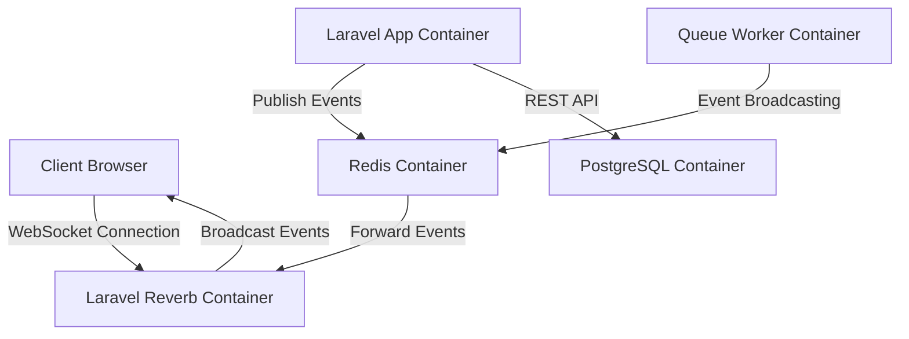

# WebSocket Integration Design Document

## 1. Overview

This document outlines the design for enhancing the existing chat functionality in the SmartLink platform by implementing a more robust WebSocket integration using Laravel 12 and Reverb. The current implementation uses Laravel Echo with Pusher/Soketi for basic real-time messaging.

The WebSocket integration will provide:
- Enhanced real-time chat capabilities with typing indicators and read receipts
- Real-time notifications for system events
- Live user presence tracking
- Real-time campaign status updates
- Real-time financial transaction notifications

## 2. Technology Stack & Dependencies

### Backend
- **Laravel 12** with Broadcasting component and Reverb
- **Redis** for message queue and broadcasting
- **Laravel Reverb** as WebSocket server
- **PHP 8.4** (Docker)

### Frontend
- **Laravel Echo** client library
- **Pusher JS** client
- **JavaScript** for client-side logic

### Infrastructure
- **Docker** for containerization
- **PostgreSQL** for data persistence
- **Redis** for caching and pub/sub

## 3. Architecture Overview



### Component Interaction Flow

1. Client establishes WebSocket connection with Laravel Reverb container
2. Laravel application container publishes events to Redis container
3. Redis container forwards events to Laravel Reverb container
4. Laravel Reverb container broadcasts events to connected clients
5. Clients receive real-time updates through WebSocket connection

### Docker Services
- `smartlink-app`: Main Laravel application
- `smartlink-reverb`: Laravel Reverb WebSocket server
- `smartlink-db`: PostgreSQL database
- `smartlink-redis`: Redis server for caching and pub/sub

## 4. WebSocket Channels Design

### Public Channels
- `chat`: General chat messages for all users (existing)

### Private Channels
- `private-user.{userId}`: User-specific notifications and updates
- `private-campaign.{campaignId}`: Campaign-specific updates
- `private-financial.{userId}`: Financial transaction notifications

### Presence Channels
- `presence-chat`: Track online users in chat
- `presence-campaign.{campaignId}`: Track users viewing specific campaign

## 5. Enhanced Chat Features

### Real-time Typing Indicators
- Users can see when others are typing in chat
- Implementation using temporary broadcast events

### Message Read Receipts
- Track when messages are read by recipients
- Update message status in real-time

### Online Presence
- Show which users are currently online
- Update user status in real-time

### Direct Messaging
- Private chat between specific users
- Separate channels for direct conversations
- Implementation using private channels: `private-chat.{userId1}.{userId2}`

## 6. Event Design

### Chat Events
| Event | Channel | Description |
|-------|---------|-------------|
| `MessageSent` | `chat` | New message posted to general chat (existing) |
| `UserTyping` | `chat` | User started typing in chat |
| `MessageRead` | `private-user.{userId}` | Message marked as read |
| `UserJoined` | `presence-chat` | User joined chat room |
| `UserLeft` | `presence-chat` | User left chat room |
| `PrivateMessageSent` | `private-chat.{userId1}.{userId2}` | Private message between users |

### Notification Events
| Event | Channel | Description |
|-------|---------|-------------|
| `NotificationCreated` | `private-user.{userId}` | New notification for user |
| `NotificationRead` | `private-user.{userId}` | Notification marked as read |

### Campaign Events
| Event | Channel | Description |
|-------|---------|-------------|
| `CampaignUpdated` | `private-campaign.{campaignId}` | Campaign status/properties updated |
| `BudgetChanged` | `private-campaign.{campaignId}` | Campaign budget updated |
| `CampaignActivated` | `private-campaign.{campaignId}` | Campaign activated |
| `CampaignDeactivated` | `private-campaign.{campaignId}` | Campaign deactivated |

### Financial Events
| Event | Channel | Description |
|-------|---------|-------------|
| `DepositCompleted` | `private-financial.{userId}` | User deposit completed |
| `WithdrawalProcessed` | `private-financial.{userId}` | User withdrawal processed |
| `BalanceUpdated` | `private-financial.{userId}` | User balance changed |

## 7. Implementation Plan

### Phase 1: Infrastructure Setup
1. Configure Redis for broadcasting in `.env` file
2. Set up Laravel Reverb server using Docker (update docker-compose.yml)
3. Configure Laravel broadcasting to use Redis
4. Update environment variables for WebSocket connections
5. Install Laravel Reverb: `docker-compose exec smartlink-app composer require laravel/reverb`
6. Publish Reverb configuration: `docker-compose exec smartlink-app php artisan reverb:install`
7. Update docker-compose.yml to add Reverb service

### Phase 2: Enhanced Chat Features
1. Implement typing indicators in chat
2. Add message read receipts functionality
3. Enable user presence tracking
4. Create private messaging channels
5. Test features using Docker commands

### Phase 3: Extended Real-time Features
1. Implement real-time notifications
2. Add campaign status updates
3. Enable financial transaction notifications
4. Create admin dashboard real-time updates
5. Run all tests in Docker environment

### Phase 4: Frontend Integration
1. Update frontend to handle new events
2. Implement real-time UI updates
3. Add connection status indicators
4. Handle reconnection logic
5. Test in Docker development environment

## 8. API Endpoints

### WebSocket Authentication
- **Endpoint**: `/broadcasting/auth`
- **Method**: POST
- **Description**: Authenticate private channel subscriptions
- **Middleware**: `auth:sanctum`
- **Docker Test Command**: `docker-compose exec smartlink-app php artisan test --filter=test_broadcasting_auth`

### Enhanced Chat Endpoints
| Endpoint | Method | Description |
|----------|--------|-------------|
| `/api/chat/messages` | POST | Send chat message with typing indicator reset (extends existing) |
| `/api/chat/typing` | POST | Notify other users that current user is typing (new) |
| `/api/chat/messages/{id}/read` | POST | Mark message as read (new) |
| `/api/chat/users/online` | GET | Get list of online users (new) |
| `/api/chat/messages/private` | POST | Send private message to specific user (new) |

## 10. Reverb Configuration

### Configuration File
The Reverb configuration is located at `config/reverb.php`. Key settings include:

```php
'servers' => [
    'reverb' => [
        'host' => env('REVERB_HOST', '0.0.0.0'),
        'port' => env('REVERB_PORT', 8080),
        'scheme' => env('REVERB_SCHEME', 'http'),
    ],
],

'apps' => [
    [
        'id' => env('REVERB_APP_ID'),
        'key' => env('REVERB_APP_KEY'),
        'secret' => env('REVERB_APP_SECRET'),
        'app' => [
            'capacity' => 1000,
            'activity_timeout' => 30,
            'heartbeat_interval' => 15,
        ],
    ],
],
```

### Docker Environment Variables
Add to `.env` file:
```env
BROADCAST_DRIVER=redis
REVERB_APP_ID=app-id
REVERB_APP_KEY=app-key
REVERB_APP_SECRET=app-secret
REVERB_HOST=0.0.0.0
REVERB_PORT=8080
REVERB_SCHEME=http
```

### Broadcasting Configuration
Update `config/broadcasting.php`:
```php
'connections' => [
    'reverb' => [
        'driver' => 'reverb',
        'key' => env('REVERB_APP_KEY'),
        'secret' => env('REVERB_APP_SECRET'),
        'app_id' => env('REVERB_APP_ID'),
        'options' => [
            'host' => env('REVERB_HOST', 'localhost'),
            'port' => env('REVERB_PORT', 8080),
            'scheme' => env('REVERB_SCHEME', 'http'),
            'useTLS' => env('REVERB_SCHEME', 'https') === 'https',
        ],
        'client_options' => [
            // Guzzle client options
        ],
    ],
],
```

## 11. Database Schema Updates

### Chat Messages Table Enhancement (Migration)
```php
Schema::table('chat_messages', function (Blueprint $table) {
    $table->boolean('is_read')->default(false)->after('message');
    $table->foreignId('recipient_id')->nullable()->constrained('users')->onDelete('cascade')->after('message');
    $table->index(['user_id', 'recipient_id']);
});
```

### User Presence Table (New Migration)
```php
Schema::create('user_presence', function (Blueprint $table) {
    $table->id();
    $table->foreignId('user_id')->constrained()->onDelete('cascade');
    $table->timestamp('last_seen')->useCurrent();
    $table->boolean('is_online')->default(false);
    $table->timestamps();
});
```

## 12. Security Considerations

1. **Private Channels**: All user-specific channels must be authenticated
2. **Rate Limiting**: Implement rate limiting for typing indicators to prevent abuse
3. **Data Validation**: Validate all data sent through WebSocket connections
4. **Connection Limits**: Limit number of concurrent connections per user
5. **Encryption**: Use WSS (WebSocket Secure) in production

## 13. Performance Optimization

1. **Event Filtering**: Only broadcast necessary events to reduce network traffic
2. **Connection Pooling**: Reuse WebSocket connections where possible
3. **Message Batching**: Batch multiple events when appropriate
4. **Caching**: Cache frequently accessed data to reduce database queries
5. **Lazy Loading**: Load detailed data only when needed

## 14. Testing Strategy

### Unit Tests
- Test event broadcasting logic
- Verify channel authorization
- Test presence channel functionality

### Feature Tests
- Test real-time message delivery
- Verify typing indicator functionality
- Test read receipt updates

### Integration Tests
- End-to-end WebSocket communication
- Cross-browser compatibility testing
- Load testing with multiple concurrent users

### Docker Testing Commands
- Run all tests: `docker-compose exec smartlink-app php artisan test`
- Run WebSocket tests: `docker-compose exec smartlink-app php artisan test --testsuite=Feature --filter=chat`
- Test broadcasting: `docker-compose exec smartlink-app php artisan test --filter=BroadcastingTest`
- Check Reverb status: `docker-compose exec smartlink-app php artisan reverb:status`

## 15. Deployment Considerations

### Docker Configuration

#### docker-compose.yml Updates
```yaml
services:
  smartlink-app:
    # existing configuration
    depends_on:
      - smartlink-db
      - smartlink-redis

  smartlink-reverb:
    build: .
    command: ["php", "artisan", "reverb:start"]
    ports:
      - "8080:8080"
    environment:
      - DB_CONNECTION=pgsql
      - DB_HOST=smartlink-db
      - DB_PORT=5432
      - DB_DATABASE=smartlink
      - DB_USERNAME=smartlink_user
      - DB_PASSWORD=secure_password
      - REDIS_HOST=smartlink-redis
      - REDIS_PORT=6379
      - REVERB_APP_ID=${REVERB_APP_ID}
      - REVERB_APP_KEY=${REVERB_APP_KEY}
      - REVERB_APP_SECRET=${REVERB_APP_SECRET}
    volumes:
      - .:/var/www/html
    depends_on:
      - smartlink-db
      - smartlink-redis

  smartlink-db:
    # existing configuration

  smartlink-redis:
    # existing configuration
```

#### Environment Variables
Add to `.env` file:
```env
BROADCAST_DRIVER=redis
REVERB_APP_ID=app-id
REVERB_APP_KEY=app-key
REVERB_APP_SECRET=app-secret
REVERB_HOST=0.0.0.0
REVERB_PORT=8080
REVERB_SCHEME=http
```

### Scaling
- Use load balancer for multiple Reverb instances
- Implement horizontal scaling for Redis
- Use CDN for static assets

### Monitoring
- Monitor WebSocket connection health
- Track event broadcasting performance
- Log connection errors and failures
- Use Docker logs for monitoring: `docker-compose logs smartlink-reverb`

### Maintenance
- Regular updates to WebSocket server
- Backup strategies for real-time data
- Disaster recovery procedures
- Restart Reverb service: `docker-compose restart smartlink-reverb`